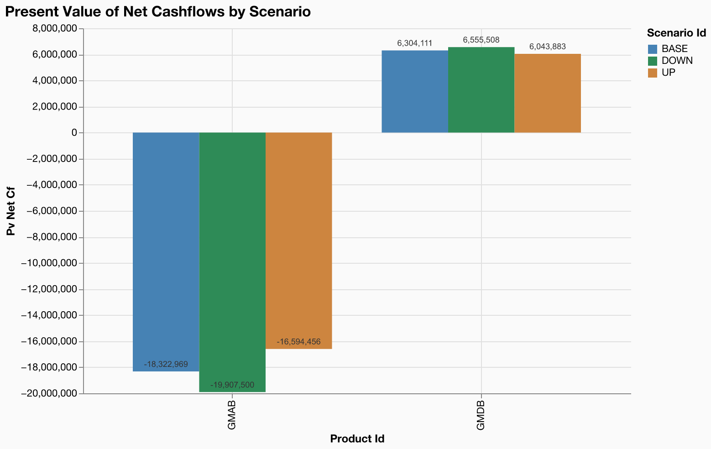
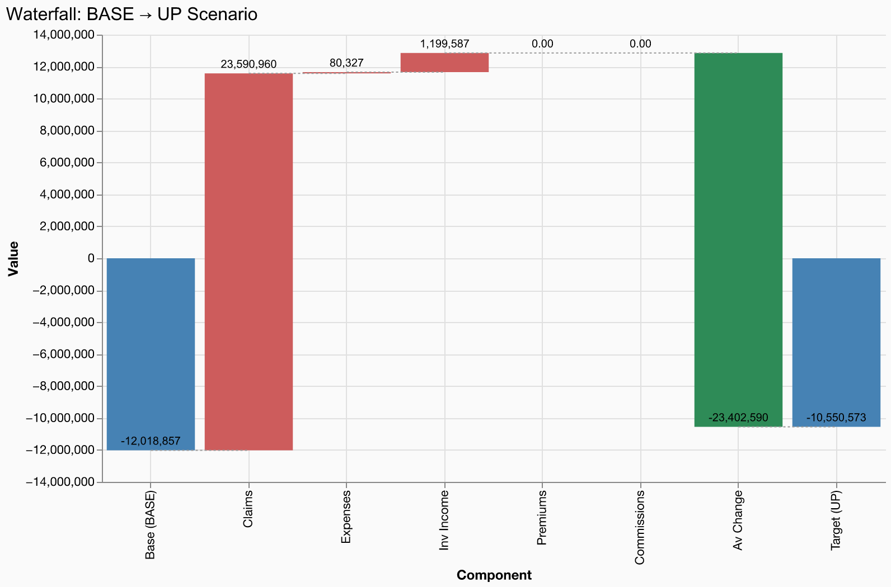

# Interest Rate Scenarios

**Model**: gaspatchio appliedlife VA | **Points**: 8 | **Scenarios**: 3 | **Runtime**: 0.47s

## Scenario Configuration

Three interest rate scenarios from the risk-free rate term structure:

- **BASE** -- Current market yield curve (no shock)
- **UP** -- Parallel upward shift of the yield curve
- **DOWN** -- Parallel downward shift of the yield curve

The `with_scenarios()` API cross-joins the 8 model points with the 3 scenario IDs, producing 24 rows. The model's discount rate lookup automatically selects the correct rate curve via the `scenario_id` column.

## Results Summary

| scenario_id | pv_net_cf | vs_base_pct |
| --- | --- | --- |
| BASE | -12,018,857 | 0.0% |
| DOWN | -13,351,992 | -11.1% |
| UP | -10,550,573 | 12.2% |

## Scenario Comparison

## Waterfall: BASE to UP

## Key Findings

- The UP scenario has the largest impact on PV of net cashflows (+12.2% vs BASE).
- Higher interest rates (UP) reduce the absolute present value of net cashflows, as expected from heavier discounting.
- Lower interest rates (DOWN) increase the absolute present value of net cashflows, as expected from lighter discounting.
- GMAB products are more sensitive to interest rate changes than GMDB products.
