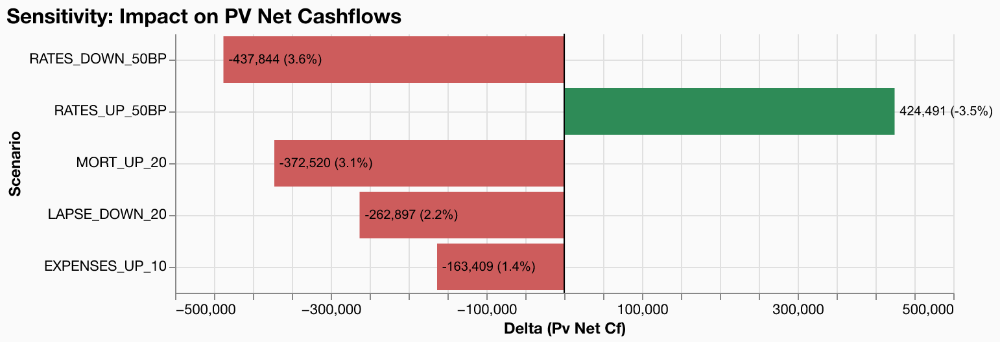

# Parameter Shocks -- Sensitivity Analysis

**Model**: gaspatchio appliedlife VA | **Points**: 8 | **Scenarios**: 6 | **Runtime**: 1.81s

## Scenario Parameters

```json
[
  {"id": "BASE"},
  {
    "id": "MORT_UP_20",
    "description": "Mortality rates increased by 20%",
    "shocks": [{"table": "mortality_select", "multiply": 1.2}]
  },
  {
    "id": "LAPSE_DOWN_20",
    "description": "Lapse rates decreased by 20%",
    "shocks": [{"table": "lapse_rates", "multiply": 0.8}]
  },
  {
    "id": "RATES_UP_50BP",
    "description": "Risk-free rates +50 basis points",
    "shocks": [{"table": "risk_free_rates", "add": 0.005}]
  },
  {
    "id": "RATES_DOWN_50BP",
    "description": "Risk-free rates -50 basis points",
    "shocks": [{"table": "risk_free_rates", "add": -0.005}]
  },
  {
    "id": "EXPENSES_UP_10",
    "description": "Maintenance expenses +10%",
    "shocks": [{"table": "space_params", "multiply": 1.1, "column": "expense_maint"}]
  }
]

```

## Scenario Configuration (Audit Trail)

# Scenario Configuration

## BASE

- *No shocks (base case)*

## MORT_UP_20

- multiply to mortality_select by 1.2

## LAPSE_DOWN_20

- multiply to lapse_rates by 0.8

## RATES_UP_50BP

- add to risk_free_rates +0.005

## RATES_DOWN_50BP

- add to risk_free_rates -0.005

## EXPENSES_UP_10

- multiply to space_params.expense_maint by 1.1


## Results Summary

| scenario_id | pv_net_cf | vs_base_pct |
| --- | --- | --- |
| BASE | -12,018,857 | 0.0% |
| EXPENSES_UP_10 | -12,182,266 | -1.4% |
| LAPSE_DOWN_20 | -12,281,754 | -2.2% |
| MORT_UP_20 | -12,391,378 | -3.1% |
| RATES_DOWN_50BP | -12,456,701 | -3.6% |
| RATES_UP_50BP | -11,594,366 | 3.5% |

## Tornado Chart



## Key Findings

- The largest sensitivity is **RATES_DOWN_50BP** (-3.6% impact on PV of net cashflows).
- The smallest sensitivity is **EXPENSES_UP_10** (-1.4% impact).
- Interest rate shocks are asymmetric -- the DOWN shock has a larger absolute impact, reflecting the convexity of discounting.
