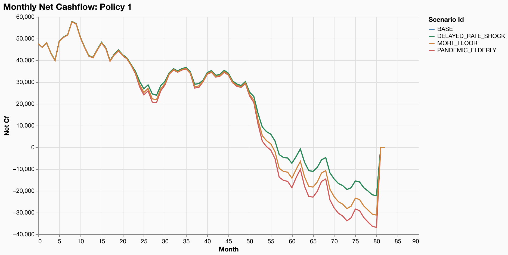
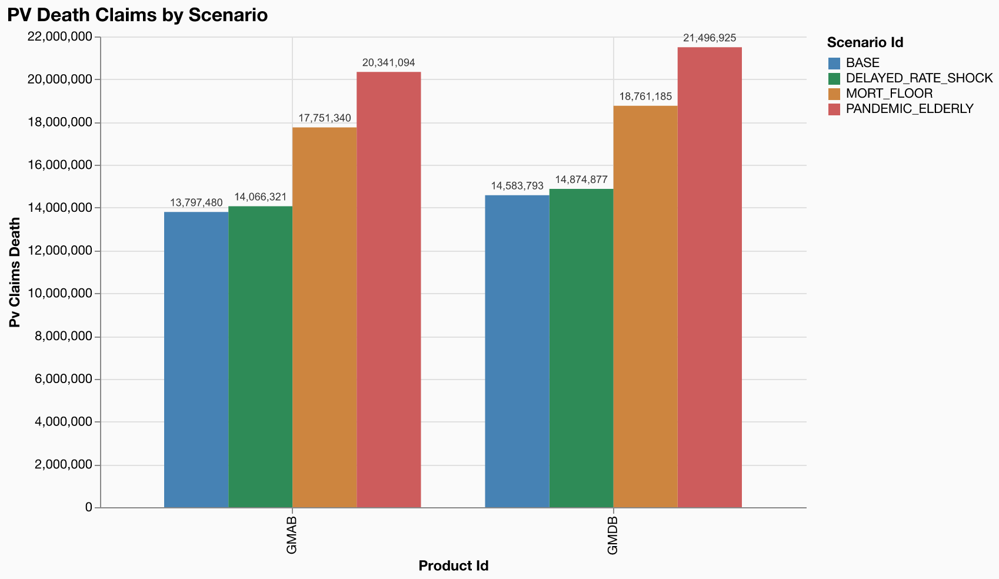

# Conditional Shocks

**Model**: gaspatchio appliedlife VA | **Points**: 8 | **Scenarios**: 4 | **Runtime**: 1.27s

## Scenario Configuration

This step demonstrates three conditional shock types:

- **FilteredShock** (`where` clause) -- applies only to rows matching a dimension filter (e.g., mortality +50% for ages 65+)
- **TimeConditionalShock** (`when` clause) -- applies at specific projection times (e.g., rates drop 100bp starting year 3)
- **PipelineShock** -- chains multiple operations (e.g., multiply by 1.3 then floor at 0.5%)

All scenarios are defined declaratively in `scenarios.json` and parsed via `parse_scenario_config()`.

## Scenario Parameters

```json
[
  {"id": "BASE"},
  {
    "id": "PANDEMIC_ELDERLY",
    "description": "Pandemic: mortality +50% for ages 65+, +10% for younger",
    "shocks": [
      {"table": "mortality_select", "multiply": 1.5, "where": {"attained_age": {"gte": 65}}},
      {"table": "mortality_select", "multiply": 1.1, "where": {"attained_age": {"lt": 65}}}
    ]
  },
  {
    "id": "DELAYED_RATE_SHOCK",
    "description": "Rates drop 100bp starting year 3",
    "shocks": [
      {"table": "risk_free_rates", "add": -0.01, "when": {"year": {"gte": 3}}}
    ]
  },
  {
    "id": "MORT_FLOOR",
    "description": "Mortality +30% but floored at 0.5%",
    "shocks": [
      {"table": "mortality_select", "pipeline": [{"multiply": 1.3}, {"clip": {"min": 0.005}}]}
    ]
  }
]

```

## Audit Trail

# Scenario Configuration

## BASE

- *No shocks (base case)*

## PANDEMIC_ELDERLY

- multiply to mortality_select by 1.5 to mortality_select WHERE attained_age ≥ 65
- multiply to mortality_select by 1.1 to mortality_select WHERE attained_age < 65

## DELAYED_RATE_SHOCK

- add to risk_free_rates -0.01 to risk_free_rates WHEN year ≥ 3

## MORT_FLOOR

- pipeline to mortality_select: multiply by 1.3 → clip min=0.005


## Results Summary

| scenario_id | pv_net_cf | pv_claims | vs_base_pct |
| --- | --- | --- | --- |
| BASE | -12,018,857 | 321,588,228 | 0.0% |
| DELAYED_RATE_SHOCK | -13,002,237 | 333,883,689 | -8.2% |
| MORT_FLOOR | -12,575,258 | 322,977,724 | -4.6% |
| PANDEMIC_ELDERLY | -12,938,321 | 323,888,842 | -7.7% |

## Cashflow Comparison (Policy 1)



## PV Death Claims by Scenario



## Key Findings

- PANDEMIC_ELDERLY increases total PV claims by +0.7% vs BASE, reflecting the age-targeted mortality shock on this elderly portfolio.
- DELAYED_RATE_SHOCK changes PV net cashflows by -8.2% vs BASE. The impact appears at year 3 when the 100bp rate drop takes effect.
- MORT_FLOOR increases PV claims by +0.4% vs BASE. The pipeline applies a 30% uplift then floors at 0.5%, preventing any mortality rate from falling below the minimum.
