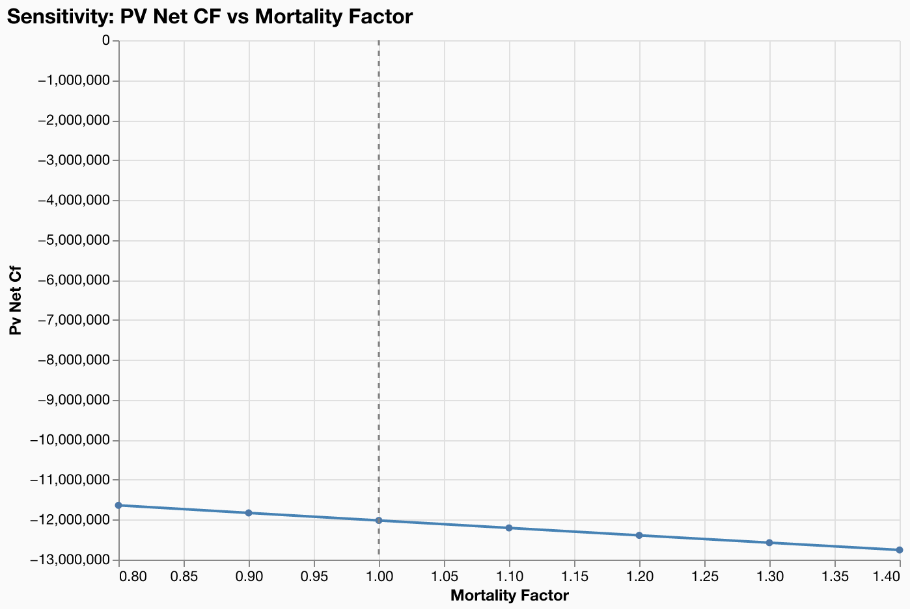
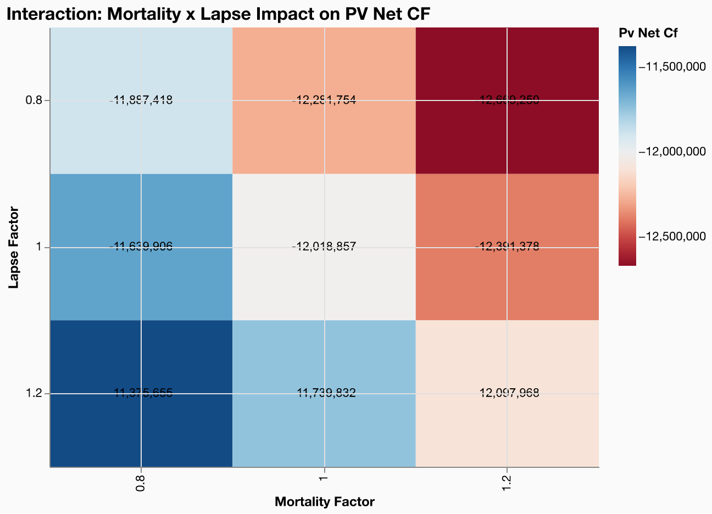

# Sensitivity Analysis

**Model**: gaspatchio appliedlife VA | **Points**: 8 | **Scenarios**: 16 | **Runtime**: 5.21s

## Overview

This step demonstrates systematic parameter sweeps using gaspatchio's scenario API:

1. **1D sweep** -- `sensitivity_analysis()` generates multiplicative shocks for mortality from 0.8x to 1.4x (7 data points plus base).
2. **2D sweep** -- A manual cross-product of mortality (0.8, 1.0, 1.2) and lapse (0.8, 1.0, 1.2) factors produces a 3x3 grid.

No `scenarios.json` file is needed -- all scenarios are built programmatically with `sensitivity_analysis()` and `parse_scenario_config()`.

## Scenario Parameters

```python
# 1D sweep: mortality factor
MORT_SWEEP_VALUES = [0.8, 0.9, 1.0, 1.1, 1.2, 1.3, 1.4]

mort_scenarios = sensitivity_analysis(
    table="mortality_select",
    shock_type="multiplicative",
    values=MORT_SWEEP_VALUES,
)

# 2D sweep: mortality x lapse grid
MORT_GRID_VALUES = [0.8, 1.0, 1.2]
LAPSE_GRID_VALUES = [0.8, 1.0, 1.2]
# Cross-product: 3 x 3 = 9 scenarios
```

## 1D Mortality Sweep

| mortality_factor | pv_net_cf |
| --- | --- |
| 0.8 | -11,639,906 |
| 0.9 | -11,830,192 |
| 1.0 | -12,018,857 |
| 1.1 | -12,205,915 |
| 1.2 | -12,391,378 |
| 1.3 | -12,575,258 |
| 1.4 | -12,757,568 |

## Sensitivity Curve



## 2D Mortality x Lapse Grid

| mortality_factor | lapse_factor | pv_net_cf |
| --- | --- | --- |
| 0.8 | 0.8 | -11,887,418 |
| 0.8 | 1.0 | -11,639,906 |
| 0.8 | 1.2 | -11,375,655 |
| 1.0 | 0.8 | -12,281,754 |
| 1.0 | 1.0 | -12,018,857 |
| 1.0 | 1.2 | -11,739,832 |
| 1.2 | 0.8 | -12,669,250 |
| 1.2 | 1.0 | -12,391,378 |
| 1.2 | 1.2 | -12,097,968 |

## Interaction Heatmap



## Key Findings

- The mortality sensitivity curve shows **convexity** (midpoint deviation 1.50% from the average of endpoints).
- Varying mortality from 0.8x to 1.4x changes PV net CF by -1,117,662 (-9.3% of base).
- Mortality and lapse shocks are approximately **additive** -- the combined impact is close to the sum of individual effects.
- Mortality and lapse shocks have **similar magnitudes** of impact on PV net CF.
