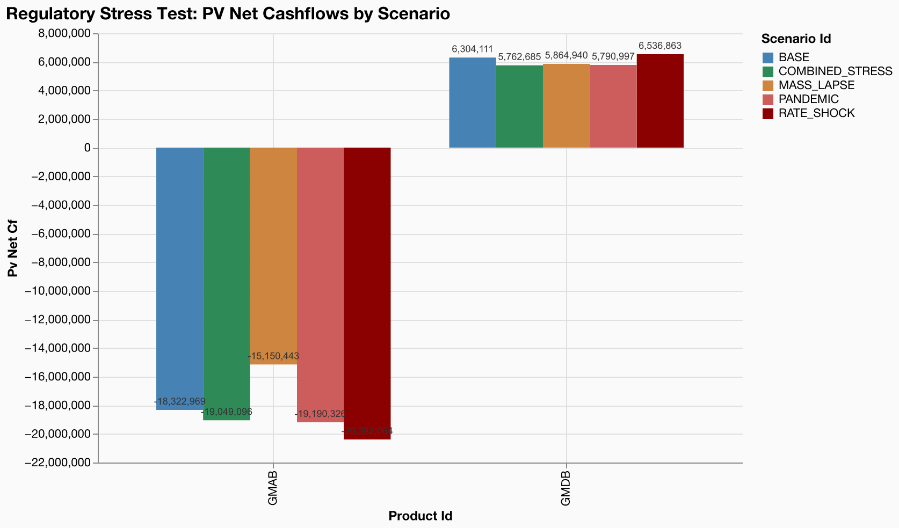

# Scenario Comparison -- Regulatory Stress Test

**Model**: gaspatchio appliedlife VA | **Points**: 8 | **Scenarios**: 5 | **Runtime**: 1.53s

## Executive Summary

The model was run across 5 scenarios covering pandemic, interest rate, lapse, and combined adverse stresses. The worst-case scenario is **RATE_SHOCK** with a **-15.3%** impact on PV of net cashflows vs the base case. GMAB products show greater sensitivity to interest rate shocks (11.3% impact) than GMDB products (3.7% impact).

## Scenario Configuration

| Scenario | Description | Parameter Changes |
| --- | --- | --- |
| BASE | Current best-estimate assumptions | No shocks (base case) |
| PANDEMIC | Severe pandemic: mortality +50% ages 65+, +20% younger, lapses -30% | multiply to mortality_select by 1.5 to mortality_select WHERE attained_age ≥ 65; multiply to mortality_select by 1.2 to mortality_select WHERE attained_age < 65; multiply to lapse_rates by 0.7 |
| RATE_SHOCK | Sudden rate drop: risk-free rates -200bp across all years | add to risk_free_rates -0.02 |
| MASS_LAPSE | Mass lapse event: lapse rates doubled | multiply to lapse_rates by 2.0 |
| COMBINED_STRESS | Combined adverse: pandemic + rate shock + expense inflation | multiply to mortality_select by 1.3; add to risk_free_rates -0.01; multiply to space_params.expense_maint by 1.2; multiply to lapse_rates by 1.3 |

## Scenario Parameters (scenarios.json)

```json
[
  {
    "id": "BASE",
    "description": "Current best-estimate assumptions"
  },
  {
    "id": "PANDEMIC",
    "description": "Severe pandemic: mortality +50% ages 65+, +20% younger, lapses -30%",
    "shocks": [
      {"table": "mortality_select", "multiply": 1.5, "where": {"attained_age": {"gte": 65}}},
      {"table": "mortality_select", "multiply": 1.2, "where": {"attained_age": {"lt": 65}}},
      {"table": "lapse_rates", "multiply": 0.7}
    ]
  },
  {
    "id": "RATE_SHOCK",
    "description": "Sudden rate drop: risk-free rates -200bp across all years",
    "shocks": [{"table": "risk_free_rates", "add": -0.02}]
  },
  {
    "id": "MASS_LAPSE",
    "description": "Mass lapse event: lapse rates doubled",
    "shocks": [{"table": "lapse_rates", "multiply": 2.0}]
  },
  {
    "id": "COMBINED_STRESS",
    "description": "Combined adverse: pandemic + rate shock + expense inflation",
    "shocks": [
      {"table": "mortality_select", "multiply": 1.3},
      {"table": "risk_free_rates", "add": -0.01},
      {"table": "space_params", "multiply": 1.2, "column": "expense_maint"},
      {"table": "lapse_rates", "multiply": 1.3}
    ]
  }
]

```

## Results Summary

| scenario_id | pv_net_cf | pv_claims | pv_expenses | pv_premiums | pv_inv_income | pv_av_change | vs_base |
| --- | --- | --- | --- | --- | --- | --- | --- |
| BASE | -12,018,857 | 321,588,228 | 1,634,088 | 0.00 | -1,990,676 | -313,194,135 | 0.0% |
| COMBINED_STRESS | -13,286,411 | 337,751,557 | 1,904,514 | 0.00 | -1,689,936 | -328,059,596 | -10.5% |
| MASS_LAPSE | -9,285,503 | 327,767,622 | 1,414,162 | 0.00 | 236,391 | -319,659,891 | 22.7% |
| PANDEMIC | -13,399,329 | 321,724,562 | 1,671,032 | 0.00 | -2,061,109 | -312,057,375 | -11.5% |
| RATE_SHOCK | -13,855,201 | 349,010,927 | 1,713,530 | 0.00 | -3,280,037 | -340,149,294 | -15.3% |

## Product: GMAB

| scenario_id | pv_net_cf | pv_claims | pv_expenses | vs_base |
| --- | --- | --- | --- | --- |
| BASE | -18,322,969 | 162,610,179 | 815,107 | 0.0% |
| COMBINED_STRESS | -19,049,096 | 169,081,156 | 955,382 | -4.0% |
| MASS_LAPSE | -15,150,443 | 160,304,199 | 713,936 | 17.3% |
| PANDEMIC | -19,190,326 | 163,853,486 | 827,943 | -4.7% |
| RATE_SHOCK | -20,392,064 | 177,015,506 | 854,441 | -11.3% |

## Product: GMDB

| scenario_id | pv_net_cf | pv_claims | pv_expenses | vs_base |
| --- | --- | --- | --- | --- |
| BASE | 6,304,111 | 158,978,049 | 818,982 | 0.0% |
| COMBINED_STRESS | 5,762,685 | 168,670,401 | 949,133 | -8.6% |
| MASS_LAPSE | 5,864,940 | 167,463,423 | 700,227 | -7.0% |
| PANDEMIC | 5,790,997 | 157,871,076 | 843,089 | -8.1% |
| RATE_SHOCK | 6,536,863 | 171,995,421 | 859,089 | 3.7% |

## Scenario Comparison



## Key Risk Indicators

- [WARNING] **COMBINED_STRESS**: PV net CF change of -10.5% exceeds 10% warning threshold
- [BREACH] **MASS_LAPSE**: PV net CF change of +22.7% exceeds 20% breach threshold
- [WARNING] **PANDEMIC**: PV net CF change of -11.5% exceeds 10% warning threshold
- [WARNING] **RATE_SHOCK**: PV net CF change of -15.3% exceeds 10% warning threshold

## Key Findings

- **RATE_SHOCK** is the worst-case scenario with a -15.3% impact on total PV of net cashflows.
- Impact ranking (largest to smallest): MASS_LAPSE (+22.7%), RATE_SHOCK (-15.3%), PANDEMIC (-11.5%), COMBINED_STRESS (-10.5%).
- The combined stress (-10.5%) differs from the sum of individual stresses (-4.0%) by -6.5 percentage points, revealing compounding risk.
- GMAB products are more sensitive to rate shocks (11.3% change) than GMDB products (3.7% change), reflecting the longer duration of guarantee-linked liabilities.
- Of 4 stress scenarios, **1** breach the 20% threshold and **3** trigger the 10% warning level.

## Audit Trail

- **Generated**: 2026-03-24 23:32:11 UTC
- **Model**: gaspatchio appliedlife VA
- **Model Points**: 8 (2023Q4IF)
- **Projection**: 82 months
- **Scenario Config**: scenarios.json
- **Runtime**: 1.53s

### Scenario Descriptions

# Scenario Configuration

## BASE

- *No shocks (base case)*

## PANDEMIC

- multiply to mortality_select by 1.5 to mortality_select WHERE attained_age ≥ 65
- multiply to mortality_select by 1.2 to mortality_select WHERE attained_age < 65
- multiply to lapse_rates by 0.7

## RATE_SHOCK

- add to risk_free_rates -0.02

## MASS_LAPSE

- multiply to lapse_rates by 2.0

## COMBINED_STRESS

- multiply to mortality_select by 1.3
- add to risk_free_rates -0.01
- multiply to space_params.expense_maint by 1.2
- multiply to lapse_rates by 1.3

