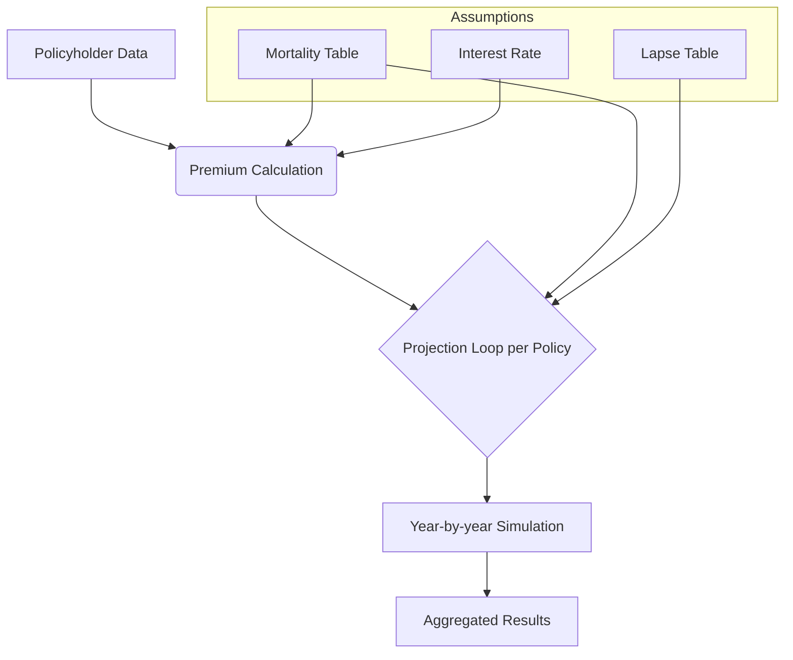
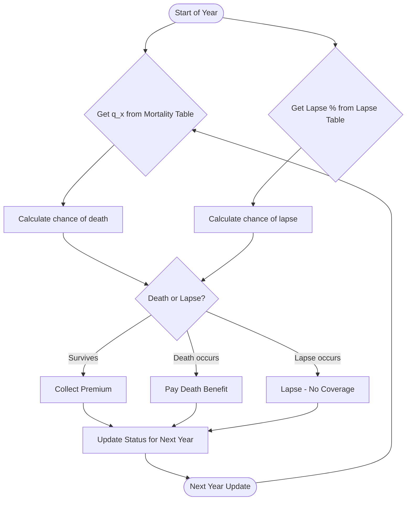

# Life Insurance Model Documentation

## 1. Policy Data and Assumptions

### Policyholder Data (Input)
- **Policyholder ID:** A unique identifier for each policy (in this model 1 through 100).  
- **Issue Age:** The age of the insured at policy start. In the model, ages are randomly generated with a mean around 45 years (using a normal distribution) and rounded to the nearest whole year.  
- **Gender:** The sex of the insured, randomly assigned as Male (M) or Female (F) with roughly equal probability.  
- **Smoking Status:** An indicator of tobacco use, randomly assigned as Smoker (S) or Non-Smoker (NS) with equal probability. This is used to adjust mortality rates (smokers typically have higher mortality).  
- **Sum Assured:** The face amount (death benefit) of the policy. In the model, this is a randomized value with a minimum of \$100,000, generated around an average of \$500,000.  
- **Policy Term (Duration):** The length of coverage (in years) from issue. This model assigns a random term, roughly around 8 years on average. 

### Mortality Assumptions (Mortality Table)
A **mortality table** provides annual mortality rates (q_x) for each combination of age, gender, and smoking status.

| **Age** | **Male Smoker q_x** | **Male Non-Smoker q_x** | **Female Smoker q_x** | **Female Non-Smoker q_x** |
|--------:|--------------------:|------------------------:|----------------------:|--------------------------:|
| 30      | 0.0020             | 0.0010                  | 0.0015                | 0.0008                    |
| 40      | 0.0050             | 0.0025                  | 0.0030                | 0.0015                    |
| 50      | 0.0120             | 0.0060                  | 0.0080                | 0.0040                    |

### Lapse Assumptions (Lapse Table)
| **Policy Year** | **Annual Lapse Rate** |
|---------------:|----------------------:|
| 1             | 10%                     |
| 2             | 8%                      |
| 3             | 6%                      |
| 4             | 5%                      |
| 5+            | 3%                      |

### Interest Rate Assumption
The **Interest rate** assumption is crucial for discounting cash flows. A constant **annual interest rate** (e.g., 5% per year) is used in the model.

## 2. Formulas and Calculations

### Premium Rate Calculation
The **Premium rate** sheet computes the level annual premium based on:

\$\$
\text{PV\_Benefits} = \sum_{t=1}^{T} \Big( {}_{t-1}p_x \times q_{x+t-1} \times v^t \times \text{SumAssured} \Big)
\$\$

\$\$
\text{PV\_Premiums} = \sum_{t=1}^{T} \Big( {}_{t-1}p_x \times v^{t-1} \Big)
\$\$

\$\$
P = \frac{\text{PV\_Benefits}}{\text{PV\_Premiums}}
\$\$

### Projection Cash Flow Calculations
For each policy, the projection logic follows these steps in each period:
1. **Determine Starting Status for the Period**
2. **Lookup Mortality Rate**
3. **Lookup Lapse Rate**
4. **Apply Mortality and Lapse to Determine Policy Status**
5. **Calculate Cash Flows** (Premium Income, Death Benefit Outgo, Lapse Effects)
6. **Update Policy Status for Next Period**

## 3. Step-by-Step Breakdown (for Python Implementation)

1. **Read Input Data:** Load policy data and assumption tables.
2. **Calculate Premium for Each Policy:** Compute net premium formula.
3. **Set Initial Status for Projection:** Set initial attained age and in-force status.
4. **Projection Loop:** Iterate year by year for mortality and lapse.
5. **Aggregate Results (if needed):** Sum total premiums, claims, and policies in force.
6. **Output and Validate:** Generate summary outputs and compare results.

## 4. Key Tables and Data Relationships

- **Mortality Table**: Provides q_x by age and risk class.
- **Lapse Table**: Provides lapse rates by policy year.
- **Policy Data Table**: Contains policyholder attributes.
- **Premium Calculation Table**: Calculates the premium per policy.
- **Projection Table**: Tracks year-by-year cash flows.

## 5. Flow Diagrams (Calculation Flowcharts)

## 6. Markdown Formatting and Structure

This document is structured using **headings**, **tables**, **Mermaid diagrams**, and **LaTeX-style formulas** for clarity. The document is designed for actuarial experts and LLM specialists to implement a life insurance projection model in Python.
