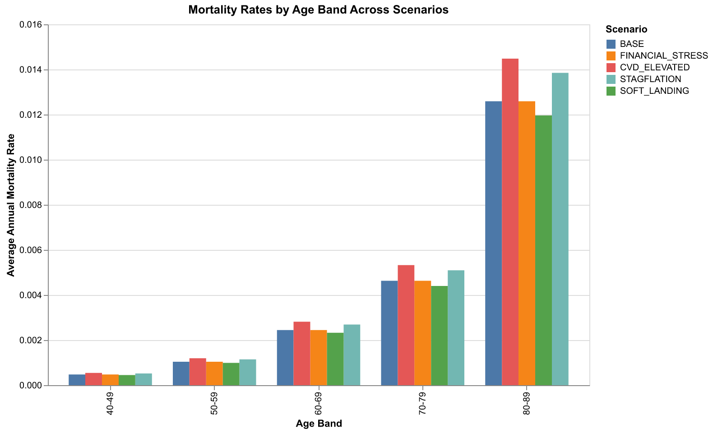
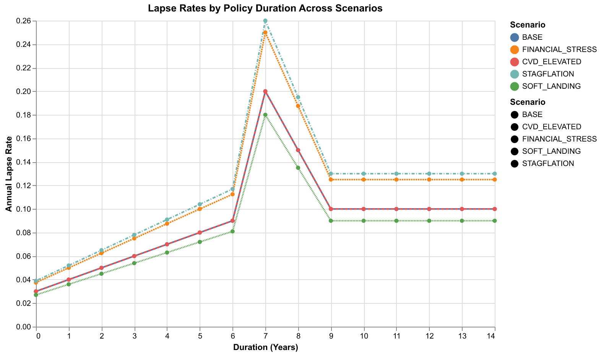
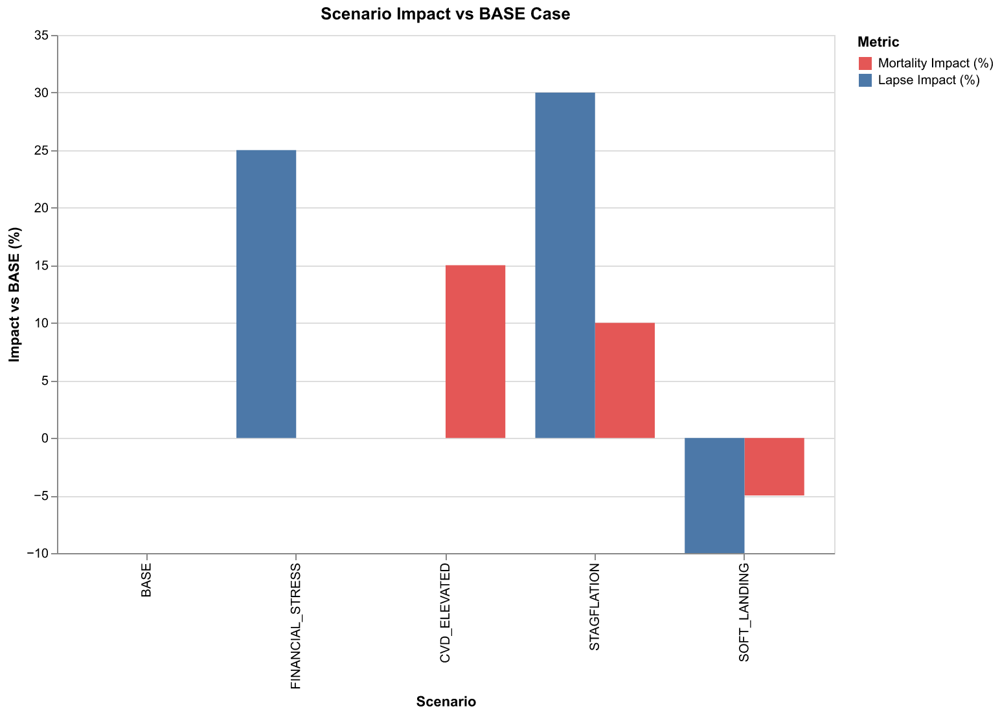

# Actuarial Scenario Analysis Report
## Macroeconomic Stress Testing - December 2025

**Report Date:** December 08, 2025

**Prepared by:** Actuarial Modeling Team

**Model:** Applied Life GMDB/GMAB Variable Annuity

---

## Executive Summary

This report presents the results of scenario stress testing based on current macroeconomic
conditions as of December 2025. Five scenarios were analyzed to assess the sensitivity of
mortality and lapse assumptions to potential economic developments.

### Key Findings

1. **STAGFLATION** scenario shows the most adverse combined impact (+10% mortality, +30% lapses)
2. **FINANCIAL_STRESS** scenario isolates lapse risk from household financial strain (+25% lapses)
3. **CVD_ELEVATED** scenario captures post-pandemic mortality trends (+15% mortality)
4. **SOFT_LANDING** scenario represents the optimistic outcome with modest improvements

### Summary Results

| Scenario | Mortality (60-80) | Lapse (0-10yr) | Mort Impact | Lapse Impact |
|----------|-------------------|----------------|-------------|--------------|
| BASE | 0.0708 | 0.9700 | +0.0% | +0.0% |
| FINANCIAL_STRESS | 0.0708 | 1.2125 | +0.0% | +25.0% |
| CVD_ELEVATED | 0.0814 | 0.9700 | +15.0% | +0.0% |
| STAGFLATION | 0.0778 | 1.2610 | +10.0% | +30.0% |
| SOFT_LANDING | 0.0672 | 0.8730 | -5.0% | -10.0% |

---

## Macroeconomic Context

### Current Conditions (December 2025)

| Indicator | Current Level | Trend | Risk Assessment |
|-----------|---------------|-------|-----------------|
| Fed Funds Rate | 3.75-4.00% | Pausing | Moderate |
| Inflation (CPI) | 3.0% | Persistent | Elevated |
| Household Debt | $18.6T | All-time high | High |
| Credit Card Debt | $1.23T | All-time high | High |
| Recession Probability | ~40% | Elevated | Elevated |
| S&P 500 YTD | +17% | Strong | Concentration Risk |
| US Life Expectancy | 78.4 years | Improving | Moderate |

### Key Risk Drivers

- **K-Shaped Economy:** Top 10% hold 87% of equities; 42% of Americans live paycheck-to-paycheck
- **Financial Stress:** 38% report difficulty paying bills; delinquencies at highest since 2020
- **Mortality Trends:** Youth mortality rising; chronic disease (diabetes, Alzheimer's) increasing
- **Market Risk:** AI-concentrated rally; Info Tech +70% from April low creates drawdown risk
- **Policy Uncertainty:** 43-day government shutdown impacted Q4; tariff concerns persist

---

## Scenario Definitions

### 1. BASE (No Shocks)

**Description:** Base case - no shocks applied

**Rationale:** Current assumptions without modification

**Configuration:**
```json
{
  "id": "BASE"
}
```

---

### 2. FINANCIAL_STRESS (+25% Lapses)

**Description:** Financial stress lapse scenario (+25% lapses)

**Rationale:** Household debt at $18.6T all-time high, credit card debt at record $1.23T, delinquencies at highest level since 2020, 42% living paycheck-to-paycheck

**Configuration:**
```json
{
  "id": "FINANCIAL_STRESS",
  "shocks": [
    {
      "table": "lapse",
      "multiply": 1.25
    }
  ]
}
```

**Key Assumptions:**
- Consumer financial stress at multi-year highs
- Credit card delinquencies doubled since 2021
- Excess pandemic savings depleted
- Lower-income households most affected

---

### 3. CVD_ELEVATED (+15% Mortality)

**Description:** Elevated cardiovascular/substance abuse mortality (+15%)

**Rationale:** Rising mortality among youth/young adults, increased chronic disease prevalence (diabetes, Alzheimer's, kidney disease), US life expectancy still 4.1 years below peer nations

**Configuration:**
```json
{
  "id": "CVD_ELEVATED",
  "shocks": [
    {
      "table": "mortality",
      "multiply": 1.15
    }
  ]
}
```

**Key Assumptions:**
- Rising mortality rates among adolescents and young adults
- Chronic disease deaths increasing (diabetes, Alzheimer's, kidney disease)
- US had smallest decline in chronic disease deaths among 25 high-income nations
- Life expectancy gap vs peer nations persists at 4.1 years

---

### 4. STAGFLATION (+10% Mortality, +30% Lapses)

**Description:** Stagflation stress scenario (+10% mortality, +30% lapses)

**Rationale:** 40% recession probability with persistent 3.0% inflation, K-shaped economy with mounting financial stress among lower-income households, potential Deloitte recession scenario Q4 2026

**Configuration:**
```json
{
  "id": "STAGFLATION",
  "shocks": [
    {
      "table": "mortality",
      "multiply": 1.1
    },
    {
      "table": "lapse",
      "multiply": 1.3
    }
  ]
}
```

**Key Assumptions:**
- Recession materializes Q4 2026 (Deloitte scenario)
- Unemployment rises to 5% (from current 4.2%)
- K-shaped divide widens - lower-income segments disproportionately affected
- Healthcare access and chronic disease management impacted by financial stress

---

### 5. SOFT_LANDING (-10% Lapses, -5% Mortality)

**Description:** Soft landing scenario (-10% lapses, -5% mortality)

**Rationale:** Fed has cut 50bps in 2025, labor market remains resilient, US life expectancy gained 0.9 years in 2023 (largest single-year gain), global life expectancy recovering to pre-pandemic levels

**Configuration:**
```json
{
  "id": "SOFT_LANDING",
  "shocks": [
    {
      "table": "lapse",
      "multiply": 0.9
    },
    {
      "table": "mortality",
      "multiply": 0.95
    }
  ]
}
```

**Key Assumptions:**
- Fed achieves soft landing with controlled rate cuts
- Labor market remains resilient
- Consumer confidence improves
- Mortality improvement trend resumes

---

## Results Analysis

### Mortality Impact by Age Band



**Observations:**
- CVD_ELEVATED and STAGFLATION scenarios show materially higher mortality across all age bands
- Impact is proportionally consistent across ages (multiplicative shock)
- Older age bands (70-79, 80-89) show largest absolute increases
- SOFT_LANDING provides modest mortality improvement

---

### Lapse Rate Impact by Duration



**Observations:**
- STAGFLATION shows highest lapse rates across all durations
- FINANCIAL_STRESS shows significant but lower lapse elevation
- Early duration lapses (years 0-5) most impacted in adverse scenarios
- SOFT_LANDING shows improved persistency throughout

---

### Combined Impact vs BASE



**Observations:**
- STAGFLATION represents worst combined outcome
- Lapse impacts generally larger than mortality impacts in stress scenarios
- SOFT_LANDING provides ~5% mortality improvement and ~10% lapse improvement
- BASE scenario anchors all comparisons

---

## Risk Assessment

### Probability-Weighted Impact

| Scenario | Estimated Probability | Mortality Impact | Lapse Impact | Weighted Impact |
|----------|----------------------|------------------|--------------|-----------------|
| BASE | 35% | 0.0% | 0.0% | 0.0% |
| FINANCIAL_STRESS | 25% | 0.0% | +25.0% | +6.25% lapse |
| CVD_ELEVATED | 15% | +15.0% | 0.0% | +2.25% mort |
| STAGFLATION | 15% | +10.0% | +30.0% | +1.5% mort, +4.5% lapse |
| SOFT_LANDING | 10% | -5.0% | -10.0% | -0.5% mort, -1.0% lapse |

**Expected Impact (Probability-Weighted):**
- Mortality: +3.25% above BASE
- Lapse: +9.75% above BASE

---

## Recommendations

### Immediate Actions

1. **Reserve Strengthening:** Consider 5-10% reserve margin for lapse-sensitive products
2. **Hedging Review:** Assess GMDB/GMAB hedge effectiveness under equity stress scenarios
3. **Monitoring:** Implement monthly tracking of lapse rates by duration and demographic

### Medium-Term Actions

1. **Pricing Updates:** Reflect elevated lapse assumptions in new business pricing
2. **Mortality Study:** Conduct experience study to validate post-pandemic mortality trends
3. **Stress Testing:** Expand scenario set to include equity drawdown impacts on guarantees

### Governance

1. **Quarterly Review:** Present scenario results to Risk Committee quarterly
2. **Assumption Updates:** Review decrement assumptions at next annual assumption review
3. **Documentation:** Maintain audit trail of all scenario configurations and results

---

## Appendix: Technical Details

### Data Sources

- **Mortality Tables:** SOA 2017 CSO Select Tables (T3275)
- **Lapse Rates:** Company experience study (L001 table)
- **Economic Data:** Federal Reserve, BLS, NY Fed, Conference Board

### Methodology

- Scenarios applied as multiplicative or additive shocks to base tables
- Metrics computed as summed rates across specified age/duration ranges
- Charts generated using Altair visualization library
- All calculations performed in Gaspatchio actuarial framework

### Limitations

- Point-in-time analysis based on December 2025 conditions
- Does not include investment return scenarios (equity stress)
- Assumes independence between mortality and lapse shocks
- Base assumptions may require updating based on emerging experience

---

*This report was generated using the Gaspatchio actuarial modeling framework.*

*Report generated on December 08, 2025*
