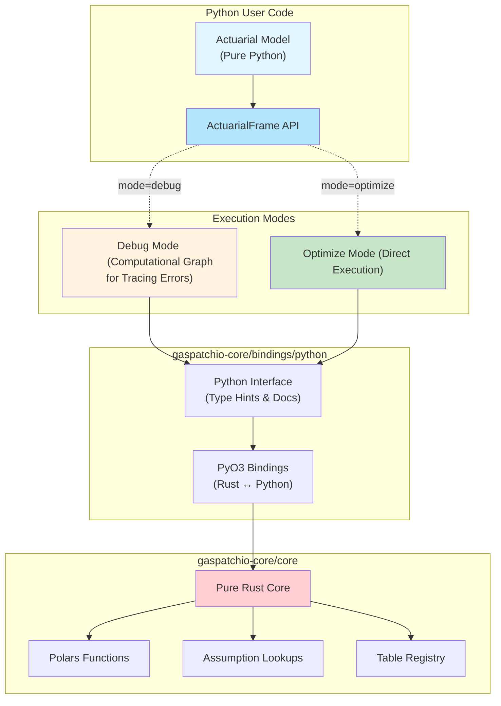

# Gaspatchio Core

Gaspatchio is a high-performance actuarial modeling framework that combines Python's simplicity with Rust's performance. It's designed for building and running actuarial models at scale, processing millions of policy projections efficiently while maintaining Excel function compatibility.

**New to Gaspatchio?** Start with the [Architecture Summary](ref/ARCHITECTURE_SUMMARY.md) for a comprehensive overview of key design decisions and technical motivations behind the framework.

## Overview

Gaspatchio represents a modern approach to actuarial modeling, addressing the fundamental tension between the need for debuggable, maintainable models and the performance requirements of production systems. Here's what makes it unique:

### Key Design Decisions

The framework evolved over time. Each major decision is documented in the [ref/](ref/) directory:

1. **[Python-Native DSL](ref/01-dsl/)** - Write models in Python, not a custom language
2. **[ActuarialFrame Abstraction](ref/02-assumptions/)** - DataFrames enhanced for actuarial projections
3. **[Core/Bindings Separation](ref/03-library-isolation/)** - Pure Rust core with language bindings
4. **[High-Performance Lookups](ref/04-assumption-lookup/)** - O(1) assumption table access
5. **[Polars Integration](ref/05-dsl-polars-wrapper/)** - Leverage best-in-class DataFrame library
6. **[Domain Namespacing](ref/07-dsl-namespacing/)** - Organized, discoverable actuarial functions
7. **[Type-Safe Proxies](ref/09-concrete-proxies/)** - Full IDE support with autocompletion
8. **[Contextual Errors](ref/13-error-handling/)** - Actionable error messages for model debugging

### Why This Matters for Actuaries

- **Excel Function Compatibility**: Working toward comprehensive Excel function support (currently partial coverage)
- **Vector Operations**: Natural support for time-based projections and mortality tables
- **Assumption Management**: Efficient lookup tables with automatic transformations
- **Debugging**: Enhanced error messages and operation tracing during development
- **Performance**: High-performance Polars engine for production workloads
- **AI-Ready**: Designed for LLM-assisted development with comprehensive documentation

### Enhanced Debugging and Tracing

Actuarial models in Gaspatchio are written in pure Python with a familiar DataFrame API. The framework provides two execution modes for different development needs:
- **Debug Mode**: Enhanced tracing and logging for detailed error messages and operation tracking
- **Optimize Mode**: Streamlined execution with minimal overhead for production performance

Both modes use the same high-performance Polars engine underneath, with debug mode providing additional introspection capabilities to help actuaries understand and troubleshoot their models.


## Architecture Overview



## Project Architecture

This project follows a modular architecture with clear separation of concerns:

### 1. Core Rust Library (`gaspatchio-core/core`)
- Contains all core functionality, data structures, and algorithms
- No PyO3 dependencies or references
- Benchmarkable and testable in pure Rust
- Includes all lookup registry logic, HashMap building, and plugin expressions
- Integration and unit tests for all functionality
- Move to the `core` directory to run the core library (`cd core`)
- For more details, see the [Core README](core/README.md).

```
gaspatchio-core/core/
├── benches/
│   └── fixtures/           # Benchmark data fixtures
└── src/
    └── polars_functions/   # Core Polars function implementations
├── tests/                  # Integration tests (Note: Need to confirm if this still exists or moved)
└── Cargo.toml              # Core dependencies only
```

### 2. PyO3 Bindings in Rust (`gaspatchio-core/bindings/python`)
- Thin layer that exposes core functionality to Python
- Handles conversion between Python and Rust types
- Only place where PyO3 dependencies should exist
- No business logic, only binding code
- Built using Matruin (`matruin build -uv`)
- For more details, see the [Python Bindings README](bindings/python/README.md).

```
gaspatchio-core/bindings/python/
├── src/                    # PyO3 module definition and binding code
├── jobs/                   # Example job scripts (if applicable)
├── scripts/                # Utility scripts
├── tests/                  # Python binding tests
└── Cargo.toml              # PyO3 and core dependencies
```

### 3. Python Interface (`gaspatchio-core/bindings/python/gaspatchio_core`)
- Pure Python code for user-friendly interface
- Polars plugin registration
- Type conversions and convenience functions
- Documentation and examples
- Test using pytest (`uv run pytest -v`)
- For more details, see the [Python Bindings README](bindings/python/README.md) (as `gaspatchio_core` is part of the `bindings/python` module).

```
gaspatchio-core/bindings/python/gaspatchio_core/
├── __init__.py             # Package exports
├── functions.py            # Plugin function wrappers (if still used)
├── registry.py             # TableRegistry Python interface (if still used)
└── typing.py               # Type definitions (if still used)
```

### Motivation for This Architecture

This separation provides several benefits:
1. **Core Library Purity**: The core Rust implementation remains focused and PyO3-free, making it easier to test, benchmark, and maintain.
2. **Multiple Bindings**: Future bindings to other languages (R, JavaScript, etc.) can be added without modifying the core library.
3. **Testing Efficiency**: Core functionality can be tested in Rust without Python dependencies, allowing for faster test cycles.
4. **Performance Optimization**: Benchmarking can be done directly on the core library, ensuring optimal performance.
5. **Maintainability**: Changes to the Python interface don't require recompiling the Rust code, and vice versa.

## Technical Deep Dive

### ActuarialFrame: The Core Abstraction

At the heart of Gaspatchio is the `ActuarialFrame` - a DataFrame designed specifically for actuarial projections:

```python
# Create projection timeline using vector operations
af["proj_months"] = af.fill_series(af["num_proj_months"], 0, 1)
af["age"] = af["age"] + (af["proj_months"] / 12)

# Multi-dimensional assumption lookups
af["mortality_rate"] = gs.assumption_lookup(
    "age-last", "variable", table_name="mortality_rates"
)

# Actuarial calculations with list operations
af["P[IF]"] = pl.col("monthly_persist_prob").cum_prod().shift(1).fill_null(1.0)

# Excel function compatibility
af["year_frac"] = af["effective_date"].excel.yearfrac(af["date"], 0)
```

### Performance Architecture

The dual execution mode is achieved through careful API design:

1. **Debug Mode**: Operations execute with enhanced tracing and logging for debugging
2. **Optimize Mode**: Operations execute with minimal overhead for performance

```python
# Same code, different execution modes
af = ActuarialFrame(data, mode="optimize")  # Optimized execution
af = ActuarialFrame(data, mode="debug")     # Debug execution with tracing
```

### Assumption Management

Gaspatchio provides O(1) lookup performance for assumption tables through HashMap-based indexing:

```python
# Register assumption tables once
registry = TableRegistry()
registry.register("mortality", mortality_df)
registry.register("lapse", lapse_df)

# Efficient lookups in projections
af["mortality_rate"] = gs.assumption_lookup("age-last", "variable", table_name="mortality_rates")
```

### Project Documentation

For comprehensive documentation, including guides, concepts, and API references, please visit the official Gaspatchio documentation site:
- [Gaspatchio Documentation](https://opioinc.github.io/gaspatchio-docs/)

### For AI, LLMs, and Automated Tooling

Gaspatchio is designed with AI-assisted development in mind. We provide specific resources to help language models and automated tools understand and interact with the project:

- **`llms.txt`**: [https://opioinc.github.io/gaspatchio-docs/llms.txt](https://opioinc.github.io/gaspatchio-docs/llms.txt)
  - Provides concise, LLM-friendly context, guidance, and links to key documentation sections. This follows the emerging `llms.txt` convention (llmstxt.org), designed to give LLMs essential, structured information about a project or website efficiently.
- **`llms-full.txt`**: [https://opioinc.github.io/gaspatchio-docs/llms-full.txt](https://opioinc.github.io/gaspatchio-docs/llms-full.txt)
  - An expanded version, potentially including content from linked resources mentioned in `llms.txt`. This offers a more comprehensive context suitable for deeper analysis or more complex query answering.

This approach, inspired by the AI-first design of Gaspatchio (see [Building Actuarial Models with AI](https://opioinc.github.io/gaspatchio-docs/ai/intro/)), helps ensure that AI tools can effectively assist in the development, analysis, and understanding of models built with this framework.
