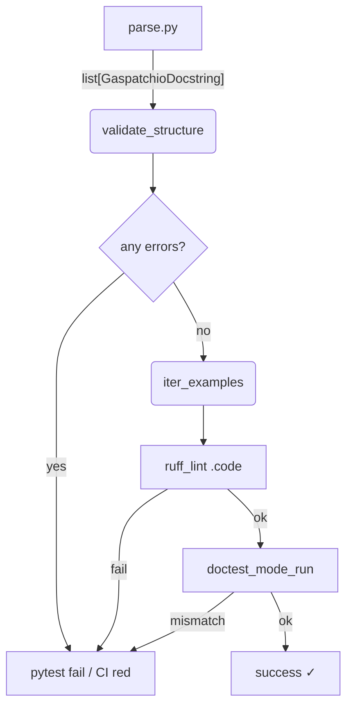

Below is a **design / implementation specification** for turning *doc\_string\_parser.py* into the "one-stop" engine that

* parses every Gaspatchio docstring into a strict pydantic model
* validates structure **and** Example blocks
* lints & executes examples in a **pytest-examples** style workflow (with Ruff + doctest compatibility)
* optionally rewrites docstrings in-place (`run_print_update`)
* still allows `uv run pytest -v --doctest-modules` to succeed unchanged.

---

## 1  High-level objectives

| # | Objective                                                                                                                                           | Why it matters                                              |
| - | --------------------------------------------------------------------------------------------------------------------------------------------------- | ----------------------------------------------------------- |
| 1 | Preserve existing `GaspatchioDocstringParser.process_files()` behaviour so core RAG ingestion keeps working.                                        | Non-breaking change.                                        |
| 2 | Add a *validation & execution* phase that surfaces clear errors **before** RAG ingestion.                                                           | Prevents garbage-in embeddings.                             |
| 3 | Reuse the excellent ergonomics of `pytest-examples` (`find_examples`, `run_print_check`, `run_print_update`).                                       | Consistent contributor DX.                                  |
| 4 | Guarantee each Example block passes **three gates**: Ruff lint → doctest importability → runtime value check.                                       | Catches stale snippets early.                               |
| 5 | Expose programmatic API *(e.g. `GaspatchioDocstring.validate(strict=True)`)* so tooling / pre-commit hooks and future MCP-server flows can call it. | Lets Cursor or MCP servers surface rich feedback instantly. |

---

## 2  Proposed module / package layout

```
gaspatchio-core/bindings/python/gaspatchio_core/
│
├─ examples/docstrings/
│   ├─ parse.py                  # *mostly* the current doc_string_parser.py (renamed)
│   ├─ models.py                 # pydantic models (DocstringParameter …)
│   ├─ validate.py               # structural validation + Ruff lint + doctest runner
│   ├─ rewrite.py                # run_print_update helpers
│   ├─ pytest_plugin.py          # registers find_examples() + param test
│   └─ __init__.py
│
├─ tests/examples/docstrings/
│   └─ test_parse.py             # @test_parse.py
└─ ...

```

> **Why split files?** `parse.py` stays import-only (no side-effects) so it can be reused by RAG ingestion *without* bringing in Ruff / pytest at runtime.

---

## 3  Enriched pydantic models

Add methods (no external deps) so they can be called both from the pytest plugin and the CLI:

```python
class GaspatchioDocstring(BaseModel):
    ...
    def validate_structure(self) -> list[str]:
        """Return a list of human-readable issues (empty == OK).

        Checks:
        - short_description exists
        - parameter count + names match inspect.signature()
        - each Example has at least one '>>>' line
        - examples[#].output is non-empty **if** snippet ends with a pure expression
        - returns section present when fn actually returns non-None
        """

    def iter_examples(self) -> Iterable[DocstringCodeExample]:
        ...
```

Each `DocstringCodeExample` gains:

```python
class DocstringCodeExample(BaseModel):
    ...
    def lint(self) -> list[str]:          # Ruff via stdin / API
    def run(self, globals: dict) -> tuple[str, Any]:
        """
        Execute code in a fresh module-level namespace.
        Returns (captured_stdout, last_expr_value)
        """
```

---

## 4  Validation + execution pipeline



### 4.1 Ruff integration

This section outlines how docstring examples are linted using Ruff directly via its Python API. This approach is similar to how a tool like `pytest-examples` would integrate Ruff for linting code snippets. Ruff will be configured using the `pyproject.toml` file located at the root of the repository (see section "11 Open questions & recommended next steps" for more on configuration specifics, including custom `noqa` directives).

```python
from ruff import check

# Assuming 'code' is the string content of the example snippet
# and 'virtual_filename' is a placeholder for context (e.g., 'docstring_example.py')
problems = check(source=code, filename=virtual_filename)

if problems:
    # Handle or report linting issues found by Ruff
    for problem in problems:
        print(f"Ruff issue: {problem['message']} at line {problem['location']['row']}")
```

*We call Ruff in-process using its `check` function for optimal performance. A fallback to `subprocess.run(["ruff", "-"], …)` could be considered if direct import is problematic, though direct API usage is preferred.*

### 4.2 Doctest compatibility

We run each snippet twice:

1. **Plain doctest** via `doctest.DocTestRunner` against the raw snippet (ensures the `--doctest-modules` semantics still hold).
2. **pytest-examples** style execution: This involves a more sophisticated execution model:
    *   **Stdout Capture**: The system temporarily intercepts anything written to standard output (e.g., by redirecting `sys.stdout`) during the example's execution.
    *   **Expected Output**: The `DocstringCodeExample.output` attribute (detailed in section "4.3 Output matching rules") serves as the "golden" or expected output. This value might be manually authored or, in an update/accept mode, generated from a previous successful run.
    *   **Comparison**: After the example code executes, the captured stdout is compared against the expected `.output`. This comparison typically involves normalization steps (as outlined in "4.3 Output matching rules", such as `textwrap.dedent` and stripping trailing whitespace) to ensure the matching is robust against minor, inconsequential formatting differences.
    *   **Result**: If the normalized captured output matches the expected output, the example passes this check. A mismatch results in a test failure, often highlighting the discrepancies.

The snippet string already has `>>>` / `...`; doctest parses it directly.

### 4.3 Output matching rules

* If `DocstringCodeExample.output` is *not* `None`, we treat it as the golden stdout **exactly as printed in docs**.
* Otherwise we treat the *value* of the last expression as the expected result (mirrors `pytest-examples` "evaluate last expr" trick).
* We normalise whitespace using `textwrap.dedent` + `.rstrip()` before diffing.

---

## 5  Pytest plugin

`examples.docstrings.pytest_plugin` exposes:

```python
def pytest_configure(config):
    config.addinivalue_line(
        "markers",
        "examples.docstrings: execute & validate Gaspatchio docstring examples"
    )

def find_examples(root: Path) -> list[DocstringCodeExample]:
    docs = GaspatchioDocstringParser(root).process_files()
    return [ex for d in docs for ex in d.examples]
```

Generated tests:

```python
@pytest.mark.parametrize(
    "example",
    find_examples("src"),  # or project root
    ids=lambda ex: f"{ex.object_context}#{ex.example_index}"
)
def test_docstring_example(example: DocstringCodeExample, eval_example: EvalExample):
    # structural + Ruff lint first
    errors = example.lint()
    if errors:
        pytest.fail("\n".join(errors))

    if eval_example.update_examples:
        eval_example.format(example)          # black / isort optional
        eval_example.run_print_update(example)
    else:
        eval_example.lint(example)            # black string diff check
        eval_example.run_print_check(example)
```

> **Note**: We do *not* store Example snippets on disk; `pytest-examples` accepts an object implementing the `CodeExample` protocol, so our pydantic model works as-is.

---

## 6  Updating docstrings (`run_print_update`)

The `run_print_update` functionality allows for the automatic regeneration of example outputs within docstrings. This is particularly useful when code changes lead to different, but correct, example results.

*Strategy:* Regenerate the Example block **in-place**:

1.  **Execute Snippet & Capture Output**: The code snippet within the example block is executed. Standard output (stdout) from `print()` statements is captured. If the last line of the snippet is an expression (not a `print()` call) and its result is not `None`, its string representation (typically via `repr()`) is also captured. Specific Polars formatting (defined in `pyproject.toml` and applied via `pl.Config`) will be active during this capture for DataFrame outputs. This caters to:
    *   Pretty-printed `polars.DataFrame` objects (which have a rich string representation).
    *   Standard Python types like strings, integers, lists, etc.
    *   Any object with a suitable `__repr__` or `__str__` method.

2.  **Format New Output Block**: The captured stdout and/or the representation of the final expression is formatted into a new text block. For `print()` statements, this might follow a convention like `#> output_line`. For a final expression, its direct string output is used.
    Example for a Polars DataFrame (captured via its `repr`):
    ```rst
    >>> import polars as pl
    >>> df = pl.DataFrame({'a': [1, 2], 'b': [3, 4]})
    >>> df
    shape: (2, 2)
    ┌─────┬─────┐
    │ a   ┆ b   │
    │ --- ┆ --- │
    │ i64 ┆ i64 │
    ╞═════╪═════╡
    │ 1   ┆ 3   │
    │ 2   ┆ 4   │
    └─────┴─────┘
    ```
    Example for a simple print:
    ```rst
    >>> x = 10
    >>> print(f"Value is {x}")
    Value is 10
    ```

3.  **Locate & Patch Docstring**: Use Python's `ast` (Abstract Syntax Trees) and `tokenize` modules to precisely locate the start and end of the original docstring in the source file. The identified region corresponding to the old example output is then replaced with the newly formatted output block.

4.  **Overwrite File**: The modified file content is written back to disk, effectively updating the docstring in-place (often controlled by an `--inplace` or `--update-examples` flag).

5.  **Re-validate**: After updating, it's crucial to re-parse and re-validate the modified docstring (including linting and re-running the example) to ensure the automated patch has not introduced syntax errors or other issues.

---

## 7  Strictness matrix

| Check                      | Level *lenient* | Level *strict* (opt-in)                  |
| -------------------------- | --------------- | ---------------------------------------- |
| Missing *Examples* section | Warn            | **Fail**                                 |
| Parameter mismatch         | Warn            | **Fail**                                 |
| Ruff lint errors           | Skip            | **Fail**                                 |
| doctest runner             | Skip            | **Fail**                                 |
| `output` absent            | OK              | **Fail if snippet ends with expression** |

Expose via CLI:

```bash
gp-examples-docstrings-lint src/  --strict
```

---

## 8  CLI entry-points

* `gp-examples-docstrings-parse dir/ > artifacts/docstrings.json`
* `gp-examples-docstrings-lint  dir/ [--strict]`
* `gp-examples-docstrings-update dir/` (runs `run_print_update` wherever needed)

All three are thin wrappers around the core modules so they can be used in pre-commit or CI.

---

## 9  Example of end-to-end flow (developer experience)

```bash
# run whole suite including examples
uv run pytest -v

# just lint & run examples (fast CI target)
uv run pytest -m examples.docstrings

# accept recorded outputs & rewrite docs
uv run pytest -m examples.docstrings --accept      # sets eval_example.update_examples=1
```

`--doctest-modules` still passes because:

* The docstrings remain syntactically valid doctest blocks.
* Any examples that previously printed nothing still do so.
* The new validation layer *adds* tests; it does not remove doctest discovery.

---

## 10  Forward compatibility / RAG-specific hooks

* Every successful `GaspatchioDocstring` is serialisable to the same JSON we already emit.
* Add optional `embeddable_chunks()` yielding `(text, metadata)` tuples so the RAG pipeline can push *only* "good" docstrings to the vector store.
* Store Ruff / validate error messages in `docstring.metadata["lint_errors"]` so the LLM-RAG layer can surface them as hints ("this snippet is outdated – want me to fix it?").

---

## 11  Open questions & recommended next steps

| Question                                                         | Proposed answer                                                                                                                                   |
| ---------------------------------------------------------------- | ------------------------------------------------------------------------------------------------------------------------------------------------- |
| Where to execute examples that touch internal Rust (\_internal)? | Use `importlib.reload` on the package under test so that plugin-registered accessors are live; run in subprocess if risk of state bleed.          |
| Ruff config?                                                     | Ruff rules are defined in the main `pyproject.toml` at the repository root. Specific examples can be excluded from linting using a `# noqa: GP_DOC_EXAMPLE` comment. |
| How to ensure consistent Polars table formatting in `run_print_update`? | Define desired Polars formatting options (e.g., max rows, max cols, string length, float precision, cell alignment, table style like `POLARS_FMT_TABLE_FORMATTING`) in a dedicated section within the root `pyproject.toml` (e.g., `[tool.gaspatchio.polars.formatting]`). During `run_print_update`, these project-specific settings will be applied using a `with pl.Config(**config_from_pyproject):` context manager before calling `str(df)` or `repr(df)` on Polars objects. This ensures docstring outputs consistently match the intended project style and that formatting is scoped to the update process, avoiding global state changes. |
| Performance of full example suite?                               | Cache heavy fixtures (e.g., building an `ActuarialFrame` with large DF) with `lru_cache` across examples; parameterize expensive ones separately. |

---

### Milestone plan (2-3 PRs)

1. **PR-1:** Extract `models.py`, move existing parsing code unchanged.
2. **PR-2:** Add `validate_structure` + Ruff lint; integrate pytest plugin but mark tests `xfail` until examples fixed.
3. **PR-3:** Implement execution + output diff + rewrite; switch CI to strict mode.

Once merged, Gaspatchio gains **self-healing, self-documenting** docstrings that feed a bullet-proof RAG corpus.
