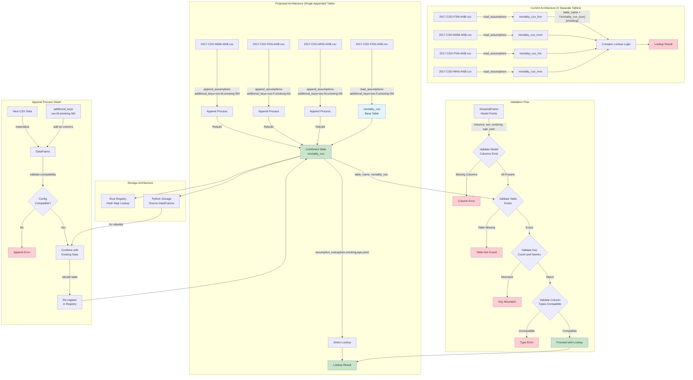
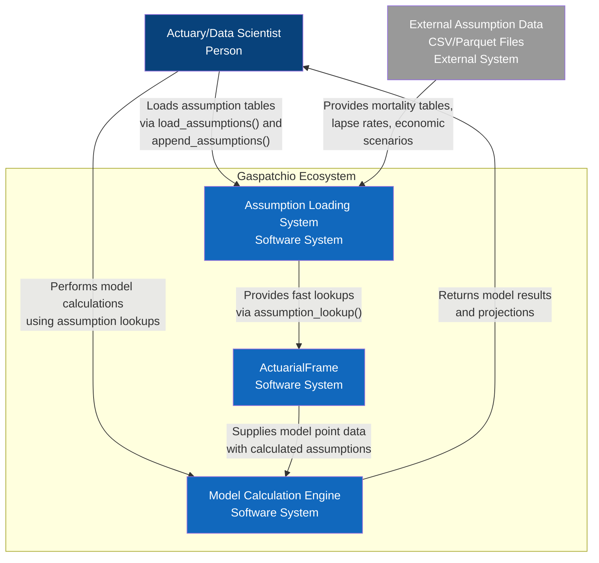
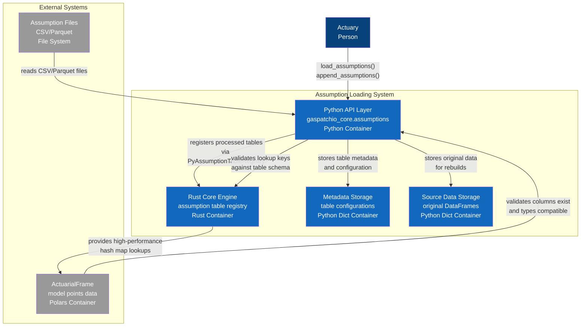
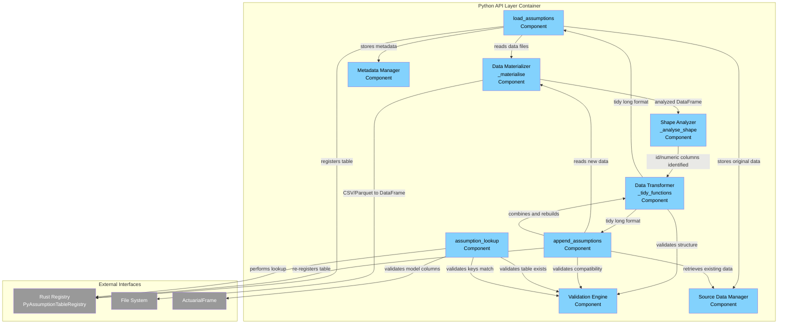
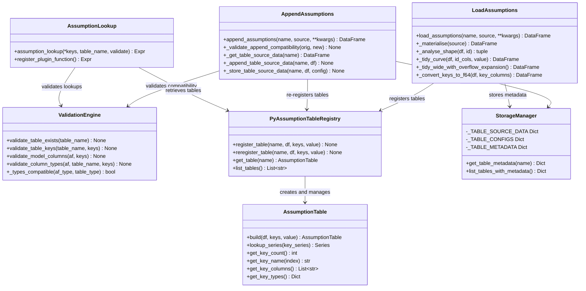

# Assumption Table Append Functionality Specification



## C4 Architecture Diagrams

### Level 1: System Context Diagram
*Shows the assumption loading system and its relationships with users and external systems*



### Level 2: Container Diagram  
*Shows the containers within the assumption loading system*



### Level 3: Component Diagram
*Shows the components within the Python API container*



### Level 4: Code Diagram  
*Shows the key classes and functions implementing the append functionality*



*These C4 diagrams follow the hierarchical approach recommended by the [C4 model](https://c4model.com/) for visualizing software architecture, showing the system from multiple levels of abstraction.*

## Overview

This specification details the design and implementation of append functionality for assumption tables, allowing multiple data sources to be combined into a single table with additional keys for more efficient multi-dimensional lookups.

## Current Architecture Analysis

### Current Flow
1. **Load**: CSV/DataFrame → `_materialise()` → Polars DataFrame
2. **Analyze**: `_analyse_shape()` → Identify id columns and table type
3. **Transform**: `_tidy_*()` → Convert to standard long format
4. **Build**: `AssumptionTable::build()` → Create hash map for fast lookup
5. **Register**: Store in global registry with single table name

### Current Limitations
- Each assumption file becomes a separate table
- Multi-dimensional lookups require multiple tables and complex logic
- No way to combine related assumption data (e.g., different sex/smoking combinations)

## Proposed Architecture

### Goal
Transform this pattern:
```python
# Current: 4 separate tables
gs.load_assumptions("mortality_cso_fsm", "2017-CSO-FSM-ANB.csv", overflow="Ult.")
gs.load_assumptions("mortality_cso_msm", "2017-CSO-MSM-ANB.csv", overflow="Ult.")
gs.load_assumptions("mortality_cso_fns", "2017-CSO-FNS-ANB.csv", overflow="Ult.")
gs.load_assumptions("mortality_cso_mns", "2017-CSO-MNS-ANB.csv", overflow="Ult.")

# Complex lookup requiring table name logic
table_name = f"mortality_cso_{sex}{smoking}"
rate = gs.assumption_lookup("issue_age", "year_lookup", table_name=table_name)
```

Into this pattern:
```python
# Proposed: Single table with additional keys
gs.load_assumptions(
    "mortality_cso",
    "2017-CSO-FSM-ANB.csv",
    additional_keys={"sex": "F", "smoking": "SM"},
    overflow="Ult."
)
gs.append_assumptions(
    "mortality_cso", 
    "2017-CSO-MSM-ANB.csv",
    additional_keys={"sex": "M", "smoking": "SM"},
    overflow="Ult."
)
# ... more appends ...

# Clean single lookup
rate = gs.assumption_lookup(
    "sex", "smoking", "issue_age", "year_lookup",
    table_name="mortality_cso"
)
```

## Design Options

### Rebuild-on-Append (Recommended)

**Architecture:**
- Store original DataFrame data with each table
- On append, combine all DataFrames and rebuild AssumptionTable
- Use copy-on-write semantics for efficiency

**Pros:**
- Simple and clean architecture
- Consistent with current build process
- No changes needed to lookup performance
- Easy to implement and debug

**Cons:**
- Rebuilds entire table on each append
- Higher memory usage (stores original data)
- Slower append operations for large tables


## Recommended Implementation 

### Python Changes (within `gaspatchio_core.assumptions`: `api.py`, `core.py`, `registry.py`, `validation.py`)

The Python functions and logic described below, originally conceived for a single `_loader.py` file, are now organized across the `gaspatchio_core.assumptions` module, primarily in `api.py` (for public-facing functions like `load_assumptions`, `append_assumptions`, `assumption_lookup`), `core.py` (for internal data processing logic like `_materialise`, `_analyse_shape`, `_tidy_*`), `registry.py` (for managing table configurations and state like `_TABLE_CONFIGS`, `_store_table_config`), and `validation.py` (for validation logic like `_validate_append_compatibility`, `validate_table_exists`).

#### Source Data Storage

**What Changes:** New global storage for table configuration parameters only. Instead of storing original DataFrames, we store just the configuration needed for validation and retrieve processed data from the Rust registry when appending.

**Why:** The original approach of storing source DataFrames was unnecessarily complex and memory-intensive. Since we can process new append data through the same pipeline and retrieve existing processed data from the Rust registry, we only need to store configuration for compatibility validation.

**Key Implementation Details:**
- `_TABLE_CONFIGS` stores only the configuration parameters used when loading each table
- No DataFrame storage in Python - processed data lives only in the Rust registry  
- Append operations retrieve existing processed data from Rust, combine with new processed data, and re-register
- Much lower memory footprint and simpler architecture
- Enables the same functionality with cleaner implementation

```python
# Minimal storage - just configuration for validation
_TABLE_CONFIGS: Dict[str, Dict[str, Any]] = {}

def _store_table_config(name: str, config: dict):
    """Store table configuration for compatibility validation."""
    _TABLE_CONFIGS[name] = config.copy()

def _get_table_config(name: str) -> dict:
    """Get stored configuration for a table."""
    if name not in _TABLE_CONFIGS:
        raise ValueError(f"No configuration found for table '{name}'")
    return _TABLE_CONFIGS[name].copy()

def _table_exists(name: str) -> bool:
    """Check if a table exists in the configuration storage."""
    return name in _TABLE_CONFIGS
```

#### Enhanced load_assumptions Function

**What Changes:** The existing `load_assumptions` function is extended with a new `additional_keys` parameter that allows users to specify constant key-value pairs to be added as columns to the assumption data. This enables building multi-dimensional tables from single-dimension source files.

**Why:** Instead of loading separate assumption tables for each combination (e.g., 4 separate mortality tables for male/female and smoker/non-smoker), we can load one base table and append the others with different `additional_keys`. This creates a single unified table that can be efficiently looked up with multiple dimensions like `assumption_lookup("sex", "smoking", "age", "year")`.

**Key Implementation Details:**
- Validates the `additional_keys` parameter to ensure it's a proper dictionary with non-empty string keys
- Adds the additional key columns to the DataFrame before processing, so they become part of the table schema
- Stores only the table configuration (not the DataFrame) for potential future appends
- Maintains backward compatibility - existing code continues to work unchanged

```python
def load_assumptions(
    name: str,
    source: Union[str, Path, pl.DataFrame],
    *,
    id: Union[str, list[str], None] = None,
    value: str = "rate",
    value_vars: Union[list[str], None] = None,
    overflow: Union[Literal["auto"], str, None] = "auto",
    max_overflow: int = 200,
    metadata: dict[str, Any] | None = None,
    lookup_keys: Union[list[str], None] = None,
    additional_keys: dict[str, Any] | None = None,  # NEW
) -> pl.DataFrame:
    """Load assumptions with optional additional keys for multi-dimensional tables."""
    
    # ... existing validation ...
    
    # Validate additional_keys
    if additional_keys is not None:
        if not isinstance(additional_keys, dict):
            raise ValueError("additional_keys must be a dictionary")
        if not all(isinstance(k, str) and k.strip() for k in additional_keys.keys()):
            raise ValueError("All additional_keys must have non-empty string keys")
    
    # Step 1: Materialize data
    df = _materialise(source)
    
    # Step 2: Add additional keys as columns
    if additional_keys is not None:
        for key, value in additional_keys.items():
            df = df.with_columns(pl.lit(value).alias(key))
    
    # Step 3: Analyze shape (now includes additional keys)
    id_columns, numeric_columns, text_columns, is_wide = _analyse_shape(df, id)
    
    # ... rest of existing logic ...
    
    # Store only configuration for potential appends
    _store_table_config(name, {
        'id': id,
        'value': value,
        'value_vars': value_vars,
        'overflow': overflow,
        'max_overflow': max_overflow,
        'lookup_keys': lookup_keys,
        'additional_keys': additional_keys
    })
```

#### New append_assumptions Function

**What Changes:** A completely new function that allows appending additional data to an existing assumption table. It validates compatibility with the original table configuration, processes the new data with its own `additional_keys`, and appends the processed entries directly to the existing lookup structure.

**Why:** This is the core of the append functionality. After loading a base table with `load_assumptions`, users can call `append_assumptions` multiple times to add more data with different key combinations. The direct hashmap append approach is the most efficient - we avoid storing DataFrames and rebuilding lookup structures by inserting new entries directly into the existing hashmap.

**Key Implementation Details:**
- Requires the `additional_keys` parameter (not optional like in `load_assumptions`) since appending without distinguishing keys would create duplicates
- Validates that the table exists and configurations are compatible (same value column, overflow settings, etc.)
- Prevents duplicate key combinations that would create ambiguous lookups
- Processes new data through the same pipeline as `load_assumptions`
- Converts processed data to hashmap entries and appends directly to existing lookup structure
- No DataFrame storage or rebuilding needed - direct hashmap manipulation is very fast

```python
def append_assumptions(
    name: str,
    source: Union[str, Path, pl.DataFrame],
    *,
    additional_keys: dict[str, Any],
    id: Union[str, list[str], None] = None,
    value: str = "rate",
    value_vars: Union[list[str], None] = None,
    overflow: Union[Literal["auto"], str, None] = "auto",
    max_overflow: int = 200,
    metadata: dict[str, Any] | None = None,
    lookup_keys: Union[list[str], None] = None,
) -> pl.DataFrame:
    """Append data to an existing assumption table."""
    
    # Validate table exists
    if not _table_exists(name):
        raise ValueError(f"Table '{name}' does not exist. Use load_assumptions() first.")
    
    # Get original table configuration
    original_config = _get_table_config(name)
    
    # Validate compatibility
    _validate_append_compatibility(original_config, {
        'id': id,
        'value': value,
        'value_vars': value_vars,
        'overflow': overflow,
        'max_overflow': max_overflow,
        'lookup_keys': lookup_keys,
        'additional_keys': additional_keys
    })
    
    # Process new data through same pipeline as load_assumptions
    new_df = _materialise(source)
    
    # Add additional keys
    for key, val in additional_keys.items():
        new_df = new_df.with_columns(pl.lit(val).alias(key))
    
    # Apply same analysis and tidying logic as load_assumptions
    id_columns, numeric_columns, text_columns, is_wide = _analyse_shape(
        new_df, original_config.get('id')
    )
    
    # Process through same tidying pipeline
    if is_wide:
        tidy_df = _tidy_wide_with_overflow_expansion(
            new_df, id_columns, 
            original_config.get('value_vars') or numeric_columns,
            original_config.get('value'),
            original_config.get('overflow'),
            original_config.get('max_overflow')
        )
    else:
        tidy_df = _tidy_curve(new_df, id_columns, original_config.get('value'))
    
    # Apply custom lookup keys if needed
    if original_config.get('lookup_keys'):
        # ... same key renaming logic as load_assumptions ...
        pass
    
    # Convert to f64 for optimal lookup performance
    tidy_df = _convert_keys_to_f64(tidy_df, final_keys)
    
    # Append directly to existing table structure (no DataFrame storage/rebuilding)
    registry = PyAssumptionTableRegistry()
    registry.append_to_table(
        name=name,
        df=tidy_df,
        keys=final_keys,
        value_column=original_config.get('value'),
    )
    
    return tidy_df
```

### Rust Changes

#### Registry Updates (registry.rs)

**What Changes:** The Rust registry is extended with an `append_to_table` method that directly inserts new hashmap entries into an existing lookup structure, plus validation methods to prevent duplicate keys.

**Why:** The most efficient approach for appending data is to convert the new processed data directly into hashmap entries and insert them into the existing lookup structure. This avoids storing DataFrames, rebuilding lookup structures, or any unnecessary data copying. The hashmap is already the optimal structure for lookups, so direct manipulation is the fastest approach.

**Key Implementation Details:**
- `append_to_table` processes new DataFrame entries and inserts them directly into existing hashmap
- Validates no duplicate keys exist before insertion to prevent ambiguous lookups
- No DataFrame storage needed - only the efficient lookup structure is maintained
- Atomic operation that either succeeds completely or fails without partial updates
- Maintains all existing performance characteristics while enabling append functionality

```rust
impl AssumptionTableRegistry {
    /// Append new entries directly to an existing table's lookup structure
    pub fn append_to_table(
        &mut self,
        name: String,
        df: DataFrame,
        keys: Vec<String>,
        value: String,
    ) -> PolarsResult<()> {
        // Get the existing table
        let table = self.assumption_tables.get_mut(&name)
            .ok_or_else(|| polars_err!(ComputeError: "Table '{}' not found", name))?;
        
        // Append entries directly to the existing lookup structure
        table.append_entries(df, &keys, &value)?;
        
        Ok(())
    }
    
    /// List all registered table names
    pub fn list_tables(&self) -> Vec<String> {
        self.assumption_tables.keys().cloned().collect()
    }
    
    /// Check if a table exists
    pub fn table_exists(&self, name: &str) -> bool {
        self.assumption_tables.contains_key(name)
    }
}

/// Global function to append to a table
pub fn append_to_assumption_table_global(
    name: String,
    df: DataFrame,
    keys: Vec<String>,
    value_column: String,
) -> PolarsResult<()> {
    let _guard = REGISTRATION_LOCK.lock().map_err(|_| {
        polars_err!(ComputeError: "Registration lock poisoned")
    })?;

    let current_arc = GLOBAL_REGISTRY.load_full();
    let mut new_registry = (*current_arc).clone();

    match new_registry.append_to_table(name.clone(), df, keys, value_column) {
        Ok(()) => {
            GLOBAL_REGISTRY.store(Arc::new(new_registry));
            debug!("Successfully appended to table '{}' in global registry", name);
            Ok(())
        }
        Err(e) => Err(e)
    }
}
```

#### Enhanced AssumptionTable (table.rs)

**What Changes:** The `AssumptionTable` is extended with an `append_entries` method that converts DataFrame rows to hashmap entries and inserts them directly into the existing lookup structure.

**Why:** This is where the actual append logic happens. We need to convert the new processed DataFrame into the same hashmap entry format used by the existing table, validate no duplicate keys exist, and insert the entries efficiently. This approach maintains the existing lookup performance while enabling dynamic table growth.

**Key Implementation Details:**
- `append_entries` converts DataFrame rows to hashmap entries using the same logic as initial table building
- Validates no duplicate keys before insertion to maintain lookup consistency
- Uses efficient hashmap operations for fast insertion
- Maintains the same key hashing and lookup algorithms as the original table
- Preserves all existing functionality while adding append capability

```rust
impl AssumptionTable {
    /// Append new entries directly to the existing lookup structure
    pub fn append_entries(
        &mut self, 
        df: DataFrame, 
        keys: &[String], 
        value: &str
    ) -> PolarsResult<()> {
        // Convert new DataFrame to hashmap entries using same logic as build()
        let new_entries = self.dataframe_to_hashmap_entries(df, keys, value)?;
        
        // Validate no duplicate keys
        for key in new_entries.keys() {
            if self.lookup_map.contains_key(key) {
                return Err(polars_err!(
                    ComputeError: 
                    "Duplicate key found during append: {:?}. Cannot append data with existing key combinations.", 
                    key
                ));
            }
        }
        
        // Insert all new entries into existing hashmap
        self.lookup_map.extend(new_entries);
        
        // Update key count and other metadata if needed
        self.total_entries += new_entries.len();
        
        Ok(())
    }
    
    /// Convert DataFrame to hashmap entries (extracted from build() logic)
    fn dataframe_to_hashmap_entries(
        &self,
        df: DataFrame,
        keys: &[String],
        value: &str,
    ) -> PolarsResult<HashMap<Vec<AnyValue>, f64>> {
        // Use the same conversion logic as in build() method
        // This ensures consistency with the existing table structure
        // ... implementation details same as current build() method ...
        todo!("Extract hashmap building logic from existing build() method")
    }
    
    /// Get the number of entries in the table
    pub fn entry_count(&self) -> usize {
        self.lookup_map.len()
    }
}
```

#### Simplified Registry Architecture

**What Changes:** The registry only stores the lookup structures (`AssumptionTable` instances) without any DataFrame storage. This is the most memory-efficient approach.

**Why:** Since we're appending directly to the hashmap structure, we don't need to store the original processed DataFrames at all. The `AssumptionTable` contains the efficient lookup structure, which is all we need for both lookups and appends.

**Key Implementation Details:**
- Store only `assumption_tables: HashMap<String, AssumptionTable>`
- No DataFrame storage needed - minimal memory footprint
- Direct hashmap manipulation for maximum efficiency
- Simpler architecture with fewer moving parts

```rust
/// A registry that stores only lookup structures for maximum efficiency
#[derive(Debug, Clone, Default)]
pub struct AssumptionTableRegistry {
    /// Lookup structures for fast value retrieval and append operations
    assumption_tables: HashMap<String, AssumptionTable>,
}

impl AssumptionTableRegistry {
    /// Register a new table with lookup structure only
    pub fn register_table(
        &mut self,
        name: String,
        df: DataFrame,
        keys: Vec<String>,
        value: String,
    ) -> PolarsResult<()> {
        // Build lookup structure directly from DataFrame
        let assumption_table = AssumptionTable::build(df, keys, value)?;
        self.assumption_tables.insert(name, assumption_table);
        Ok(())
    }
    
    /// Get a reference to a lookup table for value retrieval
    pub fn get_table(&self, name: &str) -> Option<&AssumptionTable> {
        self.assumption_tables.get(name)
    }
}
```

## Lookup Validation Requirements

### 1. Assumption Table Validation

The assumption lookup system must validate that:

#### Table Existence
```python
def validate_table_exists(table_name: str) -> None:
    """Validate that the named table exists in the registry."""
    registry = get_global_assumption_registry()
    if not registry.get_table(table_name):
        available_tables = registry.list_tables()
        raise ValueError(
            f"Assumption table '{table_name}' not found. "
            f"Available tables: {available_tables}"
        )
```

#### Table Key Schema Validation  
```python
def validate_table_keys(table_name: str, lookup_keys: list[str]) -> None:
    """Validate that lookup keys match the registered table schema."""
    registry = get_global_assumption_registry()
    table = registry.get_table(table_name)
    
    if table is None:
        raise ValueError(f"Table '{table_name}' not found")
    
    # Get registered keys from table metadata
    table_keys = table.get_key_columns()  # This method needs to be added
    
    if len(lookup_keys) != len(table_keys):
        raise ValueError(
            f"Key count mismatch for table '{table_name}'. "
            f"Expected {len(table_keys)} keys: {table_keys}, "
            f"got {len(lookup_keys)}: {lookup_keys}"
        )
    
    # Validate key names match (order-sensitive)
    for i, (provided_key, expected_key) in enumerate(zip(lookup_keys, table_keys)):
        if provided_key != expected_key:
            raise ValueError(
                f"Key mismatch at position {i} for table '{table_name}'. "
                f"Expected '{expected_key}', got '{provided_key}'. "
                f"Full expected order: {table_keys}"
            )
```

### 2. Model Points Data Validation  

The system must validate that the model points data (ActuarialFrame) contains the required columns:

#### ActuarialFrame Column Validation
```python
def validate_model_columns(af: ActuarialFrame, lookup_keys: list[str]) -> None:
    """Validate that ActuarialFrame contains all required lookup columns."""
    af_columns = af.columns  # Gets current column list
    missing_columns = [key for key in lookup_keys if key not in af_columns]
    
    if missing_columns:
        raise ValueError(
            f"Model points data missing required columns for lookup: {missing_columns}. "
            f"Available columns: {af_columns}. "
            f"Required columns: {lookup_keys}"
        )
```

#### Column Type Compatibility Validation
```python
def validate_column_types(af: ActuarialFrame, table_name: str, lookup_keys: list[str]) -> None:
    """Validate that model point column types are compatible with assumption table key types."""
    registry = get_global_assumption_registry()
    table = registry.get_table(table_name)
    
    # Get table key types (this requires extending the table metadata)
    table_key_types = table.get_key_types()  # Returns Dict[str, pl.DataType]
    
    # Get ActuarialFrame column types  
    af_schema = af._df.collect_schema()
    
    for key in lookup_keys:
        table_type = table_key_types.get(key)
        af_type = af_schema.get(key)
        
        if not _types_compatible(af_type, table_type):
            raise ValueError(
                f"Type mismatch for column '{key}'. "
                f"Model points type: {af_type}, "
                f"Assumption table type: {table_type}. "
                f"Types must be compatible for lookup."
            )

def _types_compatible(af_type: pl.DataType, table_type: pl.DataType) -> bool:
    """Check if two Polars data types are compatible for lookup."""
    # Allow numeric type conversions (Int64 ↔ Float64)
    numeric_types = {pl.Int64, pl.Float64, pl.Int32, pl.Float32}
    if af_type in numeric_types and table_type in numeric_types:
        return True
    
    # Allow string/categorical conversions
    string_types = {pl.Utf8, pl.Categorical}
    if af_type in string_types and table_type in string_types:
        return True
    
    # Exact type match
    return af_type == table_type
```

### 3. Enhanced assumption_lookup Function

The `assumption_lookup` function should be enhanced with comprehensive validation:

```python
def assumption_lookup(*keys: IntoExpr, table_name: str, validate: bool = True) -> pl.Expr:
    """Enhanced assumption lookup with validation."""
    
    if validate:
        # Convert key expressions to column names for validation
        key_names = []
        for key in keys:
            if isinstance(key, str):
                key_names.append(key)
            elif isinstance(key, pl.Expr):
                try:
                    # Try to extract column name from expression
                    key_name = key.meta.output_name()
                    key_names.append(key_name)
                except:
                    # For complex expressions, skip validation
                    # User can set validate=False for complex cases
                    raise ValueError(
                        f"Cannot validate complex expression {key}. "
                        f"Use column names or set validate=False"
                    )
            else:
                key_names.append(str(key))
        
        # Validate table exists and keys match
        validate_table_exists(table_name)
        validate_table_keys(table_name, key_names)
        
        # Note: Model points validation happens at execution time
        # when the expression is evaluated in context of an ActuarialFrame
    
    # Proceed with original lookup logic
    key_exprs = [pl.col(key) if isinstance(key, str) else key for key in keys]
    
    return register_plugin_function(
        plugin_path=LIB,
        function_name="lookup_by_table_and_hash",
        args=key_exprs,
        kwargs={"table_name": table_name},
        is_elementwise=False,
    )
```

### 4. Runtime Validation in Rust

The Rust lookup implementation should include runtime validation:

```rust
// In lookup_by_table_and_hash function
fn lookup_by_table_and_hash(
    inputs: &[Series],
    kwargs: AssumptionLookupKwargs,
) -> PolarsResult<Series> {
    if inputs.is_empty() {
        return Err(polars_err!(ComputeError: "Lookup requires at least one key column."));
    }

    let table_name = &kwargs.table_name;
    let key_series_refs: Vec<&Series> = inputs.iter().collect();

    let registry = get_global_assumption_registry();
    let table = registry
        .get_table(table_name)
        .ok_or_else(|| {
            let available_tables = registry.list_tables();
            polars_err!(
                ComputeError: 
                "Assumption table '{}' not found. Available tables: {:?}", 
                table_name, available_tables
            )
        })?;
    
    // Validate key count matches table schema
    let expected_key_count = table.get_key_count(); // New method needed
    if key_series_refs.len() != expected_key_count {
        return Err(polars_err!(
            ComputeError:
            "Key count mismatch for table '{}'. Expected {}, got {}",
            table_name, expected_key_count, key_series_refs.len()
        ));
    }
    
    // Validate key column names if available
    for (i, series) in key_series_refs.iter().enumerate() {
        let series_name = series.name();
        let expected_key_name = table.get_key_name(i)?; // New method needed
        
        if series_name != expected_key_name {
            return Err(polars_err!(
                ComputeError:
                "Key name mismatch at position {} for table '{}'. Expected '{}', got '{}'",
                i, table_name, expected_key_name, series_name
            ));
        }
    }
    
    table.lookup_series(&key_series_refs)
}
```

### 5. Required Rust Extensions

The following methods need to be added to `AssumptionTable`:

```rust
impl AssumptionTable {
    /// Get the number of key columns for this table
    pub fn get_key_count(&self) -> usize {
        self.keys.len()
    }
    
    /// Get the name of the key column at the specified index
    pub fn get_key_name(&self, index: usize) -> PolarsResult<&str> {
        self.keys.get(index)
            .map(|s| s.as_str())
            .ok_or_else(|| polars_err!(
                ComputeError: "Key index {} out of bounds (table has {} keys)", 
                index, self.keys.len()
            ))
    }
    
    /// Get all key column names
    pub fn get_key_columns(&self) -> &[String] {
        &self.keys
    }
    
    /// Get the data types of key columns
    pub fn get_key_types(&self) -> HashMap<String, DataType> {
        // Implementation depends on how we store type information
        // May need to extend AssumptionTable to store this metadata
        todo!("Implement key type storage and retrieval")
    }
}
```

## Validation Logic

### Compatibility Checks
```python
def _validate_append_compatibility(original_config: dict, new_config: dict):
    """Validate that new data is compatible with existing table."""
    
    # Check that fundamental parameters match
    if original_config.get('value') != new_config.get('value'):
        raise ValueError("Value column name must match existing table")
    
    if original_config.get('overflow') != new_config.get('overflow'):
        raise ValueError("Overflow setting must match existing table")
    
    if original_config.get('max_overflow') != new_config.get('max_overflow'):
        raise ValueError("Max overflow setting must match existing table")
    
    # Validate additional_keys don't conflict
    original_keys = set(original_config.get('additional_keys', {}).keys())
    new_keys = set(new_config.get('additional_keys', {}).keys())
    
    if original_keys != new_keys:
        raise ValueError(
            f"Additional keys must match. "
            f"Original: {original_keys}, New: {new_keys}"
        )
    
    # Check for data conflicts (same additional_keys values)
    original_values = original_config.get('additional_keys', {})
    new_values = new_config.get('additional_keys', {})
    
    if original_values == new_values:
        raise ValueError(
            "Cannot append data with identical additional_keys values. "
            "This would create duplicate keys."
        )
```

## Usage Examples

### Basic Multi-Dimensional Table
```python
import gaspatchio_core as gs

# Build mortality table with sex/smoking dimensions
gs.load_assumptions(
    "mortality_2017_cso",
    "2017-CSO-FSM-ANB.csv",
    additional_keys={"sex": "F", "smoking": "SM"},
    overflow="Ult."
)

gs.append_assumptions(
    "mortality_2017_cso",
    "2017-CSO-MSM-ANB.csv", 
    additional_keys={"sex": "M", "smoking": "SM"}
)

gs.append_assumptions(
    "mortality_2017_cso",
    "2017-CSO-FNS-ANB.csv",
    additional_keys={"sex": "F", "smoking": "NS"}
)

gs.append_assumptions(
    "mortality_2017_cso", 
    "2017-CSO-MNS-ANB.csv",
    additional_keys={"sex": "M", "smoking": "NS"}
)

# Single efficient lookup
mortality_rates = gs.assumption_lookup(
    "sex", "smoking", "issue_age", "year_lookup",
    table_name="mortality_2017_cso"
)
```

### Model Integration with Validation
```python
def setup_mortality(af: ActuarialFrame) -> ActuarialFrame:
    # Single table instead of 4 separate tables
    for sex in ["F", "M"]:
        for smoking in ["SM", "NS"]:
            file_suffix = f"{sex}{smoking}"
            file_path = f"../assumptions/2017-CSO-{file_suffix}-ANB.csv"
            
            if sex == "F" and smoking == "SM":
                # First load
                gs.load_assumptions(
                    "mortality_cso",
                    file_path,
                    additional_keys={"sex": sex, "smoking": smoking},
                    overflow="Ult."
                )
            else:
                # Subsequent appends
                gs.append_assumptions(
                    "mortality_cso",
                    file_path, 
                    additional_keys={"sex": sex, "smoking": smoking}
                )
    
    return af

def life_model(af: ActuarialFrame) -> ActuarialFrame:
    # ... setup code ...
    
    # Validation happens automatically
    # This will validate that:
    # - "mortality_cso" table exists
    # - Table has exactly 4 keys: sex, smoking, issue_age, year_lookup
    # - af has columns: Policyholder sex, Policyholder smoking status, issue_age, year_lookup
    # - Column types are compatible
    
    af["mortality_rate"] = gs.assumption_lookup(
        "Policyholder sex",      # Maps to "sex" in table
        "Policyholder smoking status",  # Maps to "smoking" in table
        "issue_age",            # Direct match
        "year_lookup",          # Direct match
        table_name="mortality_cso"
    )
    
    return af
```

### Error Handling Examples
```python
# Table not found
try:
    rate = gs.assumption_lookup("age", table_name="nonexistent_table")
except ValueError as e:
    print(f"Error: {e}")
    # Error: Assumption table 'nonexistent_table' not found. Available tables: ['mortality_cso', ...]

# Key mismatch
try:
    rate = gs.assumption_lookup("age", table_name="mortality_cso")  # Only 1 key, need 4
except ValueError as e:
    print(f"Error: {e}")
    # Error: Key count mismatch for table 'mortality_cso'. Expected 4 keys: ['sex', 'smoking', 'issue_age', 'year_lookup'], got 1: ['age']

# Missing model column
try:
    af = ActuarialFrame({"wrong_column": [30, 31]})
    af["rate"] = gs.assumption_lookup("issue_age", table_name="mortality_table")
    result = af.collect()  # Error occurs here during execution
except ValueError as e:
    print(f"Error: {e}")
    # Error: Model points data missing required columns for lookup: ['issue_age']. Available columns: ['wrong_column']
```

## Performance Considerations

### Memory Usage
- **Minimal Increase**: Only storing table configurations (small dictionaries) in Python
- **No DataFrame Storage**: Rust registry stores only efficient lookup structures (hashmaps)
- **Optimal Memory**: Most memory-efficient approach possible - no data duplication anywhere
- **Linear Growth**: Memory usage grows linearly with data, no overhead from storage architectures

### Append Performance
- **Direct Hashmap Insertion**: New entries inserted directly into existing lookup structure
- **No Rebuilding**: No table reconstruction or DataFrame operations during append
- **Optimal Complexity**: O(n) where n is number of new entries, same as initial table building
- **Atomic Operations**: Append either succeeds completely or fails without partial updates

### Lookup Performance
- **No Impact**: Lookup performance remains identical to current implementation
- **No Degradation**: Direct hashmap manipulation preserves all existing performance characteristics
- **Same Algorithm**: Uses identical hash map lookup mechanism regardless of how data was added
- **Scalable**: Performance scales with total table size, not number of append operations

### Validation Performance
- **Duplicate Key Checking**: O(n) validation during append to prevent key conflicts
- **Early Failure**: Fast validation prevents invalid appends before any data modification
- **Configurable**: Validation can be made optional for high-performance scenarios where duplicates are guaranteed not to exist

## Error Handling

### Validation Errors
```python
# Invalid additional_keys
gs.append_assumptions("table", "data.csv", additional_keys={"": "value"})
# → ValueError: Additional keys must have non-empty string keys

# Mismatched configuration
gs.append_assumptions("table", "data.csv", additional_keys={"sex": "F"}, value="different")
# → ValueError: Value column name must match existing table

# Duplicate key combination
gs.append_assumptions("table", "data.csv", additional_keys={"sex": "F", "smoking": "SM"})
# → ValueError: Cannot append data with identical additional_keys values
```

### Data Validation
```python
# Incompatible schema
gs.append_assumptions("table", df_with_different_columns, additional_keys={"sex": "M"})
# → ValueError: Schema mismatch: missing columns ['Age']

# Type conflicts
gs.append_assumptions("table", df_with_string_ages, additional_keys={"sex": "M"})
# → Warning: Age column type mismatch, attempting conversion
```

### Lookup Validation Errors
```python
# Table not found
gs.assumption_lookup("age", table_name="missing_table")
# → ValueError: Assumption table 'missing_table' not found. Available tables: [...]

# Key count mismatch  
gs.assumption_lookup("age", table_name="multi_key_table")
# → ValueError: Key count mismatch for table 'multi_key_table'. Expected 3, got 1

# Missing model columns (at execution time)
af = ActuarialFrame({"wrong_col": [1, 2]})
af["result"] = gs.assumption_lookup("missing_col", table_name="test_table")
af.collect()
# → ValueError: Model points data missing required columns: ['missing_col']
```

## Migration Strategy

### Phase 1: Add Core Functionality
1. Implement `additional_keys` parameter in `load_assumptions`
2. Add source data storage infrastructure
3. Create `append_assumptions` function
4. Add validation logic

### Phase 2: Enhanced Features
1. Add metadata merging for appended tables
2. Implement progress indicators for large rebuilds
3. Add table inspection utilities
4. Create migration helpers for existing code

### Phase 3: Optimization
1. Implement copy-on-write optimizations
2. Add optional incremental update mode
3. Create benchmarking and profiling tools
4. Optimize memory usage patterns

## Testing Strategy

### Unit Tests
```python
def test_additional_keys_basic():
    """Test basic additional_keys functionality."""
    df = pl.DataFrame({"age": [30, 31], "rate": [0.001, 0.002]})
    
    result = load_assumptions(
        "test", df, 
        additional_keys={"sex": "M", "smoking": "NS"}
    )
    
    assert "sex" in result.columns
    assert "smoking" in result.columns
    assert result["sex"].unique().to_list() == ["M"]

def test_append_compatibility_validation():
    """Test that incompatible appends are rejected."""
    # ... setup original table ...
    
    with pytest.raises(ValueError, match="Value column name must match"):
        append_assumptions("test", df, additional_keys={"sex": "F"}, value="different")

def test_append_duplicate_keys():
    """Test that duplicate additional_keys are rejected."""
    # ... setup original table with sex=M ...
    
    with pytest.raises(ValueError, match="identical additional_keys values"):
        append_assumptions("test", df, additional_keys={"sex": "M"})

def test_lookup_validation():
    """Test lookup validation."""
    # Table not found
    with pytest.raises(ValueError, match="not found"):
        assumption_lookup("age", table_name="missing")
    
    # Key count mismatch
    load_assumptions("test_table", df, id=["age", "sex"])
    with pytest.raises(ValueError, match="Key count mismatch"):
        assumption_lookup("age", table_name="test_table")  # Only 1 key, need 2

def test_model_column_validation():
    """Test model points column validation."""
    load_assumptions("test_table", df, id=["age"])
    af = ActuarialFrame({"wrong_column": [30, 31]})
    
    af["result"] = assumption_lookup("age", table_name="test_table")
    
    with pytest.raises(ValueError, match="missing required columns"):
        af.collect()
```

### Integration Tests
```python
def test_full_mortality_table_workflow():
    """Test complete multi-dimensional table creation."""
    # Load base table
    gs.load_assumptions("mortality", fsm_data, additional_keys={"sex": "F", "smoking": "SM"})
    
    # Append other combinations
    gs.append_assumptions("mortality", msm_data, additional_keys={"sex": "M", "smoking": "SM"})
    gs.append_assumptions("mortality", fns_data, additional_keys={"sex": "F", "smoking": "NS"})
    gs.append_assumptions("mortality", mns_data, additional_keys={"sex": "M", "smoking": "NS"})
    
    # Test lookups with validation
    af = ActuarialFrame({
        "sex": ["F", "M"], 
        "smoking": ["SM", "NS"], 
        "age": [30, 40], 
        "year": [1, 2]
    })
    
    af["mortality_rate"] = gs.assumption_lookup(
        "sex", "smoking", "age", "year", 
        table_name="mortality"
    )
    
    result = af.collect()
    # ... validate results ...

def test_model_points_integration():
    """Test with actual model points structure."""
    # Load model points similar to model-points.csv
    model_points = ActuarialFrame({
        "Policy number": [1, 2, 3],
        "Policyholder issue age": [38, 39, 40],
        "Policyholder sex": ["M", "F", "M"], 
        "Policyholder smoking status": ["SM", "NS", "SM"]
    })
    
    # Setup mortality table
    setup_mortality_table()
    
    # This should work with validation
    model_points["mortality_rate"] = gs.assumption_lookup(
        "Policyholder sex",
        "Policyholder smoking status", 
        "Policyholder issue age",
        "year_lookup",  # Assume this gets calculated
        table_name="mortality_cso"
    )
    
    result = model_points.collect()
    assert "mortality_rate" in result.columns
```

## Future Enhancements

### Advanced Features
1. **Conditional Loading**: Load different additional_keys based on data content
2. **Partial Updates**: Update specific key combinations without full rebuild  
3. **Table Versioning**: Track and manage different versions of appended tables
4. **Lazy Loading**: Load source data only when needed for appends

### Integration Improvements
1. **DataFrame Annotations**: Automatically detect additional_keys from DataFrame metadata
2. **File Pattern Loading**: Auto-load multiple files with pattern-based additional_keys
3. **Configuration Files**: YAML/TOML configuration for complex table definitions
4. **Assumption Lineage**: Track data provenance and transformation history

### Validation Enhancements
1. **Smart Column Mapping**: Automatically map similar column names (e.g., "age" ↔ "issue_age")
2. **Type Coercion**: Automatically convert compatible types during lookup
3. **Validation Caching**: Cache validation results to avoid repeated checks
4. **Model Schema Inference**: Infer required columns from assumption table structure

## Conclusion

The append functionality provides a clean, efficient way to build multi-dimensional assumption tables while maintaining the performance characteristics of the current lookup system. The rebuild-on-append approach offers the best balance of simplicity, reliability, and performance for the expected usage patterns.

The comprehensive validation system ensures that assumption lookups fail fast with clear error messages, preventing runtime errors in complex actuarial models. This makes the system more robust and user-friendly, especially for large-scale production models.

The implementation preserves backward compatibility while enabling more sophisticated assumption table architectures that better match actuarial modeling requirements.

#### No Changes Needed to table.rs

**What Changes:** None - the existing `AssumptionTable::build()` method and lookup functionality remain completely unchanged.

**Why:** The beauty of this design is that the core table structure and lookup mechanism already supports arbitrary key combinations. The `AssumptionTable` builds hash maps from any set of key columns, so adding more keys (like sex and smoking status) doesn't require changes to the lookup engine. The performance characteristics remain identical whether you're looking up by age alone or by sex + smoking + age + year.

**Key Implementation Details:**
- Existing hash map lookup algorithm handles any number of keys
- No performance degradation from additional key dimensions  
- Lookup validation and error handling work with the existing table interface
- All current functionality is preserved while enabling new multi-dimensional capabilities

## Lookup Validation Requirements
