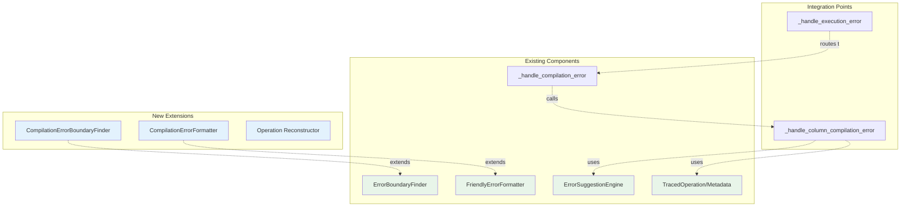

# Enhanced Compilation Error Handling Specification (v2)

## Executive Summary

This specification describes how to extend the existing error handling infrastructure to provide enhanced context for compilation-time errors. The approach leverages existing components (`ErrorBoundaryFinder`, `FriendlyErrorFormatter`, `ErrorSuggestionEngine`) while adding compilation-specific extensions.

**Key Decision**: No feature flags. Enhanced compilation error handling is automatically enabled when `AF_ERROR_MODE=enhanced` (the new default) or `AF_ERROR_MODE=debug`.

## Key Changes from v1

- **Reuse existing components** instead of creating parallel infrastructure
- **Extend rather than replace** current error handlers
- **Minimal new code** - focus on compilation-specific adaptations
- **Maintain compatibility** with existing error handling flow

## Architecture Overview

### Component Reuse Strategy



## Detailed Design

### 1. Extend Existing Error Detection

Update `_handle_execution_error()` in `formatting_errors.py`:

```python
def _handle_execution_error(frame: ActuarialFrame, e: Exception):
    """Handle errors during collect() or profile()."""
    from ..util import get_error_mode
    
    error_mode = get_error_mode()
    
    # Early exit for production mode
    if not (frame._tracing or frame._mode == "debug" or error_mode in ["enhanced", "debug"]):
        raise e
    
    # NEW: Check for compilation errors FIRST
    if _is_compilation_error(e) and error_mode in ["enhanced", "debug"]:
        # Route to compilation handler which already exists
        return _handle_compilation_error(frame, e)
    
    # ... existing execution error handling continues ...
```

### 2. Enhance Existing Compilation Handler

Extend the existing `_handle_compilation_error()`:

```python
def _handle_compilation_error(frame: ActuarialFrame, e: Exception):
    """Handle Polars compilation/optimization errors with helpful messages."""
    from ..util import get_error_mode
    
    error_mode = get_error_mode()
    error_msg = str(e)
    
    # EXISTING: Type coercion errors
    if "got invalid or ambiguous dtypes" in error_msg:
        # ... existing handling stays ...
    
    # NEW: Column reference errors with replay
    elif _is_column_reference_compilation_error(e):
        if error_mode in ["enhanced", "debug"] and frame._computation_graph:
            return _handle_column_compilation_error(frame, e)
        else:
            # Fall back to existing basic handling
            return _handle_basic_column_error(frame, e)
    
    # EXISTING: General compilation errors
    elif error_mode in ["enhanced", "debug"]:
        # ... existing general handling stays ...
    
    raise e
```

### 3. Create Compilation-Specific Extensions

#### 3.1 CompilationErrorBoundaryFinder

```python
# In boundary.py, add new class:
class CompilationErrorBoundaryFinder(ErrorBoundaryFinder):
    """
    Extends ErrorBoundaryFinder for compilation errors.
    Uses schema validation instead of execution to find failures.
    """
    
    def _apply_operations_up_to(self, index: int) -> pl.DataFrame:
        """Override to use schema validation instead of collection."""
        current_df = self.original_df
        
        if hasattr(current_df, 'lazy'):
            current_df = current_df.lazy()
        
        # Apply operations up to index
        for i, operation in enumerate(self.af._computation_graph[:index + 1]):
            if isinstance(operation, tuple):
                name, expr = operation
                current_df = current_df.with_columns(expr.alias(name))
            else:
                current_df = current_df.with_columns(
                    operation.expression.alias(operation.alias)
                )
        
        # NEW: Test compilation with schema collection instead of data collection
        try:
            _ = current_df.collect_schema()
            # Return limited data for context
            return self._safe_collect_for_context(current_df)
        except Exception as schema_error:
            # Re-raise to be caught by binary search
            raise schema_error
    
    def _safe_collect_for_context(self, df: pl.LazyFrame) -> pl.DataFrame:
        """Safely collect limited data for error context."""
        try:
            return df.limit(10).collect()
        except Exception:
            try:
                # Fall back to empty frame with schema
                schema = df.collect_schema()
                return pl.DataFrame(schema=schema)
            except Exception:
                return pl.DataFrame()
```

#### 3.2 CompilationErrorFormatter

```python
# In formatter.py, add new class:
class CompilationErrorFormatter(FriendlyErrorFormatter):
    """
    Extends FriendlyErrorFormatter for compilation-specific formatting.
    """
    
    def __init__(self, *args, **kwargs):
        super().__init__(*args, **kwargs)
        self.error_type = "Compilation Error"
    
    def _format_header(self) -> str:
        """Override header for compilation errors."""
        total_ops = len(self.operation.metadata._computation_graph) if hasattr(
            self.operation.metadata, '_computation_graph'
        ) else "?"
        
        return f"""❌ {self.error_type} at Operation {self.operation_index + 1}/{total_ops}

🔍 Failed During Query Optimization:
   {self.operation.alias} = {self._truncate_expr(str(self.operation.expression), 80)}
   
⚠️  This error occurred during query compilation, before any data was processed."""
    
    def _format_suggestions(self) -> str:
        """Add compilation-specific suggestions."""
        base_suggestions = super()._format_suggestions()
        
        compilation_tips = """
💡 Compilation Error Tips:
   • Check column names exist before this operation
   • Verify data types match for operations
   • Use af.columns to see available columns
   • Consider breaking complex expressions into steps"""
        
        return base_suggestions + "\n" + compilation_tips
```

### 4. Default Mode Configuration

Update `get_error_mode()` in `util.py` to make `enhanced` the default:

```python
def get_error_mode() -> str:
    """
    Get the current error handling mode.
    
    Returns:
        'enhanced' (default), 'debug', 'basic', or 'off'
    """
    mode = os.environ.get("AF_ERROR_MODE", "enhanced").lower()
    if mode not in ["enhanced", "debug", "basic", "off"]:
        logger.warning(f"Invalid AF_ERROR_MODE '{mode}', using 'enhanced'")
        return "enhanced"
    return mode
```

### 5. Integration Function

```python
def _handle_column_compilation_error(frame: ActuarialFrame, e: Exception):
    """
    Handle compilation errors for missing columns using existing components.
    """
    # Reuse existing components with compilation-specific extensions
    finder = CompilationErrorBoundaryFinder(frame, e)
    
    try:
        fail_idx, fail_op, last_good_df = finder.find_failing_operation()
    except Exception as finder_error:
        logger.debug(f"Compilation error finder failed: {finder_error}")
        # Fall back to basic handling
        return _handle_basic_column_error(frame, e)
    
    if fail_op and last_good_df is not None:
        # Reuse existing suggestion engine as-is
        from .suggestions import ErrorSuggestionEngine
        engine = ErrorSuggestionEngine()
        suggestions = engine.suggest_fixes(
            e, fail_op, list(last_good_df.columns) if last_good_df else []
        )
        
        # Use extended formatter
        formatter = CompilationErrorFormatter(
            operation=fail_op,
            exception=e,
            last_good_df=last_good_df,
            suggestions=suggestions,
            operation_index=fail_idx
        )
        
        # Create enhanced exception using existing pattern
        enhanced_msg = formatter.format_error()
        new_exception = type(e)(enhanced_msg)
        new_exception.llm_context = formatter.format_for_llm()
        
        # Add compilation-specific context
        new_exception.llm_context["error_category"] = "compilation"
        new_exception.llm_context["compilation_phase"] = "query_optimization"
        
        raise new_exception from e
    else:
        # No specific operation found, use basic handling
        return _handle_basic_column_error(frame, e)
```

## Implementation Strategy

### Phase 1: Minimal Integration (1 day)
1. Add compilation error detection to `_handle_execution_error`
2. Extend `_handle_compilation_error` to route column errors
3. Create `_handle_column_compilation_error` function
4. Test with existing error cases

### Phase 2: Component Extensions (1 day)
1. Create `CompilationErrorBoundaryFinder` extending `ErrorBoundaryFinder`
2. Create `CompilationErrorFormatter` extending `FriendlyErrorFormatter`
3. Add compilation-specific helper functions
4. Integrate with existing flow

### Phase 3: Testing and Polish (1 day)
1. Add tests to existing test files
2. Verify performance impact
3. Test edge cases
4. Update documentation

## Testing Strategy

### Unit Tests
Add to existing test files:
```python
# In test_error_handling_fixed.py
class TestCompilationErrors:
    def test_missing_column_compilation_enhanced(self):
        """Test enhanced compilation error with context."""
        # ... test implementation ...
    
    def test_compilation_error_fallback(self):
        """Test fallback when enhancement fails."""
        # ... test implementation ...
```

### Integration Tests
Extend existing integration tests to cover compilation errors.

## Benefits of This Approach

1. **Minimal New Code**: ~300 lines instead of ~1000
2. **Reuses Existing Infrastructure**: 
   - `ErrorSuggestionEngine` - unchanged
   - `TracedOperation` - unchanged
   - `FriendlyErrorFormatter` - extended
   - `ErrorBoundaryFinder` - extended
3. **Lower Risk**: Extends working code rather than replacing
4. **Consistent Architecture**: Follows established patterns
5. **Easier Maintenance**: Clear separation of concerns

## Configuration Philosophy

### No Feature Flags
This implementation deliberately avoids feature flags for the following reasons:

1. **Simplicity**: One less configuration option to manage
2. **Consistency**: Enhanced errors are either on or off based on error mode
3. **User Experience**: Users get the best experience by default
4. **Testing**: Fewer code paths to test and maintain

### Default Mode Change
Changing the default from `basic` to `enhanced` provides:

1. **Better Developer Experience**: Rich error context out of the box
2. **Opt-out Model**: Users can still use `AF_ERROR_MODE=basic` for production
3. **Progressive Enhancement**: Basic mode still available for performance-critical scenarios
4. **Discoverability**: Users immediately see the enhanced error features

## Migration Notes

### From Existing System
- No breaking changes to existing error handling
- Compilation errors get enhanced context when available  
- Graceful fallback to basic handling
- Users currently setting `AF_ERROR_MODE=basic` explicitly are unaffected

### Configuration
- Works with existing `AF_ERROR_MODE` settings
- **No feature flags** - compilation error replay is always enabled when `AF_ERROR_MODE=enhanced` or `AF_ERROR_MODE=debug`
- **Default behavior change**: `AF_ERROR_MODE=enhanced` becomes the default if not explicitly set

### Performance Considerations
- Enhanced mode adds <100ms overhead for typical errors
- No performance impact on successful operations
- Basic mode remains available for performance-critical production use

## Conclusion

This revised approach leverages the well-designed existing error handling infrastructure, adding minimal new code to provide enhanced context for compilation errors. The key insight is that most components can be reused with minor extensions, making the implementation simpler and more maintainable.