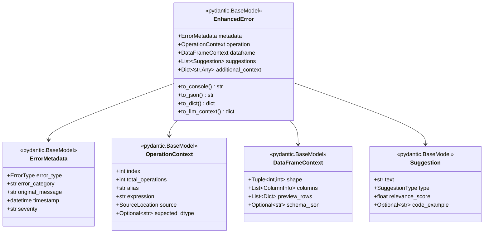

# Enhanced Compilation Error Handling Specification (v3)

## Executive Summary

This specification describes how to extend the existing error handling infrastructure to provide enhanced context for compilation-time errors using **structured Pydantic models**. This approach ensures errors are both human-friendly (with emoji and formatting for console) and machine-parsable (for APIs, LLMs, and MCP servers).

**Key Decision**: 
- Use Pydantic models for all error structures
- Single source of truth for error data
- Multiple output formats from the same model

## Architecture Overview

### Structured Error Model



## Detailed Design

### 1. Core Pydantic Models

Create new file `gaspatchio_core/errors/models.py`:

```python
from __future__ import annotations

from datetime import datetime
from enum import Enum
from typing import Any, Dict, List, Optional, Tuple

from pydantic import BaseModel, Field


class ErrorType(str, Enum):
    """Types of errors that can occur."""
    COLUMN_NOT_FOUND = "column_not_found"
    TYPE_MISMATCH = "type_mismatch"
    INVALID_OPERATION = "invalid_operation"
    SCHEMA_CONFLICT = "schema_conflict"
    UNKNOWN = "unknown"


class SuggestionType(str, Enum):
    """Types of suggestions."""
    TYPO_FIX = "typo_fix"
    TYPE_CAST = "type_cast"
    OPERATION_SPLIT = "operation_split"
    DOCUMENTATION = "documentation"
    CODE_EXAMPLE = "code_example"


class SourceLocation(BaseModel):
    """Source code location information."""
    file_path: str
    line_number: int
    function_name: str
    source_line: str
    
    @property
    def display_location(self) -> str:
        """Format for display."""
        return f"{self.file_path}:{self.line_number}"


class ColumnInfo(BaseModel):
    """Information about a DataFrame column."""
    name: str
    dtype: str
    null_count: Optional[int] = None
    unique_count: Optional[int] = None
    
    def display(self, include_stats: bool = False) -> str:
        """Format for display."""
        base = f"{self.name} ({self.dtype})"
        if include_stats and self.null_count is not None:
            base += f" - {self.null_count} nulls"
        return base


class ErrorMetadata(BaseModel):
    """Metadata about the error."""
    error_type: ErrorType
    error_category: str = "compilation"
    original_message: str
    timestamp: datetime = Field(default_factory=datetime.now)
    severity: str = "error"
    
    def display_header(self) -> str:
        """Format header for console display."""
        emoji = {
            ErrorType.COLUMN_NOT_FOUND: "🔍",
            ErrorType.TYPE_MISMATCH: "🔢",
            ErrorType.INVALID_OPERATION: "⚠️",
            ErrorType.SCHEMA_CONFLICT: "📊",
            ErrorType.UNKNOWN: "❌"
        }.get(self.error_type, "❌")
        
        return f"{emoji} {self.error_type.value.replace('_', ' ').title()}"


class OperationContext(BaseModel):
    """Context about the failing operation."""
    index: int
    total_operations: int
    alias: str
    expression: str
    source: SourceLocation
    expected_dtype: Optional[str] = None
    
    def display(self, max_expr_length: int = 80) -> str:
        """Format for console display."""
        expr = self.expression
        if len(expr) > max_expr_length:
            expr = expr[:max_expr_length-3] + "..."
        
        return f"""Operation {self.index + 1}/{self.total_operations}:
   {self.alias} = {expr}
   at {self.source.display_location}"""


class DataFrameContext(BaseModel):
    """Context about the DataFrame state."""
    shape: Tuple[int, int]
    columns: List[ColumnInfo]
    preview_rows: List[Dict[str, Any]] = Field(default_factory=list)
    schema_json: Optional[str] = None
    
    def display_columns(self, max_display: int = 10) -> str:
        """Format columns for display."""
        if len(self.columns) <= max_display:
            return "\n".join(f"   • {col.display()}" for col in self.columns)
        else:
            displayed = self.columns[:max_display]
            lines = [f"   • {col.display()}" for col in displayed]
            lines.append(f"   ... and {len(self.columns) - max_display} more columns")
            return "\n".join(lines)
    
    def display_preview(self) -> str:
        """Format preview for display."""
        if not self.preview_rows:
            return "   [No preview available]"
        
        # Simple table representation
        if len(self.preview_rows) == 1:
            return "   [1 row preview available in JSON format]"
        else:
            return f"   [{len(self.preview_rows)} rows preview available in JSON format]"


class Suggestion(BaseModel):
    """A suggestion for fixing the error."""
    text: str
    type: SuggestionType
    relevance_score: float = Field(ge=0.0, le=1.0)
    code_example: Optional[str] = None
    
    def display(self) -> str:
        """Format for console display."""
        if self.code_example:
            return f"   • {self.text}\n     Example: {self.code_example}"
        return f"   • {self.text}"


class EnhancedError(BaseModel):
    """Complete enhanced error information."""
    metadata: ErrorMetadata
    operation: OperationContext
    dataframe: DataFrameContext
    suggestions: List[Suggestion] = Field(default_factory=list)
    additional_context: Dict[str, Any] = Field(default_factory=dict)
    
    def to_console(self, use_emoji: bool = True) -> str:
        """
        Format for console display with optional emoji.
        """
        lines = []
        
        # Header
        if use_emoji:
            lines.append(f"❌ {self.metadata.display_header()}")
        else:
            lines.append(f"ERROR: {self.metadata.error_type.value}")
        
        lines.append("")
        
        # Operation context
        if use_emoji:
            lines.append("🔍 Failed Operation:")
        else:
            lines.append("Failed Operation:")
        lines.append(f"   {self.operation.display()}")
        lines.append("")
        
        # DataFrame context
        if use_emoji:
            lines.append("📊 DataFrame State:")
        else:
            lines.append("DataFrame State:")
        lines.append(f"   Shape: {self.dataframe.shape}")
        lines.append("   Columns:")
        lines.append(self.dataframe.display_columns())
        lines.append("")
        
        # Suggestions
        if self.suggestions:
            if use_emoji:
                lines.append("💡 Suggestions:")
            else:
                lines.append("Suggestions:")
            for suggestion in sorted(self.suggestions, key=lambda s: s.relevance_score, reverse=True)[:5]:
                lines.append(suggestion.display())
            lines.append("")
        
        # Original error
        lines.append("Original Error:")
        lines.append(f"   {self.metadata.original_message}")
        
        return "\n".join(lines)
    
    def to_json(self) -> str:
        """Export as JSON string."""
        return self.model_dump_json(indent=2)
    
    def to_dict(self) -> dict:
        """Export as dictionary."""
        return self.model_dump()
    
    def to_llm_context(self) -> dict:
        """
        Export optimized for LLM consumption.
        Flattens structure and adds helpful context.
        """
        return {
            "error_type": self.metadata.error_type.value,
            "error_category": self.metadata.error_category,
            "failing_operation": {
                "index": self.operation.index,
                "total": self.operation.total_operations,
                "alias": self.operation.alias,
                "expression": self.operation.expression,
                "source_file": self.operation.source.file_path,
                "source_line": self.operation.source.line_number,
                "code": self.operation.source.source_line
            },
            "dataframe_shape": list(self.dataframe.shape),
            "available_columns": [
                {"name": col.name, "type": col.dtype} 
                for col in self.dataframe.columns
            ],
            "suggestions": [
                {
                    "text": s.text,
                    "type": s.type.value,
                    "score": s.relevance_score,
                    "example": s.code_example
                }
                for s in sorted(self.suggestions, key=lambda s: s.relevance_score, reverse=True)
            ],
            "original_error": self.metadata.original_message,
            **self.additional_context
        }
```

### 2. Integration with Error Handlers

Update error handling to create and use these models:

```python
def _handle_column_compilation_error(frame: ActuarialFrame, e: Exception) -> None:
    """Handle compilation errors using structured models."""
    finder = CompilationErrorBoundaryFinder(frame, e)
    
    try:
        fail_idx, fail_op, last_good_df = finder.find_failing_operation()
    except Exception:
        return _handle_basic_column_error(frame, e)
    
    if fail_op and last_good_df is not None:
        # Build structured error
        enhanced_error = _build_enhanced_error(
            exception=e,
            operation=fail_op,
            operation_index=fail_idx,
            dataframe=last_good_df,
            total_operations=len(frame._computation_graph)
        )
        
        # Determine output format based on context
        if _is_interactive_console():
            # Console output with emoji
            error_message = enhanced_error.to_console(use_emoji=True)
        else:
            # Plain text for logs/non-interactive
            error_message = enhanced_error.to_console(use_emoji=False)
        
        # Create new exception with structured data
        new_exception = type(e)(error_message)
        
        # Attach structured data for programmatic access
        new_exception.enhanced_error = enhanced_error
        new_exception.llm_context = enhanced_error.to_llm_context()
        
        # For MCP servers or APIs
        new_exception.to_json = enhanced_error.to_json
        new_exception.to_dict = enhanced_error.to_dict
        
        raise new_exception from e
```

### 3. Error Builder Function

```python
def _build_enhanced_error(
    exception: Exception,
    operation: TracedOperation,
    operation_index: int,
    dataframe: pl.DataFrame,
    total_operations: int
) -> EnhancedError:
    """Build structured enhanced error from components."""
    
    # Determine error type
    error_type = _classify_error_type(exception)
    
    # Extract missing column if applicable
    missing_column = None
    if error_type == ErrorType.COLUMN_NOT_FOUND:
        missing_column = _extract_missing_column_robust(str(exception))
    
    # Build metadata
    metadata = ErrorMetadata(
        error_type=error_type,
        error_category="compilation",
        original_message=str(exception)
    )
    
    # Build operation context
    operation_context = OperationContext(
        index=operation_index,
        total_operations=total_operations,
        alias=operation.alias,
        expression=str(operation.expression),
        source=SourceLocation(
            file_path=operation.metadata.file_name,
            line_number=operation.metadata.line_number,
            function_name=operation.metadata.function_name,
            source_line=operation.metadata.source_line
        ),
        expected_dtype=str(operation.expected_dtype) if operation.expected_dtype else None
    )
    
    # Build dataframe context
    columns = [
        ColumnInfo(name=col, dtype=str(dtype))
        for col, dtype in dataframe.schema.items()
    ]
    
    dataframe_context = DataFrameContext(
        shape=dataframe.shape,
        columns=columns,
        preview_rows=dataframe.limit(5).to_dicts() if not dataframe.is_empty() else []
    )
    
    # Generate suggestions
    suggestions = _generate_suggestions(
        error_type=error_type,
        missing_column=missing_column,
        available_columns=[col.name for col in columns],
        operation=operation
    )
    
    # Build complete error
    return EnhancedError(
        metadata=metadata,
        operation=operation_context,
        dataframe=dataframe_context,
        suggestions=suggestions,
        additional_context={
            "missing_column": missing_column,
            "execution_mode": frame._mode
        }
    )
```

### 4. Console Detection

```python
def _is_interactive_console() -> bool:
    """Detect if running in an interactive console."""
    import sys
    
    # Check if stdout is a terminal
    if not hasattr(sys.stdout, 'isatty'):
        return False
        
    if not sys.stdout.isatty():
        return False
    
    # Check for common CI environment variables
    ci_vars = ['CI', 'CONTINUOUS_INTEGRATION', 'GITHUB_ACTIONS', 'GITLAB_CI']
    if any(os.environ.get(var) for var in ci_vars):
        return False
    
    # Check for Jupyter/IPython
    try:
        get_ipython()  # type: ignore
        return True
    except NameError:
        pass
    
    return True
```

## Usage Examples

### Console Output (with emoji)
```
❌ Column Not Found

🔍 Failed Operation:
   Operation 15/23:
   bad_reference = col("nonexistent_column")
   at model_test_bad_col_name.py:262

📊 DataFrame State:
   Shape: (1, 22)
   Columns:
   • policyholder nr (Int64)
   • age (List[Float64])
   • gender (Utf8)
   ... and 19 more columns

💡 Suggestions:
   • Did you mean 'sum_assured'? (similarity: 89%)
   • Check operations 10-14 which created new columns
   • Use af.columns to list all available columns

Original Error:
   Column 'nonexistent_column' not found
```

### JSON Output (for APIs/LLMs)
```python
# Access via exception
try:
    af.collect()
except Exception as e:
    if hasattr(e, 'enhanced_error'):
        # For MCP server
        error_json = e.enhanced_error.to_json()
        
        # For LLM
        llm_context = e.enhanced_error.to_llm_context()
        
        # For structured logging
        error_dict = e.enhanced_error.to_dict()
```

### Programmatic Access
```python
try:
    result = af.collect()
except pl.ColumnNotFoundError as e:
    if hasattr(e, 'enhanced_error'):
        error = e.enhanced_error
        
        # Access specific fields
        print(f"Failed at operation {error.operation.index}")
        print(f"Missing column: {error.additional_context.get('missing_column')}")
        
        # Get top suggestion
        if error.suggestions:
            top = max(error.suggestions, key=lambda s: s.relevance_score)
            print(f"Try: {top.text}")
```

## Benefits

1. **Single Source of Truth**: One model defines all error information
2. **Multiple Output Formats**: Console, JSON, dict, LLM-optimized
3. **Type Safety**: Pydantic validation ensures data integrity
4. **Extensibility**: Easy to add new fields or error types
5. **API-Ready**: Can be returned directly from web services
6. **LLM-Friendly**: Structured context for AI assistance
7. **MCP-Compatible**: JSON export works with Model Context Protocol

## Migration Path

1. Create `errors/models.py` with Pydantic models
2. Update error builders to use models
3. Gradually migrate existing error handlers
4. Maintain backward compatibility with string-only errors

## Configuration Philosophy

(Same as v2 - no feature flags, enhanced mode is default)

## Testing Strategy

```python
def test_enhanced_error_structure():
    """Test that enhanced errors have correct structure."""
    # Trigger error
    with pytest.raises(pl.ColumnNotFoundError) as exc_info:
        # ... code that causes error ...
    
    # Verify structure
    assert hasattr(exc_info.value, 'enhanced_error')
    error = exc_info.value.enhanced_error
    
    # Validate with Pydantic
    assert isinstance(error, EnhancedError)
    
    # Test outputs
    console_output = error.to_console()
    assert "❌" in console_output
    
    json_output = error.to_json()
    parsed = json.loads(json_output)
    assert parsed['metadata']['error_type'] == 'column_not_found'
```

## Conclusion

Using Pydantic models for error handling provides a robust, type-safe foundation that serves multiple consumers: human developers reading console output, APIs returning structured errors, and LLMs processing error context. The single model approach ensures consistency while allowing flexible presentation.