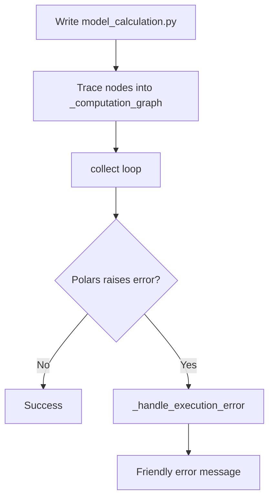
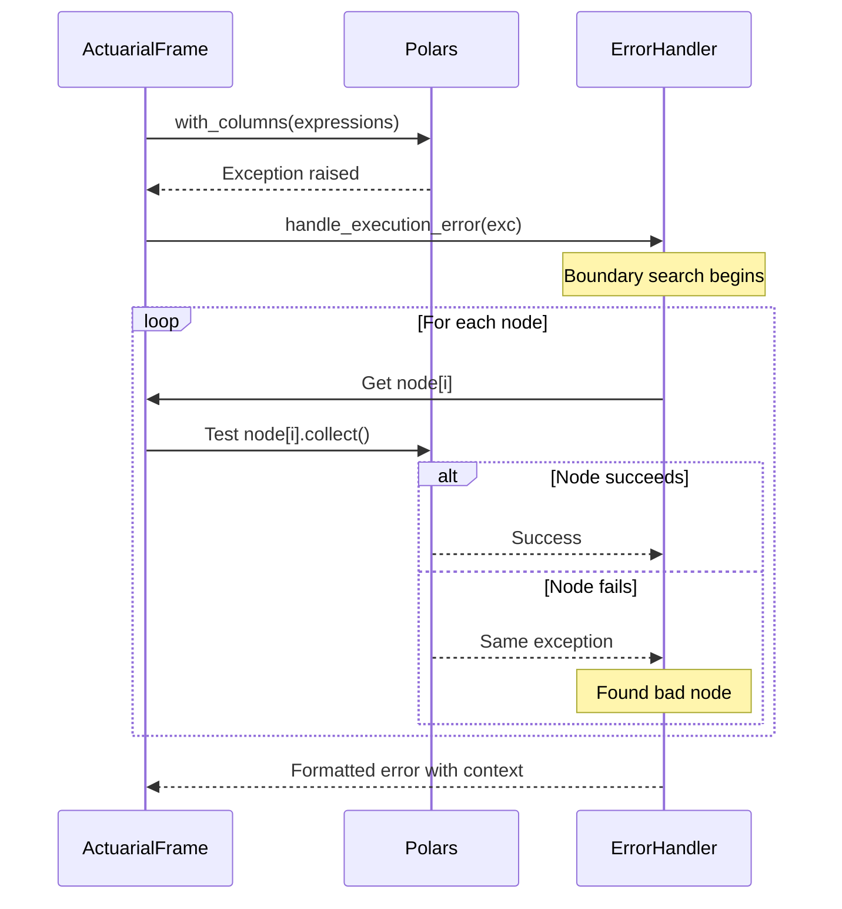

# Friendly Error Surfacing for `ActuarialFrame`

**Audience:** Principal Engineer / Tech-lead  
**Scope:** Polars-backed modelling framework inside **`gaspatchio-core`**  
**Goal:** Replace unreadable Polars traces with contextual, model-level errors *without* touching the hot-path implementation of `collect()`.

---

## 1. Background

Actuaries build models by composing Polars expressions on an `ActuarialFrame`. When a typo or bad calculation sneaks in, Polars raises deep inside `collect()`, producing a 100-plus-line stack trace that is useless to non-engineers. 

We already trace each column addition as a "node" in `_computation_graph`; we just don't show that trace back to the user.

---

## 2. Problem Statement

| Pain-point | Detail |
|------------|--------|
| **Opaque stack trace** | Error references Polars internals, never the user's model line |
| **No notion of progress** | Actuaries can't tell *how far* the frame got before breaking |
| **Difficult debugging loop** | Requires dropping into a debugger, inspecting Polars plans, or peppering the model with `collect()` calls that obliterate lazy optimisation |

---

## 3. Desired Runtime Output

**Example from an intentional typo in `model_calculation.py:27`:**

```
❌ Calculation error in model_calculation.py:27
af["year"] = af["effective_date"].excel.yearfrac(af["data"], "act/360")

Polars raised → ColumnNotFoundError: column 'data' does not exist

Last good rows (truncated):
┌────────────────────┬────────────┬─────────┐
│ Policy number      ┆ age_last   ┆ date    │
│ —                  ┆ —          ┆ —       │
│ i64                ┆ i64        ┆ date    │
╞════════════════════╪════════════╪═════════╡
│ 1                  ┆ 31         ┆ 2025-01-31 │
│ 2                  ┆ 45         ┆ 2025-01-31 │
│ …                  ┆ …          ┆ …       │
└────────────────────┴────────────┴─────────┘
```

### Key Properties

- File, line-number, and exact source line of the failing node
- Original Polars exception type & message preserved  
- Mini-snapshot of the frame up to (but **excluding**) the bad node
- Triggered **only in `debug` mode** or when `af._tracing` is `True`; zero cost in production

---

## 4. High-Level Design

### 4.1 Conceptual Data Flow



### 4.2 Error-handling Sequence (boundary search version)



**Why we don't touch collect()**  
All replay logic is isolated in the error-handler; normal runs incur no extra allocations or integer bookkeeping.

---

## 5. Implementation Sketch

*Exact code left to the implementation phase; this lists where changes live.*

### 5.1 Attach Source Metadata

- **File:** `frame/tracing.py`
- **Change:** When tracing is enabled, append `(filename, lineno, source_line)` to each node tuple

### 5.2 Helper: `_find_boundary(af, exc) → (bad_idx, pre_df)`

- **File:** Co-locate in `frame/base.py` beside `_handle_execution_error`
- **Algorithm:**
  1. Start with the pristine `_df`
  2. Replay `_computation_graph` until the first node that triggers the same exception type
  3. Return index of that node (`bad_idx`) and the DataFrame after the last good node (`pre_df`)

### 5.3 Enhanced `_handle_execution_error`

- **File:** `frame/base.py`
- **Changes:**
  - Call `_find_boundary` to locate `bad_node` and `last_good_df`
  - Build the human-friendly message (section 3)
  - Re-raise same exception type with enriched message text

### 5.4 Config Switch

- Respect existing `ModelRunConfig(mode="debug")` or `ActuarialFrame._tracing`
- Skip metadata capture and boundary replay when off

---

## 6. Non-Goals / Out-of-Scope

- IDE integration (e.g. clickable stack traces)
- Levenshtein "did-you-mean" fixes (tracked as a follow-up)
- Performance tuning of Polars expressions themselves

---

## 7. Future Enhancements

| Idea | Rationale |
|------|-----------|
| Return `last_good_df` via `exc.ctx` for programmatic access by Cursor.ai or unit tests | Enables automated remediation agents |
| Optional colourised output via loguru in CLI mode | Human-friendly logs in CI pipelines |
| Jupyter rich display (HTML table) when running inside notebooks | Polished UX for exploratory modelling |

---

## Appendix A — Glossary

| Term | Meaning in this context |
|------|-------------------------|
| **Node** | Single `(alias, expression, metadata…)` entry in `_computation_graph` |
| **Last good rows** | Result of collecting all nodes before the failing one |
| **Boundary search** | Iterative replay to find first node that reproduces the caught exception |