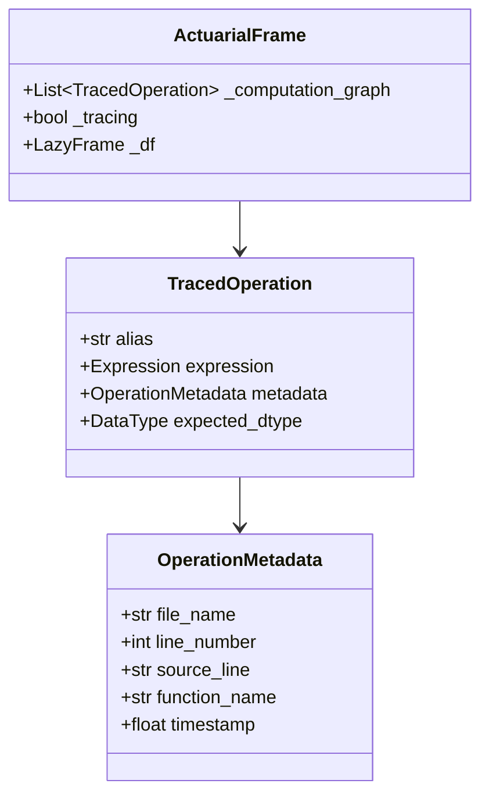
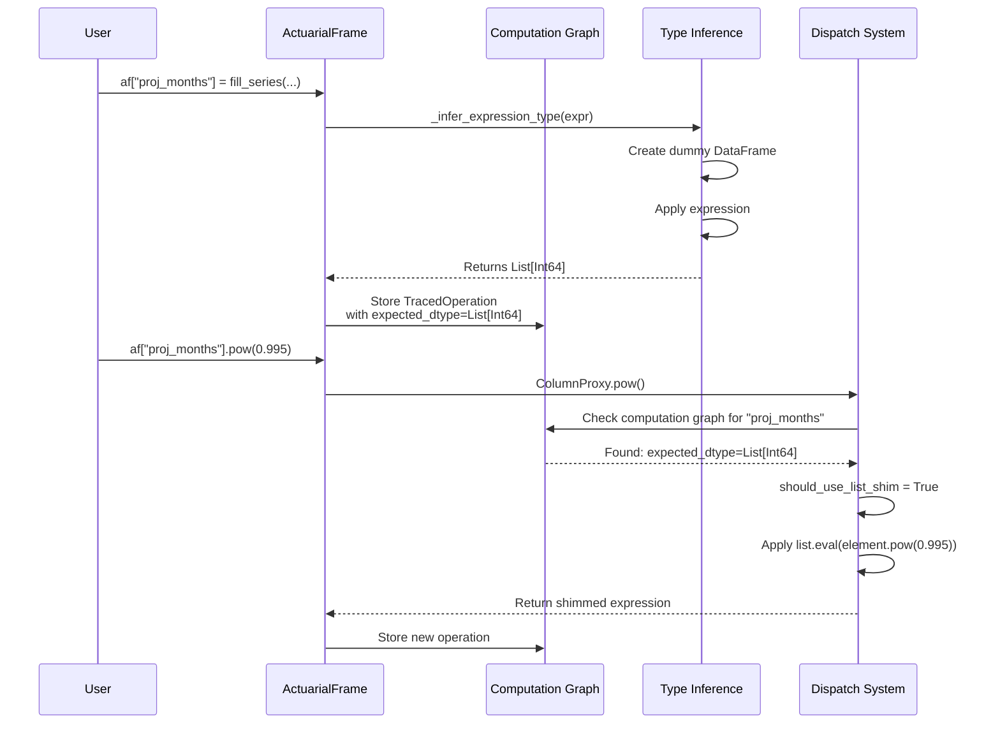

# Type-Aware List Shimming Implementation

## Executive Summary

This document describes the implementation of type-aware list shimming in Gaspatchio's debug mode. The solution enhances the computation graph to carry type information, enabling correct list/scalar operation detection without hardcoding specific patterns.

**Key Achievement**: Debug mode now correctly handles list column operations by tracking types through the computation graph, ensuring parity with optimize mode.

## Problem Context

Gaspatchio's list shimming system enables seamless scalar/vector operations on actuarial data. However, in debug mode, operations are stored in a computation graph and executed later, causing type information to be unavailable when shimming decisions are made.

### The Original Issue

```python
# This failed in debug mode, worked in optimize mode
af["P[death]"] = af["P[IF]"] * (af["mortality rate"] / 12).shift(1).fill_null(0.0)
# Error: got invalid or ambiguous dtypes: '[list[f64], dyn float]' in expression 'fill_null'
```

## Solution Architecture

### 1. Enhanced Computation Graph with Type Information



### 2. Type Inference Flow

```mermaid
flowchart TD
    A[Column Assignment<br/>af['col'] = expr] --> B{Mode?}
    
    B -->|Debug Mode| C[append_operation_to_graph]
    B -->|Optimize Mode| D[Execute Immediately]
    
    C --> E[_infer_expression_type]
    
    E --> F[Build Type Map]
    F --> G[From Computation Graph]
    F --> H[From DataFrame Schema]
    
    G --> I[Create Dummy DataFrame<br/>with Known Types]
    H --> I
    
    I --> J[Apply Expression]
    J --> K[Collect Schema]
    K --> L[Extract Type]
    
    L --> M[Store in TracedOperation<br/>with expected_dtype]
    
    M --> N[Computation Graph]
    
    style E fill:#e1f5fe
    style M fill:#c8e6c9
```

### 3. List Shimming Detection Flow

```mermaid
flowchart TD
    A[Method Call<br/>e.g., af['col'].pow()] --> B[_method_caller]
    
    B --> C{Is Numeric/Elementwise Op?}
    
    C -->|No| D[Regular Method Call]
    C -->|Yes| E{Proxy Type?}
    
    E -->|ColumnProxy| F[Check Computation Graph]
    E -->|ExpressionProxy| G[Check Expression String]
    
    F --> H[Search for Column in Graph]
    H --> I{Found with List Type?}
    
    I -->|Yes| J[Use List Shimming]
    I -->|No| K[Check DataFrame Schema]
    
    K --> L{Is List Type?}
    L -->|Yes| J
    L -->|No| D
    
    G --> M[Pattern Matching]
    M --> N{Matches List Pattern?}
    
    N -->|Yes| J
    N -->|No| D
    
    J --> O[Apply list.eval()]
    
    style J fill:#c8e6c9
    style D fill:#ffcdd2
```

## Implementation Details

### 1. TracedOperation Enhancement

**File**: `gaspatchio_core/errors/metadata.py`

```python
@dataclass
class TracedOperation:
    """Complete operation with metadata for error tracking."""
    alias: str
    expression: Any  # pl.Expr
    metadata: OperationMetadata
    expected_dtype: Any | None = None  # pl.DataType - NEW FIELD
```

### 2. Type Inference Implementation

**File**: `gaspatchio_core/frame/tracing.py`

```python
def _infer_expression_type(expr: Any, frame_instance: ActuarialFrame) -> Any:
    """
    Try to infer the type that an expression will produce.
    Returns a Polars DataType or None if type cannot be inferred.
    """
    # 1. Build type map from computation graph
    type_map = {}
    for op in frame_instance._computation_graph:
        if hasattr(op, "alias") and hasattr(op, "expected_dtype") and op.expected_dtype:
            type_map[op.alias] = op.expected_dtype
    
    # 2. Add types from existing schema
    schema = frame_instance._df.collect_schema()
    for col_name, dtype in schema.items():
        if col_name not in type_map:
            type_map[col_name] = dtype
    
    # 3. Create dummy DataFrame with known types
    dummy_data = {}
    for col_name, dtype in type_map.items():
        if isinstance(dtype, pl.List):
            dummy_data[col_name] = [[]]  # Empty list
        elif dtype == pl.Float64:
            dummy_data[col_name] = [0.0]
        # ... other type mappings
    
    # 4. Apply expression and get resulting type
    dummy_df = pl.DataFrame(dummy_data).lazy()
    result_df = dummy_df.select(expr.alias("_test_col"))
    result_schema = result_df.collect_schema()
    return result_schema.get("_test_col")
```

### 3. Enhanced Shimming Detection

**File**: `gaspatchio_core/column/dispatch.py`

```python
def _method_caller(...):
    # For ColumnProxy, check computation graph first
    if isinstance(self_proxy, ColumnProxy) and parent_af:
        # Check computation graph for type info
        if hasattr(parent_af, "_computation_graph"):
            for op in parent_af._computation_graph:
                if (hasattr(op, "alias") and op.alias == self_proxy.name and
                    hasattr(op, "expected_dtype") and op.expected_dtype):
                    if isinstance(op.expected_dtype, pl.List):
                        should_use_list_shim = True
                        break
        
        # Fallback to schema if not found
        if not should_use_list_shim:
            schema = parent_af._df.collect_schema()
            dtype = schema.get(self_proxy.name)
            should_use_list_shim = isinstance(dtype, pl.List)
```

## How It Works: Debug Mode Execution

### Step-by-Step Example

```python
# User code
af["proj_months"] = gs.fill_series(af["num_proj_months"])  # Creates List[Int64]
af["discount_rate"] = af["proj_months"].pow(0.995)          # Should use list shimming
```



## Key Design Decisions

### 1. Generic Type Inference
- **Decision**: Use Polars' own type inference rather than hardcoding patterns
- **Rationale**: Maintains compatibility with all Polars operations and future extensions
- **Implementation**: Create minimal dummy DataFrames to let Polars determine types

### 2. Computation Graph Enhancement
- **Decision**: Add `expected_dtype` field to TracedOperation
- **Rationale**: Preserves type information across the deferred execution boundary
- **Implementation**: Minimal change to existing data structure

### 3. Fallback Mechanisms
- **Decision**: Check both computation graph and schema
- **Rationale**: Handles both computed columns and original data columns
- **Implementation**: Computation graph checked first, then schema

## Benefits of This Approach

1. **No Hardcoding**: Works with any operation that produces lists
2. **Future-Proof**: Automatically supports new Polars operations
3. **Type Safety**: Leverages Polars' type system
4. **Performance**: Type inference only happens once per operation
5. **Debugging**: Type information visible in computation graph

## Example: Complete Flow

```python
# Original problematic code
af["mortality_rate"] = mortality_table.lookup(...)  # Returns List[Float64]
af["P[death]"] = af["P[IF]"] * (af["mortality_rate"] / 12).shift(1).fill_null(0.0)
```

```mermaid
flowchart LR
    A[mortality_table.lookup] -->|Type: List[Float64]| B[Store in Graph]
    B --> C[af['mortality_rate'] / 12]
    C -->|Check Graph: List[Float64]| D[Type preserved]
    D --> E[.shift(1)]
    E -->|List operations preserve type| F[Still List[Float64]]
    F --> G[.fill_null(0.0)]
    G -->|Shimming detected via graph| H[Success!]
    
    style H fill:#c8e6c9
```

## Testing and Validation

The implementation was validated with:

1. **Original failing case**: `fill_null` on list columns in debug mode ✓
2. **Secondary case**: `pow` operation on list columns ✓
3. **Mode parity**: Identical results in debug and optimize modes ✓

## Future Enhancements

1. **Type Caching**: Cache inferred types to avoid redundant calculations
2. **Type Validation**: Add warnings when type inference fails
3. **Performance Optimization**: Batch type inference for multiple operations
4. **Developer Tools**: Expose type information for debugging

## Conclusion

This implementation successfully resolves the debug/optimize mode divergence by making the computation graph type-aware. The solution is generic, maintainable, and leverages Polars' own type system rather than hardcoding specific patterns. This ensures gaspatchio can handle any future list operations without modification.