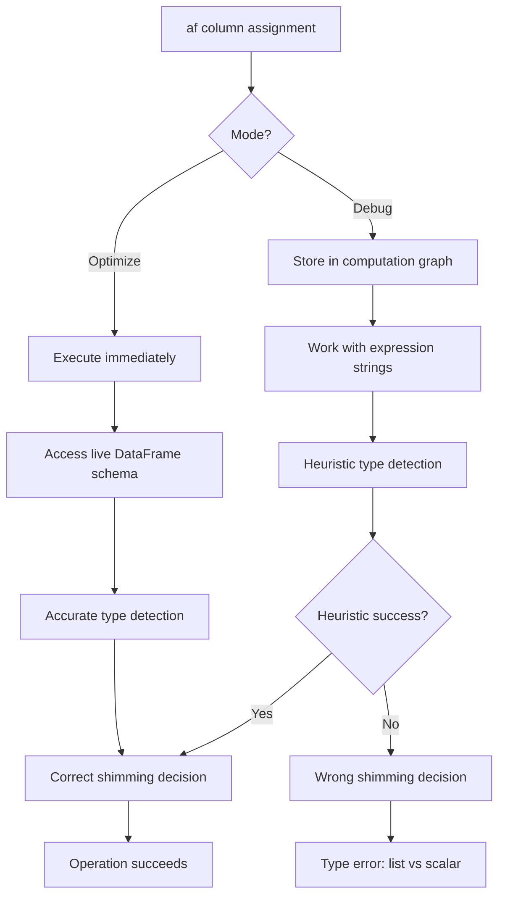
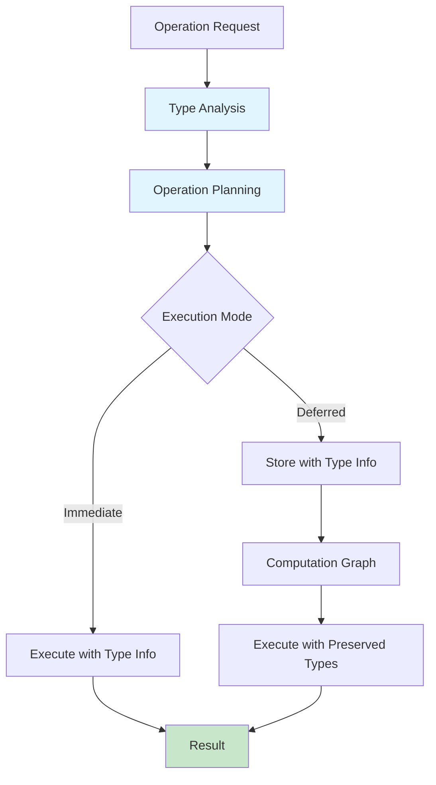

# List Shimming Logic: Debug vs Optimize Mode Divergence

## Executive Summary

Gaspatchio's list shimming system, which enables seamless scalar/vector operations, fails in debug mode for `fill_null` operations on list columns. The issue manifests as type ambiguity errors (`list[f64]` vs `dyn float`) when expressions are stored in the computation graph rather than executed immediately. This document provides a comprehensive analysis and solution plan.

**Impact**: Debug mode fails for actuarial models using vector operations with `fill_null`, breaking development workflows and error debugging capabilities.

**Root Cause**: List shimming detection heuristics fail to identify list-producing expression chains in debug mode's computation graph.

**Solution**: Enhanced shimming detection with improved expression analysis and fallback mechanisms.

## Background: List Shimming in Gaspatchio

### What is List Shimming?

List shimming is gaspatchio's core mechanism for enabling automatic scalar/vector operations on actuarial data. It allows developers to write intuitive code like:

```python
# Works on both scalar and vector columns automatically
af["mortality_rate"].abs()  # Element-wise abs() on list columns
af["interest_rate"].round(2)  # Scalar round on scalar columns
```

### Architecture Principles

The shimming system operates through several key components:

1. **Type Detection**: Identifies when columns contain lists (vectors) vs scalars
2. **Method Interception**: Catches method calls on column proxies
3. **Context-Aware Execution**: Applies operations element-wise for lists, directly for scalars
4. **Transparent Interface**: Maintains identical API regardless of underlying data structure

### Critical Code Locations

```python
# gaspatchio_core/column/dispatch.py:77
_NUMERIC_ELEMENTWISE: Set[str] = {
    "clip", "clip_min", "clip_max", "round", "pow", "mod",
    "add", "sub", "mul", "truediv", "floordiv", "cast",
    "cum_prod", "shift", "fill_null"  # <- fill_null is here
}

# gaspatchio_core/column/dispatch.py:394-426
should_use_list_shim = False
if is_unary_numeric_op or is_elementwise_op:
    if isinstance(self_proxy, ColumnProxy) and parent_af:
        # Direct schema access for ColumnProxy
        schema = parent_af._df.collect_schema()
        dtype = schema.get(self_proxy.name)
        should_use_list_shim = isinstance(dtype, pl.List)
    elif isinstance(self_proxy, ExpressionProxy):
        # Heuristic detection for ExpressionProxy
        expr_str = str(base_expr)
        might_be_list = ("list." in expr_str.lower() or 
                        any(list_column_name in expr_str 
                            for list_column_name in list_column_names))
```

## The Problem: Debug vs Optimize Mode Divergence

### Failing Code Example

```python
# This works in optimize mode, fails in debug mode
af["P[death]"] = af["P[IF]"] * (af["mortality rate"] / 12).shift(1).fill_null(0.0)
```

**Error in debug mode:**
```
got invalid or ambiguous dtypes: '[list[f64], dyn float]' in expression 'fill_null'
```

### Execution Flow Comparison



### Detailed Problem Analysis

#### 1. Optimize Mode Success Path

```python
# Step 1: Assignment triggers immediate execution
af["P[death]"] = af["P[IF]"] * (af["mortality rate"] / 12).shift(1).fill_null(0.0)

# Step 2: fill_null() method called on ExpressionProxy
# In _method_caller():
base_expr = af["P[IF]"] * (af["mortality rate"] / 12).shift(1)
polars_attr = base_expr.fill_null

# Step 3: Shimming detection
expr_str = str(base_expr)  # "[(col('mortality rate')) / 12].shift(1)"
parent_af._df.collect_schema()  # Can access live schema
list_column_names = ["mortality rate", "proj_months", ...]  # Known list columns

# Step 4: Heuristic matches
"mortality rate" in expr_str  # True!
should_use_list_shim = True

# Step 5: List shimming applied (though fill_null doesn't use list.eval)
# Operation succeeds because types are resolved from live data
```

#### 2. Debug Mode Failure Path

```python
# Step 1: Assignment captured in computation graph
af["P[death]"] = af["P[IF]"] * (af["mortality rate"] / 12).shift(1).fill_null(0.0)
# Stored as: TracedOperation(alias="P[death]", expression=..., metadata=...)

# Step 2: Later during collect(), expressions applied
for operation in self._computation_graph:
    final_df = final_df.with_columns(operation.expression.alias(operation.alias))

# Step 3: Polars tries to resolve types from stored expressions
# expression: [(col("P[IF]")) * ([(col("mortality rate")) / 12].shift(1).fill_null([dyn float: 0]))]
# Problem: "dyn float: 0" is incompatible with list[f64] result from shift()
```

### The Shimming Detection Failure

The core issue is in the heuristic detection for `ExpressionProxy` objects:

```python
# gaspatchio_core/column/dispatch.py:406-423
elif isinstance(self_proxy, ExpressionProxy):
    expr_str = str(base_expr)
    might_be_list = False
    if "list." in expr_str.lower():
        might_be_list = True
    elif parent_af:
        schema = parent_af._df.collect_schema()
        list_column_names = [name for name, dtype in schema.items() 
                           if isinstance(dtype, pl.List)]
        might_be_list = any(
            f'col("{col_name}")' in expr_str or f"'{col_name}'" in expr_str
            for col_name in list_column_names
        )
```

**The Problem**: Expression strings in debug mode look like:
```
[(col("mortality rate")) / (dyn int: 12)].shift([dyn int: 1])
```

The heuristic searches for `col("mortality rate")` but finds `(col("mortality rate"))` with parentheses, causing the pattern match to fail.

## Root Cause Deep Dive

### 1. Expression String Pattern Matching Issues

```python
# What the heuristic looks for:
search_pattern = f'col("{col_name}")'  # 'col("mortality rate")'

# What actually appears in debug mode:
actual_expression = '[(col("mortality rate")) / (dyn int: 12)]'
                    # Notice the extra parentheses ----^              ^

# Result: Pattern match fails, shimming not triggered
```

### 2. Schema Availability Differences

```mermaid
flowchart LR
    A[Operation Called] --> B{Mode}
    
    B -->|Optimize| C[DataFrame with data exists]
    B -->|Debug| D[DataFrame might be empty/schema-only]
    
    C --> E[collect_schema() returns full type info]
    D --> F[collect_schema() might miss computed columns]
    
    E --> G[Accurate list column detection]
    F --> H[Incomplete list column detection]
```

### 3. Type Resolution Timing

```python
# Optimize Mode - Immediate Resolution
af["col"] = expr  # Types resolved NOW from live data

# Debug Mode - Deferred Resolution  
af["col"] = expr  # Expression stored, types resolved LATER during collect()
```

When types are resolved later, Polars sees:
- Left side: `list[f64]` (from the expression chain)
- Right side: `dyn float` (from the literal `0.0`)
- Result: **Type incompatibility error**

## Tactical Solution: Immediate Fixes

### 1. Enhanced Pattern Matching

**Problem**: Current pattern matching is too strict.

**Solution**: Use more flexible regex patterns.

```python
# Current (fails):
f'col("{col_name}")' in expr_str

# Proposed (works):
import re
pattern = rf'col\s*\(\s*["\']?{re.escape(col_name)}["\']?\s*\)'
re.search(pattern, expr_str) is not None
```

### 2. Add fill_null to Shimming Triggers

**Problem**: `fill_null` needs special consideration for list columns.

**Solution**: Explicitly check for list columns when `fill_null` is called.

```python
# In _method_caller() function:
is_fill_null_op = name == "fill_null"

should_use_list_shim = False
if is_unary_numeric_op or is_elementwise_op or is_fill_null_op:
    # ... existing detection logic
```

### 3. Fallback Type Checking

**Problem**: Heuristics sometimes fail.

**Solution**: Add runtime type checking with graceful fallback.

```python
def _safe_list_operation(base_expr, method_name, args, kwargs):
    """Attempt list operation, fallback to scalar on type error."""
    try:
        # Try list shimming approach
        return _apply_list_shim(base_expr, method_name, args, kwargs)
    except (TypeError, SchemaError) as e:
        if "supertype" in str(e) or "ambiguous dtypes" in str(e):
            # Fallback to scalar approach
            return _apply_scalar_operation(base_expr, method_name, args, kwargs)
        raise
```

### 4. Smart fill_null Argument Conversion

**Problem**: Scalar `0.0` incompatible with `list[f64]`.

**Solution**: Context-aware argument conversion.

```python
def _convert_fill_null_args(args, target_is_list):
    """Convert fill_null arguments based on target column type."""
    if not target_is_list:
        return args
    
    converted = []
    for arg in args:
        if isinstance(arg, (int, float)):
            # Convert scalar to single-element list for list columns
            converted.append([arg])
        else:
            converted.append(arg)
    return converted
```

## Strategic Solution: Long-term Architecture

### 1. Type-Aware Expression Building

**Vision**: Expressions carry type metadata throughout the computation graph.

```python
class TypedExpression:
    def __init__(self, expr: pl.Expr, dtype: pl.DataType, source_info: dict):
        self.expr = expr
        self.dtype = dtype  # Carry type information
        self.source_info = source_info  # For debugging

    def fill_null(self, value):
        # Type-aware fill_null
        if isinstance(self.dtype, pl.List) and not isinstance(value, list):
            value = [value]  # Auto-convert scalar to list
        return TypedExpression(
            self.expr.fill_null(value),
            self.dtype,  # Preserve type info
            {"operation": "fill_null", "parent": self.source_info}
        )
```

### 2. Enhanced Computation Graph

**Vision**: Store richer metadata in debug mode computation graphs.

```python
@dataclass
class EnhancedTracedOperation:
    alias: str
    expression: pl.Expr
    expected_dtype: pl.DataType  # NEW: Expected result type
    source_columns: List[str]    # NEW: Source column dependencies
    metadata: SourceContext
    
    def apply_with_type_checking(self, df: pl.LazyFrame) -> pl.LazyFrame:
        """Apply operation with type validation."""
        # Validate types before application
        self._validate_types(df)
        return df.with_columns(self.expression.alias(self.alias))
```

### 3. Unified Execution Model

**Vision**: Consistent behavior across all execution modes.



## Implementation Roadmap

### Phase 1: Critical Path Fixes (Week 1)

**Goal**: Restore debug mode functionality for existing models.

1. **Enhanced Pattern Matching** (`dispatch.py:406-423`)
   ```python
   # Replace exact string matching with regex
   def _detect_list_columns_in_expression(expr_str: str, list_column_names: List[str]) -> bool:
       for col_name in list_column_names:
           pattern = rf'col\s*\(\s*["\']?{re.escape(col_name)}["\']?\s*\)'
           if re.search(pattern, expr_str):
               return True
       return False
   ```

2. **fill_null Special Handling** (`dispatch.py:428-460`)
   ```python
   # Add explicit fill_null detection
   is_fill_null_with_scalar = (name == "fill_null" and 
                              any(isinstance(arg, (int, float)) for arg in a))
   
   if should_use_list_shim and is_fill_null_with_scalar:
       # Convert scalar args to list-compatible format
       converted_args = [_convert_scalar_for_list(arg) for arg in a]
   ```

3. **Fallback Mechanism** (`dispatch.py:428-480`)
   ```python
   try:
       result = polars_attr(*unwrapped_args, **unwrapped_kwargs)
   except (pl.SchemaError, TypeError) as e:
       if "supertype" in str(e) and name == "fill_null":
           # Retry with list-aware conversion
           result = _retry_with_list_conversion(polars_attr, a, kw)
       else:
           raise
   ```

### Phase 2: Robust Architecture (Week 2-3)

**Goal**: Prevent similar issues in the future.

1. **Type Metadata System**
   - Add type tracking to `ExpressionProxy`
   - Enhance `TracedOperation` with type information
   - Implement type validation in computation graph

2. **Comprehensive Testing**
   - Add test cases for all shimming scenarios
   - Regression tests for debug/optimize mode parity
   - Performance benchmarks for shimming overhead

3. **Documentation Updates**
   - Update shimming logic documentation
   - Add debugging guides for mode-specific issues
   - Create troubleshooting flowcharts

### Phase 3: Advanced Features (Week 4+)

**Goal**: Enhanced developer experience and performance.

1. **Smart Type Inference**
   - Predictive type analysis for expression chains
   - Cache type information for performance
   - Warning system for potential type issues

2. **Developer Tools**
   - Expression debugger for computation graphs
   - Type visualization tools
   - Performance profiling for shimming decisions

## Test Cases and Validation

### Critical Test Scenarios

```python
def test_fill_null_list_columns_debug_mode():
    """Test fill_null with scalar values on list columns in debug mode."""
    set_default_mode("debug")
    
    data = {"policy_id": [1, 2], "rates": [[0.01, 0.02], [0.03, 0.04]]}
    af = ActuarialFrame(data)
    
    # Should work without type errors
    af["filled_rates"] = af["rates"].shift(1).fill_null([0.0])
    result = af.collect()
    
    assert result.shape[0] == 2
    assert result["filled_rates"][0] == [0.0]  # Filled null

def test_expression_chain_shimming():
    """Test shimming detection for complex expression chains."""
    set_default_mode("debug")
    
    data = {"values": [[1.0, 2.0], [3.0, 4.0]]}
    af = ActuarialFrame(data)
    
    # Complex chain should trigger shimming
    af["result"] = (af["values"] / 12).abs().round(2)
    result = af.collect()
    
    expected = [[0.08, 0.17], [0.25, 0.33]]
    assert result["result"].to_list() == expected

def test_mode_parity():
    """Ensure identical behavior across execution modes."""
    data = {"rates": [[0.01, 0.02], None, [0.03, 0.04]]}
    
    # Test in optimize mode
    set_default_mode("optimize")
    af1 = ActuarialFrame(data)
    af1["filled"] = af1["rates"].fill_null([0.0, 0.0])
    result1 = af1.collect()
    
    # Test in debug mode  
    set_default_mode("debug")
    af2 = ActuarialFrame(data)
    af2["filled"] = af2["rates"].fill_null([0.0, 0.0])
    result2 = af2.collect()
    
    # Results should be identical
    assert result1.equals(result2)
```

### Performance Validation

```python
def benchmark_shimming_overhead():
    """Measure performance impact of enhanced shimming logic."""
    data = {"values": [[random.random() for _ in range(100)] 
                      for _ in range(10000)]}
    af = ActuarialFrame(data)
    
    # Benchmark current implementation
    start = time.time()
    af["result1"] = af["values"].abs()
    baseline = time.time() - start
    
    # Benchmark enhanced implementation
    start = time.time()
    af["result2"] = af["values"].fill_null([0.0])
    enhanced = time.time() - start
    
    # Enhanced should be within 10% of baseline
    assert enhanced / baseline < 1.1
```

## Risk Assessment and Mitigation

### High Risk Areas

1. **Breaking Changes to Existing API**
   - **Risk**: Modified shimming logic breaks existing code
   - **Mitigation**: Comprehensive regression testing, backward compatibility checks

2. **Performance Degradation**
   - **Risk**: Enhanced detection adds overhead
   - **Mitigation**: Performance benchmarking, caching strategies

3. **False Positive Shimming**
   - **Risk**: Overly broad detection triggers shimming inappropriately
   - **Mitigation**: Conservative heuristics, fallback mechanisms

### Medium Risk Areas

1. **Edge Case Coverage**
   - **Risk**: New logic misses uncommon scenarios
   - **Mitigation**: Extensive test coverage, community testing

2. **Debugging Complexity**
   - **Risk**: Enhanced logic makes debugging harder
   - **Mitigation**: Better error messages, debugging tools

## Success Metrics

### Immediate Success (Phase 1)
- [ ] Debug mode actuarial models execute without type errors
- [ ] All existing optimize mode functionality preserved
- [ ] Zero regression in test suite

### Medium-term Success (Phase 2)
- [ ] >95% test coverage for shimming logic
- [ ] <5% performance overhead from enhancements
- [ ] Developer documentation complete

### Long-term Success (Phase 3)
- [ ] Unified execution model implemented
- [ ] Proactive type error detection
- [ ] Community adoption of debug mode workflows

## Conclusion

The list shimming debug mode issue represents a critical gap in gaspatchio's execution model consistency. While the tactical fixes will restore immediate functionality, the strategic vision of type-aware expression building will prevent similar issues and enable more sophisticated developer tooling.

The proposed solution maintains gaspatchio's core philosophy of transparent scalar/vector operations while strengthening the foundation for future actuarial modeling capabilities.

---

**Document Version**: 1.0  
**Last Updated**: 2025-06-11  
**Author**: Technical Analysis Team  
**Review Status**: Draft - Pending Implementation