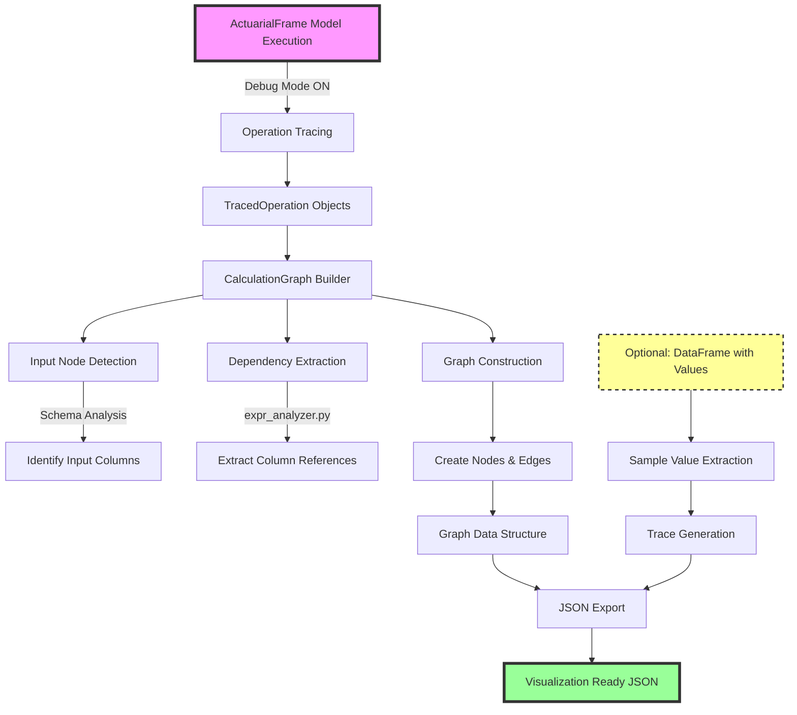

# Calculation Graph Implementation Status

## Overview

The Calculation Graph feature for Gaspatchio has been **partially implemented**. The core functionality for building and exporting calculation graphs is complete, but the natural variable syntax feature (Part 1 of the MVP) has not been implemented yet.

## ✨ Recent Refactoring (December 2024)

The calculation graph codebase has been significantly refactored for improved maintainability:

### Modular Architecture
The monolithic 625-line `calc_graph.py` has been split into focused modules within `frame/graph/`:
- **`graph_models.py`**: Pydantic models for type-safe graph components
- **`value_extractor.py`**: `SampleValueExtractor` class for clean value extraction
- **`filter_handler.py`**: `DataFrameFilter` class for DataFrame filtering logic
- **`graph_utils.py`**: Common utility functions (expression cleaning, dtype simplification)
- **`graph_builder.py`**: Refactored `CalculationGraph` with factory methods
- **`calc_graph.py`**: Now only ~270 lines with clean `GraphExporter` class

### Key Improvements
- **Eliminated code duplication**: Merged two export functions into one configurable function
- **Better separation of concerns**: Each module has a single responsibility
- **Type safety**: Pydantic models replace dictionaries and dataclasses
- **Cleaner methods**: Long functions broken into smaller, testable units
- **Reduced nesting**: Early returns and guard clauses throughout

## What Has Been Implemented ✅

### 1. Core Calculation Graph Infrastructure
- **Graph Building**: `CalculationGraph` class that builds a directed acyclic graph (DAG) from traced operations
- **Node Types**: Support for both input nodes (from model points) and computed nodes with Pydantic models
- **Dependency Extraction**: `expr_analyzer.py` module that extracts column dependencies from Polars expressions
- **JSON Export**: Export functionality that produces a JSON format suitable for visualization
- **Sample Values**: Ability to include actual computed values in the graph (when a DataFrame is provided)
- **Trace Generation**: `trace_generator.py` module that creates step-by-step calculation traces

### 2. Key Features Working
- **Automatic Input Detection**: Identifies which columns are inputs vs computed
- **Expression Analysis**: Parses Polars expressions to find column references including:
  - Simple column references: `pl.col("x")`
  - Nested expressions: `pl.col("x").clip(0, 100)`
  - Struct/list operations: `col("data").struct.field("value")`
  - Aggregation functions: `sum("column")`, `mean("column")`
- **Order Preservation**: Maintains the order in which nodes were created
- **Statistics**: Provides graph statistics (node counts, edge counts, etc.)

### 3. Integration Points
- **Debug Mode**: Works with `GSPIO_MODE=debug` environment variable
- **ActuarialFrame Integration**: Hooks into the existing tracing infrastructure
- **CLI Support**: Can be called programmatically via `export_calculation_graph()` function

### 4. Advanced Features
- **Filtered Graph Export**: `export_calculation_graph_with_df()` function that supports:
  - Policy-specific sample values via `GraphExportConfig`
  - Filter expressions (e.g., `col('year') == 7`)
  - Optimized year filtering for list columns
- **Calculation Traces**: Shows step-by-step evaluation of formulas with actual values

## What Has NOT Been Implemented ❌

### 1. Natural Variable Syntax (Part 1 of MVP)
The major missing piece is the ability to use natural variable names like:
```python
# Desired syntax (NOT YET WORKING):
issue_age = policyholder_issue_age + term_offset

# Current syntax (what you must use):
af["issue_age"] = af["Policyholder issue age"] + af["term_offset"]
```

### 2. Variable Mapping Infrastructure
Not implemented:
- `gaspatchio_core/codegen/` module for variable mapping
- Automatic mapping generation from model points
- IDE support file generation (.py and .pyi files)
- Runtime variable injection
- AST transformation for natural syntax

### 3. CLI Commands
Missing commands:
- `gspio generate-variables` - Generate IDE support files
- `gspio calc-graph` - Export calculation graph via CLI
- `--enable-variables` flag for run commands

### 4. Integration with Variable Names
The calculation graph currently uses actual column names, not mapped variable names. For example:
- Shows: `"Policyholder issue age"`
- Instead of: `"policyholder_issue_age"`

## Current Workflow

### How to Use What's Implemented

1. **Enable Debug Mode**:
```bash
export GSPIO_MODE=debug
```

2. **Run Your Model**:
```python
from gaspatchio_core import ActuarialFrame
from gaspatchio_core.frame.graph import GraphExporter, GraphExportConfig

# Your model must use traditional syntax
def model(af):
    af["issue_age"] = af["Policyholder issue age"] + 5
    af["current_age"] = af["issue_age"] + af["Policy year"]
    # ... more calculations
```

3. **Export the Graph**:
```python
# Create exporter
exporter = GraphExporter(af)

# Simple export without values
json_graph = exporter.export()

# Or with configuration for sample values
config = GraphExportConfig(
    policy_id="1",
    policy_id_column="Policy number",
    filter_expr="col('year') == 7",
    include_traces=True
)
result_df = af.collect()
json_graph = exporter.export(result_df, config)
```

4. **Graph Output Format** (Example from my-model model, year 7):
```json
{
  "nodes": [
    {
      "id": "Policyholder issue age",
      "type": "input",
      "label": "Policyholder issue age",
      "data": {
        "dtype": "int",
        "source": "model_points",
        "dependencies": [],
        "formula": null,
        "source_location": null,
        "value_sample": 38,
        "trace": null
      }
    },
    {
      "id": "issue_age",
      "type": "computed",
      "label": "issue_age = [(col(\"Policyholder issue age\")) + (col(\"term_offset\"))]",
      "data": {
        "dtype": "list",
        "source": null,
        "dependencies": [
          "Policyholder issue age",
          "term_offset"
        ],
        "formula": "[(col(\"Policyholder issue age\")) + (col(\"term_offset\"))]",
        "source_location": "/Users/.../model_calculation.py:129",
        "value_sample": 38.0,
        "trace": [
          {
            "step": 1,
            "expr": "(Policyholder issue age) + (term_offset)"
          },
          {
            "step": 2,
            "expr": "((38)) + ((0))",
            "values": {
              "Policyholder issue age": 38,
              "term_offset": 0.0
            }
          },
          {
            "step": 3,
            "expr": "38",
            "result": 38.0
          }
        ]
      }
    }
  ],
  "edges": [
    {
      "source": "Policyholder issue age",
      "target": "issue_age"
    },
    {
      "source": "term_offset",
      "target": "issue_age"
    }
  ]
}
```

## Implementation Architecture

### How the Calculation Graph Works



### Key Components (Updated Structure)

All graph-related components are now organized in the `frame/graph/` subdirectory:

1. **`graph/calc_graph.py`**: Main export module containing:
   - `GraphExporter`: Clean class-based interface for graph export with configuration support

2. **`graph/graph_builder.py`**: Core graph construction:
   - `CalculationGraph`: Builds and manages the graph with factory methods
   - Clean separation between input and computed node creation
   - Improved dependency management

3. **`graph/graph_models.py`**: Type-safe data models:
   - `NodeType`, `DataSource`: Enums for type safety
   - `NodeData`, `GraphNode`, `GraphEdge`: Pydantic models
   - `GraphExportConfig`: Configuration object for exports

4. **`graph/value_extractor.py`**: Sample value extraction:
   - `SampleValueExtractor`: Clean class for extracting values from DataFrames
   - Handles policy-specific filtering
   - Manages year index optimization

5. **`graph/filter_handler.py`**: DataFrame filtering:
   - `DataFrameFilter`: Encapsulates all filtering logic
   - Optimized year filtering for list columns
   - Safe expression evaluation

6. **`graph/expr_analyzer.py`**: Dependency extraction:
   - `extract_dependencies()`: Uses Polars' `expr.meta.root_names()` API exclusively
   - `analyze_expression_tree()`: Simplified to use only Polars meta API methods
   - **No regex usage** - fully relies on Polars' native expression metadata

7. **`graph/trace_generator.py`**: Calculation trace generation:
   - `TraceGenerator`: Creates simplified traces showing formula → values → result
   - `_minimal_clean()`: Uses only string replacements, no regex
   - **No regex usage** - all complex arithmetic evaluation removed

8. **`graph/graph_utils.py`**: Common utilities:
   - `clean_expression_string()`: Removes file paths from expressions
   - `simplify_dtype()`: Maps Polars types to simple names

## What's Left to Implement

### Priority 1: Natural Variable Syntax
This is the most critical missing piece. Users currently cannot write models with natural syntax.

1. **Variable Mapping Generation**:
   - Create mapping from "Policyholder issue age" → "policyholder_issue_age"
   - Handle special characters, spaces, Python keywords
   - Ensure valid Python identifiers

2. **Code Generation**:
   - Generate `model_variables.py` with variable definitions
   - Generate `.pyi` stub files for IDE support
   - Implement `VariableAccessor` or AST transformation

3. **Runtime Integration**:
   - Inject variables into model namespace
   - Handle both import-based and AST-based approaches
   - Ensure backward compatibility

### Priority 2: CLI Integration
1. ✅ **IMPLEMENTED**: `calc-graph` command in `cli.py` - exports calculation graph from a model
2. Add `gspio generate-variables` command
3. Add `--enable-variables` flag to existing commands
4. Add `--export-graph` flag to run commands

**The `calc-graph` command is working:**
```bash
cd gaspatchio-core/bindings/python
uv run python -m gaspatchio_core.cli calc-graph model.py data.parquet output.json
```

✅ **UPDATE (December 2024)**: The `calc-graph` command has been successfully tested with the refactored code:
```bash
# Example from my-model model:
cd gaspatchio-models/models/my-model
LOGURU_LEVEL=TRACE uv run gspio calc-graph model_calculation.py model-points.parquet \
  --policy-id "1" --filter "col('year') == 7" --output year7.json

# Output:
✓ Calculation graph saved to: year7.json
  Nodes: 33 (16 inputs, 17 computed)
  Edges: 35
```

The command now supports:
- **Policy-specific filtering**: `--policy-id "1"`
- **Year filtering**: `--filter "col('year') == 7"`
- **Sample value extraction**: Actual values from the computation
- **Calculation traces**: Step-by-step evaluation of formulas

### Priority 3: Variable Name Integration
1. Update graph to use mapped variable names
2. Ensure all dependencies use natural names
3. Update formulas to show natural syntax

### Priority 4: Testing & Documentation
1. Comprehensive tests for variable mapping
2. Integration tests with real models
3. Performance benchmarks
4. User documentation

## Known Issues and Limitations

1. **Column Names with Spaces**: Currently shown as-is in the graph (e.g., "Policyholder issue age")
2. **Complex Expressions**: Some complex Polars expressions may not have all dependencies extracted
3. **Performance**: Graph building adds overhead in debug mode
4. **Memory Usage**: Large models with many operations can consume significant memory

### ✅ RESOLVED: All Regex Removed from Both Modules

Both `expr_analyzer.py` and `trace_generator.py` have been refactored to completely eliminate regex usage:

#### Solution Summary

1. **`expr_analyzer.py`**: Now uses Polars' native `expr.meta` API exclusively
   - No regex patterns for dependency extraction
   - Fails fast with clear error if Polars version is too old
   - More accurate and maintainable

2. **`trace_generator.py`**: Simplified to use only string replacements
   - No regex for parsing expressions
   - No `eval()` for arithmetic evaluation  
   - Simpler trace format: formula → values → result
   - Safer and more maintainable

#### Benefits Achieved

- ✅ **Robustness**: No fragile regex patterns to break
- ✅ **Security**: No eval() or complex parsing
- ✅ **Maintainability**: Simple string replacements are easy to understand
- ✅ **Performance**: Native Polars API is faster than regex
- ✅ **Accuracy**: Polars knows its own expression structure better than regex

#### ✅ UPDATE: Solution Fully Implemented

**Both modules now completely avoid regex!**

##### `expr_analyzer.py` - Uses Polars Meta API

The module now uses Polars' `expr.meta.root_names()` API exclusively:

```python
def extract_dependencies(expr: pl.Expr) -> list[str]:
    """Extract column names using Polars meta API."""
    try:
        dependencies = expr.meta.root_names()
        return sorted(dependencies)
    except AttributeError as e:
        raise RuntimeError(
            "Polars version is too old. The calculation graph feature requires "
            "expr.meta.root_names() which is not available in your version."
        ) from e
```

**No fallback to regex** - if the Polars API isn't available, it fails with a clear error message.

The `analyze_expression_tree()` function also uses only Polars meta methods:
- `expr.meta.root_names()` for dependencies
- `expr.meta.is_literal()` for literal detection  
- `expr.meta.output_name()` for operation type
- `expr.meta.has_multiple_outputs()` for output checking

**Benefits of the new implementation:**
- ✅ **Accurate**: Always gets the correct column dependencies
- ✅ **Maintainable**: Automatically supports new Polars features
- ✅ **Fast**: Native API is more efficient than regex
- ✅ **Robust**: Handles edge cases like column names with spaces

**Test results confirm it works perfectly:**
```python
# Complex expression with spaces in column names
expr = pl.col("Policyholder issue age") + pl.col("Term offset")
dependencies = extract_dependencies(expr)
# Returns: ['Policyholder issue age', 'Term offset'] ✅
```

##### `trace_generator.py` - Simplified Without Regex

The module has been completely refactored to eliminate all regex usage:

```python
def _minimal_clean(self, formula: str) -> str:
    """Minimal cleaning using simple string replacements."""
    clean = formula
    # Remove Polars column syntax
    clean = clean.replace('col("', '').replace('")', '')
    clean = clean.replace("col('", "").replace("')", "")
    # Remove type hints
    clean = clean.replace("dyn int: ", "")
    clean = clean.replace("dyn float: ", "")
    # ... more simple replacements
    return clean.strip()
```

**Changes made:**
- Removed `_is_simple_arithmetic()` method (used regex)
- Removed `_evaluate_arithmetic_steps()` method (used regex and eval())
- Removed `_evaluate_monthly_cso_steps()` method (used regex)
- Removed `_balanced_parens()` method (supporting function)
- Simplified traces to show: formula → substituted values → final result
- Uses only string replacement for cleaning formulas

#### Implementation Details

**Key decisions made during refactoring:**

1. **Polars Version Requirement**: The calculation graph feature now requires a Polars version that supports `expr.meta.root_names()`. Older versions will get a clear error message.

2. **Simplified Traces**: Instead of trying to show step-by-step arithmetic evaluation, traces now show:
   - Step 1: The cleaned formula (with Polars syntax removed)
   - Step 2: The formula with actual values substituted (if dependencies exist)
   - Step 3: The final computed result

3. **No Complex Parsing**: Removed all attempts to parse and evaluate arithmetic expressions. This makes the code much more maintainable and secure.


## Testing Status

- ✅ Basic graph construction tests exist (`test_calc_graph.py`)
- ✅ Dependency extraction has been tested with various expression types
- ✅ JSON export format has been validated
- ✅ **NEW**: Full integration test with my-model model (December 2024)
- ✅ **NEW**: Refactored code uses clean GraphExporter API
- ❌ No tests for natural variable syntax (not implemented)
- ❌ No automated integration tests with full models
- ❌ No performance benchmarks

### Recent Test Results (December 2024)

Successfully tested the refactored calculation graph with a real actuarial model:
- **Model**: my-model (gaspatchio-models)
- **Test Case**: Single policy (ID: 1), filtered to year 7
- **Results**: 
  - Graph correctly identified 16 input columns and 17 computed columns
  - All dependencies were correctly extracted
  - Sample values were successfully extracted using the new `SampleValueExtractor`
  - Year filtering worked correctly with the new `DataFrameFilter`
  - Calculation traces were generated for all computed nodes
  - JSON export included complete graph structure with traces

## Recommendations for Completion

1. **Implement Variable Mapping First**: This is the foundation for natural syntax
2. **Start with Code Generation**: Generate static files for IDE support
3. **Add Runtime Support**: Implement variable injection for execution
4. **Integrate with Graph**: Update graph to use mapped names
5. **Add CLI Commands**: Make features accessible to users
6. **Comprehensive Testing**: Ensure reliability and performance

## Example: What Will Work When Complete

```python
# Future model with natural syntax (NOT YET WORKING)
from model_variables import *  # Auto-generated

def main(af):
    # Natural variable names with IDE support
    term_offset = (year - 26).clip(lower_bound=0)
    issue_age = policyholder_issue_age + term_offset
    age = issue_age + year - 1
    
    # Excel functions with natural syntax
    mortality_rates = 1 - (1 - monthly_cso_table) ** (1 / 12)
    
    # Complex calculations
    net_cash_flow = premiums_received - claims_paid - expenses
```

The generated graph will show these natural names, making it much more readable and maintainable.