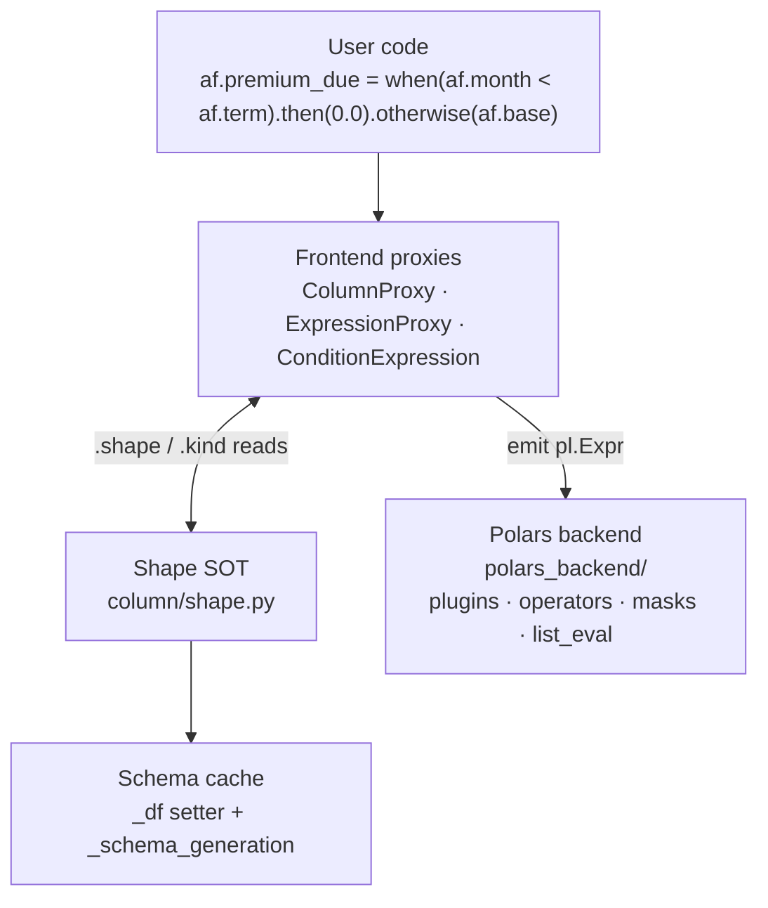
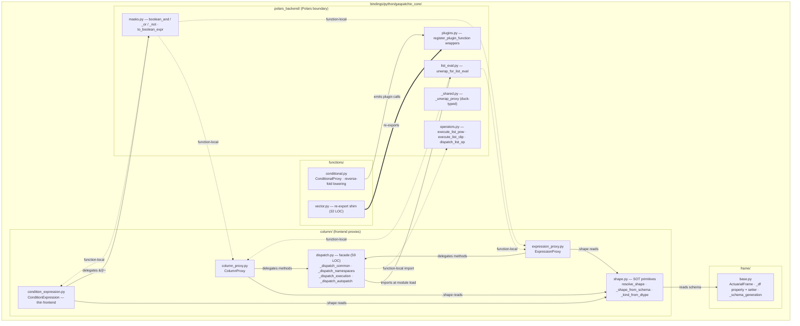
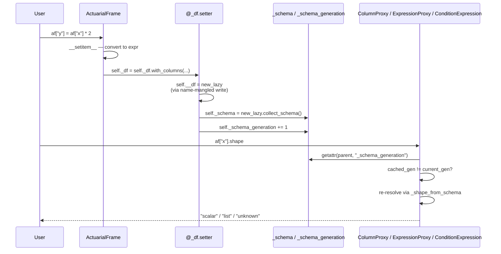
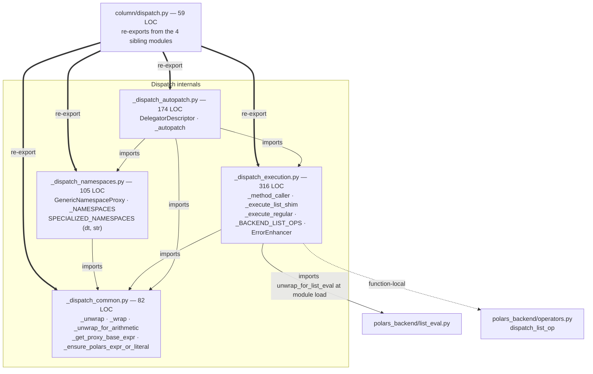
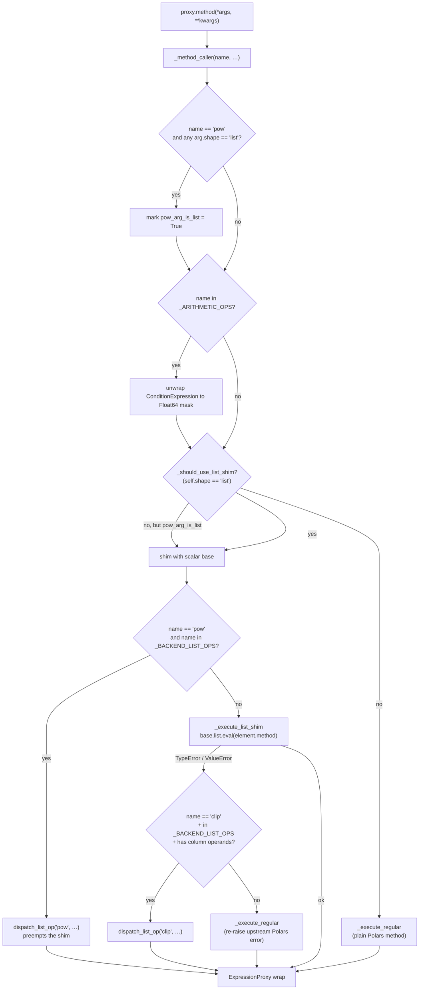
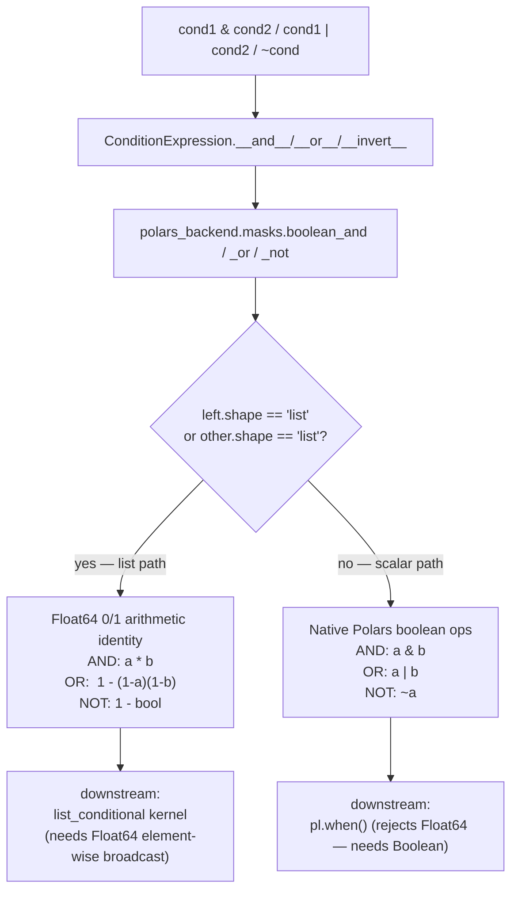
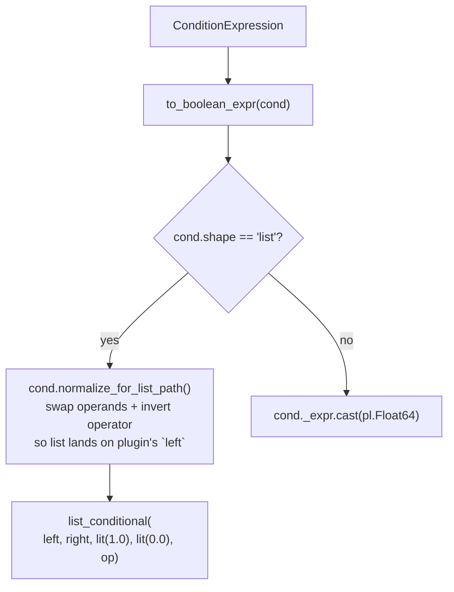
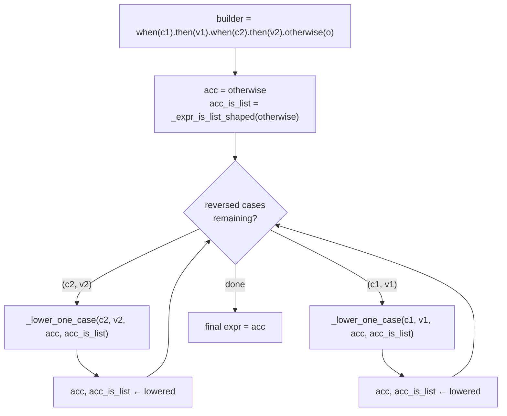
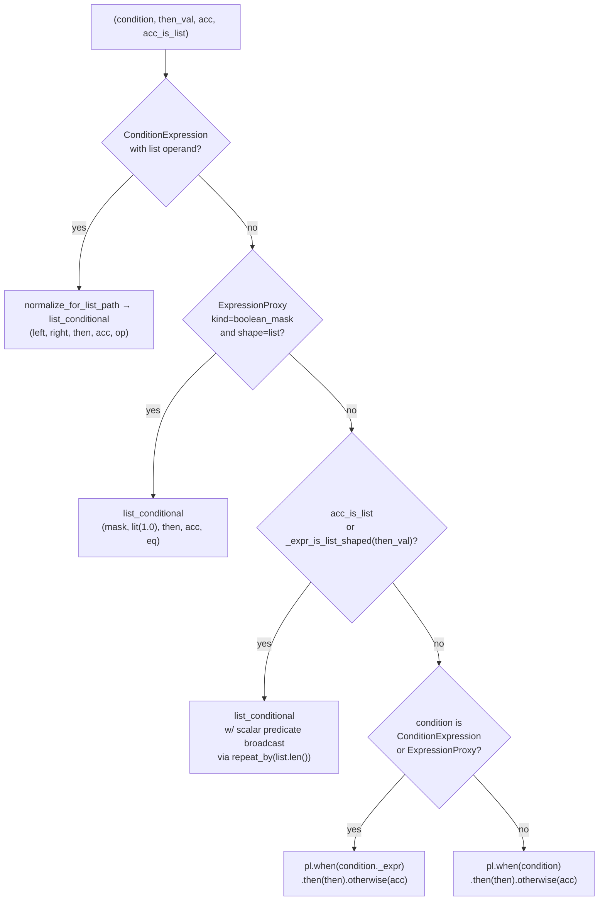
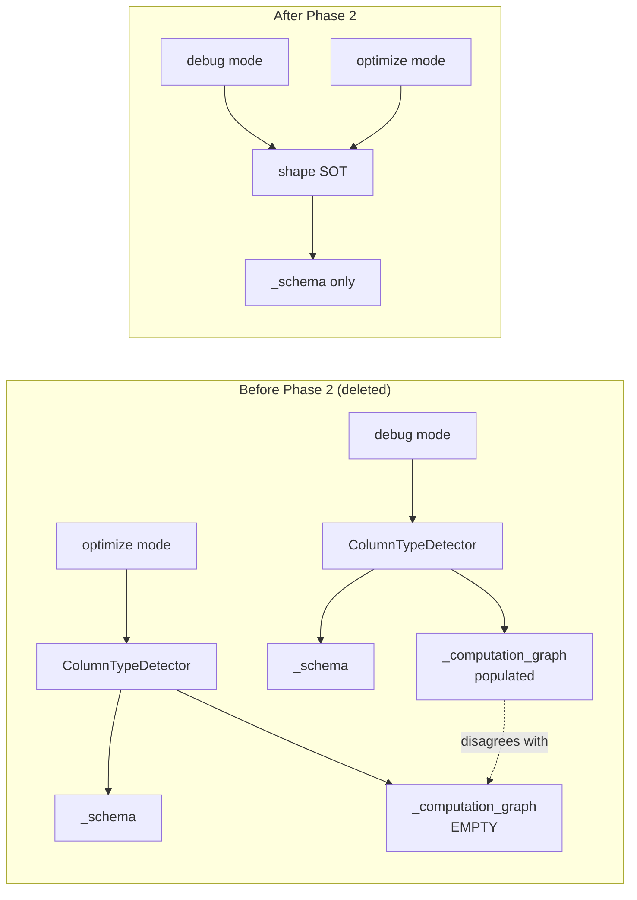

# Dispatch Engine Architecture

Developer guide to the dispatch / broadcasting / conditional surface in
`bindings/python/gaspatchio_core/`. Reflects the codebase post-GSP-95
through PR #101 (chained `when()` + shape SOT + Polars-backend boundary).

## TL;DR



Three rules govern this codebase. Internalize these before touching anything:

1. **Schema is the only source of shape truth.** No regex over expression repr,
   no computation-graph dtype probe. The Polars schema cached on the
   `ActuarialFrame` is authoritative; everything else reads from it.
2. **Cache invalidation is mechanical, not manual.** `_df` is a property whose
   setter atomically refreshes `_schema` and bumps `_schema_generation`.
   Direct writes to the underlying `__df` attribute are bounded to two sites
   (the setter itself and `__init__`), guarded by an AST test.
3. **Frontend plans, backend lowers.** `polars_backend/` is the only
   subpackage allowed to import Polars-specific kernels and emit
   `pl.Expr`-shaped results. Nothing in `polars_backend/` imports from
   `column/` at module load time. Two files (`masks.py`, `list_eval.py`)
   carry bounded, function-local exceptions for proxy-type dispatch —
   documented at the call sites.

## Top-level layering



`polars_backend/` is a peer of `column/`, `frame/`, and `functions/`. The
allowed module-load dependency direction is **frontend → backend**. The
two dotted edges from `masks.py` / `list_eval.py` back into `column/`
exist only inside function bodies and only for proxy-type dispatch —
they never run at import time.

### Why this boundary matters

Before PR #101, "Polars-specific lowering" was scattered across
`functions/vector.py` (plugin wrappers), `column/dispatch.py`
(`_unwrap_for_list_eval`, list-shim plumbing), and
`column/condition_expression.py` (arithmetic-as-logic implementations of
`&`/`|`/`~`). To extend the framework with a second backend in the
future, every one of those sites would need surgery.

The `polars_backend/` subpackage gives that surgery a single home. The
frontend now describes "what" — *this is a list-shaped boolean mask* —
and the backend describes "how" — *Float64 0/1 multiply for AND, native
`&` for scalar*.

## Shape and kind

`column/shape.py` exposes:

```python
Shape = Literal["scalar", "list", "unknown"]
Kind  = Literal["value", "comparison", "boolean_mask", "unknown"]
_UNSET = object()  # "not yet computed" — distinct from "unknown"
```

Every proxy carries both. Read them. Don't infer them yourself.

```mermaid
flowchart TD
    Value["value: object"] --> RS{"isinstance(value, …)?"}

    RS -->|ColumnProxy<br/>ExpressionProxy<br/>ConditionExpression| ProxyShape["return value.shape<br/>(cached on instance)"]
    RS -->|"pl.Expr"| ExprPath
    RS -->|bool / int / float| Scalar["return scalar"]
    RS -->|str| Unknown["return unknown<br/>(ambiguous: column name vs literal)"]
    RS -->|other| Unknown

    ExprPath{"meta.root_names()<br/>empty?"}
    ExprPath -->|yes — pl.lit(...)| LitFast["return scalar<br/>(skip plan probe)"]
    ExprPath -->|no| Probe["_shape_from_expr_dtype<br/>select(expr).collect_schema()"]
    Probe --> Result{"dtype"}
    Result -->|None| UnknownProbe["unknown"]
    Result -->|"pl.List(...)"| List[list]
    Result -->|other| ScalarProbe[scalar]
```

### Where `kind` matters

`Kind` disambiguates *what* an expression represents, not just the shape
of its output:

- `value` — a plain numeric or column reference. Default fallback.
- `comparison` — a `ConditionExpression` from `==`, `<`, etc. Carries
  `(operator, left, right)` metadata for the `list_conditional` kernel.
- `boolean_mask` — output is `pl.Boolean` (native) or `Float64` mask
  (from the multiplicative `&` / `|` / `~` overloads on
  `ConditionExpression`). Kind is set explicitly via
  `ExpressionProxy(..., kind="boolean_mask")` for the Float64 case; the
  Boolean case is inferred via `_kind_from_dtype`.

The `shape == "list"` check distinguishes the Float64-list mask path
(needs `list_conditional`) from native `pl.Boolean` masks (uses native
`pl.when()`). Both have `kind="boolean_mask"`; the shape disambiguates.

## Schema cache invariant

`ActuarialFrame._df` is a property. The setter atomically refreshes
`_schema` and bumps `_schema_generation`. This is the load-bearing
change that makes shape inference trustworthy.



Each proxy stashes `(generation, shape)` so repeat reads are O(1) until
the parent frame mutates. The integer comparison
`_shape_cached[0] != parent._schema_generation` is a single CPU
instruction; the resolver runs only on stale.

`tests/test_dead_code_removed.py::test_no_direct_underlying_df_writes_outside_property`
caps direct writes to `__df` at 2 (the setter body + `__init__`) via
AST inspection. If a contributor adds a third, the test fails.

## Dispatch internals

`column/dispatch.py` is now a 59-line compatibility facade. The
implementation lives in four concern-specific files. External imports
like `from gaspatchio_core.column.dispatch import _method_caller` keep
working unchanged because the facade re-exports every public name from
the four sibling modules.



The split is by concern, not by size. Each file has one responsibility:

- **`_dispatch_common.py`** — proxy-to-`pl.Expr` unwrap helpers. The
  three other modules all depend on these primitives.
- **`_dispatch_namespaces.py`** — handles `proxy.dt`, `proxy.str`,
  `proxy.list`, etc. Returns a namespace adapter that proxies further
  attribute access.
- **`_dispatch_execution.py`** — `_method_caller` and the registries
  that drive it (`_NUMERIC_UNARY`, `_NUMERIC_ELEMENTWISE`,
  `_BACKEND_LIST_OPS`, `_ARITHMETIC_OPS`).
- **`_dispatch_autopatch.py`** — the descriptor protocol that makes
  `ColumnProxy`/`ExpressionProxy` look like Polars `Expr` to callers.

The single module-load edge from `column/` → `polars_backend/` lives at
`_dispatch_execution.py:11` (`from gaspatchio_core.polars_backend.list_eval
import unwrap_for_list_eval`). Everything else stays function-local.

## Method dispatch flow

`_method_caller` is the runtime entry point for any autopatched method
on a proxy (e.g. `af.x.pow(2)`, `af.qx.list.sum()`). It resolves shape
via the SOT, decides whether to use the list shim or hand off to
`polars_backend/`, and wraps the result.



`_BACKEND_LIST_OPS = {"pow", "clip"}` is the registry that opts an
operation into the polars-backend fast path. The two ops follow
asymmetric routing strategies because their constraints differ:

- **`pow` is preempted.** The list-shim path
  (`base.list.eval(element.pow(arg))`) cannot handle a `pl.col`
  exponent, so we route to `dispatch_list_op` *before* attempting the
  shim. `pow_base_is_list` distinguishes the `list ** list`/`list ** scalar`
  cases (direct `list_pow`) from `scalar ** list` (guarded `exp/log`
  identity).
- **`clip` falls back.** The list-shim path handles literal bounds
  fine. We only route to `dispatch_list_op` when the shim raises
  *and* one of the bounds is a column reference (`_has_column_operands`).
  This minimizes plan-time work for the common case.

## Boolean-mask path

`ConditionExpression`'s `&` / `|` / `~` overloads are now thin
delegating stubs. The arithmetic-as-logic implementation lives in
`polars_backend/masks.py`, which routes by shape.



The pre-PR-3 implementation always returned Float64 over arithmetic
identities — fine for the list path but broken for the scalar path
because `pl.when()` rejects Float64 predicates with `SchemaError`. The
shape branch in `boolean_or` and `boolean_not` fixes that latent bug.

`boolean_and` returns `(combined_expr, is_list_path)`; the frontend
uses `is_list_path` to decide whether to stamp `kind="boolean_mask"`.
The list path always stamps; the scalar path preserves an existing
quirk (no kind stamp), which keeps native `&` results going through
`_kind_from_dtype` inference downstream.

### `to_boolean_expr` — predicate to Float64



`normalize_for_list_path` is called by two sites — `masks.to_boolean_expr`
and `functions.conditional._lower_one_case` — whenever a
`ConditionExpression` needs to feed `list_conditional`. (Single-`when`
chains route through `_lower_one_case` too, so there is no separate
`_build_scalar_conditional` call site.) Commuted predicates like `(scalar) == af.list_col`
are swapped to put the list operand on the kernel's required `left`
position; the operator is inverted on the swap (`lt↔gt`, `lte↔gte`,
`eq`/`ne` self-inverse). Already-canonical predicates pass through
unchanged.

## Conditional dispatch — reverse-fold

`when(...).then(...).when(...).then(...).otherwise(...)` lowers to a
single Polars expression via right-to-left fold over per-case lowering
rules. This is the algorithm that fixed GSP-87 (chained `when()` on
list columns) and that the rest of Phase 1 was built around.



`_lower_one_case` is the per-case dispatcher. Five branches, in
priority order:



Branch B3 catches the GSP-87 follow-up: a scalar predicate over a
list-shaped operand (either an already-list `acc` or a list-shaped
`then_val`). Without this branch,
`pl.when(scalar).then(list).otherwise(scalar)` would raise
`SchemaError: failed to determine supertype of list[f64] and f64`.

The `acc_is_list` boolean is threaded through the fold so each step
knows whether its accumulator has become list-shaped from earlier
branches. The output of every list-routed lowering returns
`(expr, True)`.

## Public API and import paths

The Polars-backend extraction is a refactor, not a rename. Every
pre-PR-3 import path still resolves; new code should prefer the
canonical module.

```mermaid
flowchart LR
    subgraph Legacy["Legacy import paths (still work)"]
        L1["from gaspatchio_core.functions.vector<br/>import accumulate, list_pow, …"]
        L2["from gaspatchio_core.column.dispatch<br/>import _method_caller, _BACKEND_LIST_OPS, …"]
    end

    subgraph Canonical["Canonical import paths"]
        C1["from gaspatchio_core.polars_backend<br/>import accumulate, list_pow, …"]
        C2["from gaspatchio_core.column._dispatch_execution<br/>import _method_caller, _BACKEND_LIST_OPS"]
    end

    subgraph Targets["Actual implementations"]
        T1["polars_backend/plugins.py<br/>(register_plugin_function wrappers)"]
        T2["column/_dispatch_execution.py"]
    end

    L1 -. re-export shim<br/>(functions/vector.py) .-> T1
    C1 -. re-export __init__ .-> T1
    L2 -. re-export facade<br/>(column/dispatch.py) .-> T2
    C2 ----> T2

    Note["Both legacy and canonical paths<br/>resolve to the SAME callable —<br/>`is`-identity preserved by the shims."]
```

`functions/vector.py` is now a 32-line re-export shim. `column/dispatch.py`
is a 59-line facade. Both exist purely to preserve external import
paths; new code should target `polars_backend/` and the
`_dispatch_*.py` modules directly.

## Mode parity by construction

Before Phase 2, `ColumnTypeDetector` queried both the schema and the
computation graph. In optimize mode the graph is empty; in debug mode
it has entries. Same shape question, two different answers.



The graph code is gone. `_computation_graph` still exists for tracing
and debugging output, but no shape decision reads from it. Schema is
the only authority. Mode parity is therefore invariant by
construction. Pinned by `tests/integration/test_mode_parity_smoke.py`.

## Layering invariant

The architectural rule: `polars_backend/` may be imported by
`column/`, `frame/`, `functions/`. The reverse direction is allowed
*only* in two function-local exception sites, both documented at the
call sites:

- `polars_backend/masks.py` — three private helpers
  (`_other_to_boolean_expr`, `_other_to_native_expr`, `_other_has_list`)
  import `ColumnProxy`/`ConditionExpression`/`ExpressionProxy` inside
  function bodies for `isinstance` dispatch on the second AND/OR
  operand. Module-load imports here would create a `masks.py`
  ↔ `condition_expression.py` cycle.
- `polars_backend/list_eval.py` — `unwrap_for_list_eval` imports
  `ColumnProxy`/`ExpressionProxy` inside its body to raise
  `TypeError` with a descriptive message for proxy operands that
  reference named columns (illegal inside `list.eval`).

### Verification recipe

```bash
# Module-load imports from polars_backend/ to column/ — must be EMPTY:
grep -n "^from gaspatchio_core.column" \
    bindings/python/gaspatchio_core/polars_backend/*.py
# (TYPE_CHECKING-only imports inside `if TYPE_CHECKING:` blocks are fine —
#  they don't execute at runtime.)

# All function-local exceptions:
grep -n "    from gaspatchio_core.column" \
    bindings/python/gaspatchio_core/polars_backend/*.py
# Should hit ONLY masks.py and list_eval.py.
```

If a contributor adds a top-level `from gaspatchio_core.column` to any
`polars_backend/*.py` module, the verification recipe above will turn
up the new edge — re-run it whenever you touch the backend package.

## Adding new shape-aware code

If you're adding a new operator, a new accessor, or a new dispatch
site:

1. **Read `proxy.shape` and `proxy.kind`.** Don't construct your own
   `ColumnTypeDetector` (it doesn't exist) and don't grep `str(expr)`.
2. **If you need shape from a bare `pl.Expr`,** call
   `resolve_shape(expr, parent)` — it handles literals via fast-path,
   proxies via `.shape`, and probes via `_shape_from_expr_dtype` only
   when needed.
3. **If you need to know which column an expression references,** use
   `expr.meta.root_names()` — never the regex.
4. **If you mutate `_df`,** assign through `self._df = new_lazy`. The
   setter handles cache + generation. Direct writes to `__df` will
   trip the AST guard test.
5. **If your new op needs a Polars-specific kernel,** put it in
   `polars_backend/`, not in `column/`. If it's a list op that should
   route from `_method_caller`, add the name to `_BACKEND_LIST_OPS`
   and a handler arm in `dispatch_list_op`.
6. **If you need a new typed kind,** extend the `Kind` literal in
   `column/shape.py` and update `_kind_from_dtype` accordingly.
   Adding a string outside the literal is a `mypy` error.

## Performance considerations

The `_shape_from_expr_dtype` plan probe (`select(expr).collect_schema()`)
is cheap (~20 µs) but called per chain step on each operand. Two
optimizations live in the codebase:

1. **Generation-keyed proxy cache.** `ColumnProxy.shape`,
   `ExpressionProxy.shape`/`.kind`, `ConditionExpression.shape` all
   cache their resolved value with `(_schema_generation, value)`.
   Repeat reads on the same proxy after no mutation are O(1).
2. **Literal fast-path.** `_shape_from_expr_dtype` and
   `_kind_from_dtype` short-circuit when `expr.meta.root_names()` is
   empty (i.e., a `pl.lit`). Catches every numeric literal in chain
   right-operands and then-branches without a plan probe.

`TestChainedWhenSlowdownGate` enforces a flat ≤ 45% slowdown vs native
`pl.when()` chained form at n=100K. The 5-point bump from 40% (PR
#100) to 45% (PR #101) is CI-variance margin, not a real perf
regression — see the test module docstring for rationale.

## Reading guide

If you have an hour:

1. `column/shape.py` (~140 lines) — the SOT primitives.
2. `frame/base.py:217-300` — `__init__`, `_df` property, setter.
3. `column/condition_expression.py` (~200 lines) — comparison
   metadata + thin operator overloads + `normalize_for_list_path`.
4. `polars_backend/masks.py` — the boolean-mask backend, including
   the documented function-local exception pattern.
5. `column/_dispatch_execution.py:_method_caller` —
   list-shim/`_BACKEND_LIST_OPS` routing.
6. `functions/conditional.py:_lower_one_case` and
   `_build_scalar_conditional` — the reverse-fold.
7. `tests/test_dead_code_removed.py` and
   `tests/polars_backend/test_public_api.py` — what doesn't exist
   anymore and the import paths that must keep resolving.

If you have ten minutes: re-read the three rules at the top.
