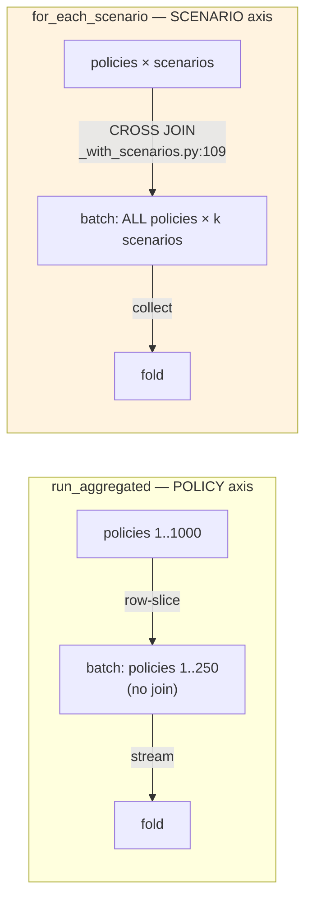
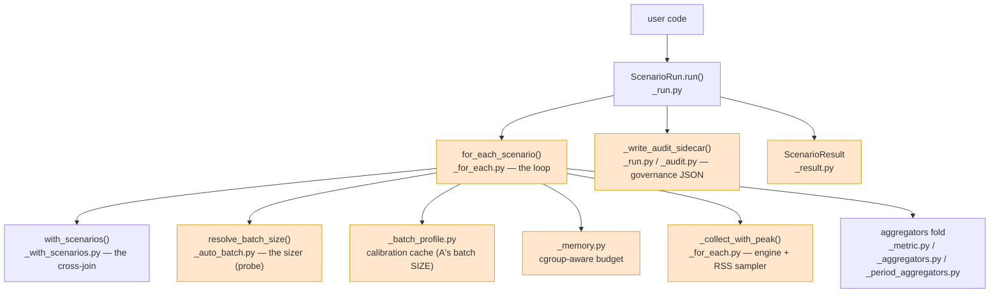
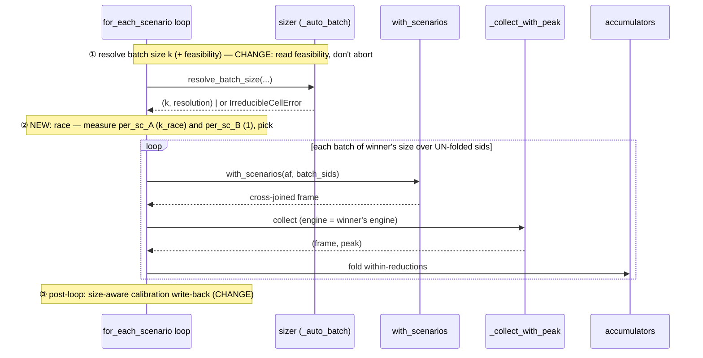
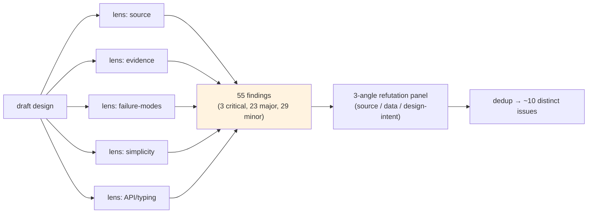
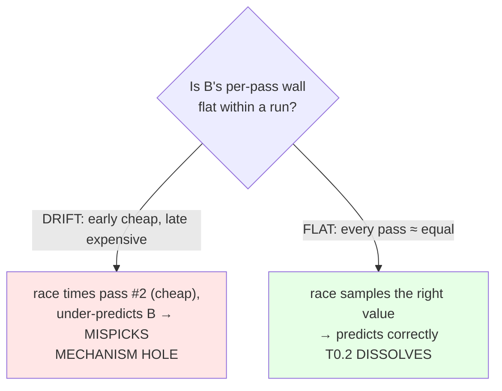
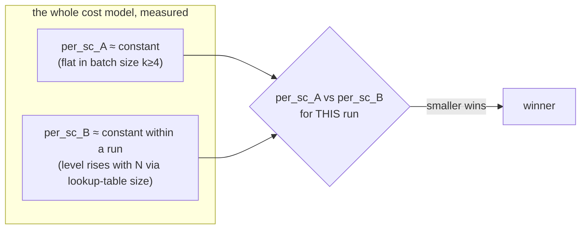
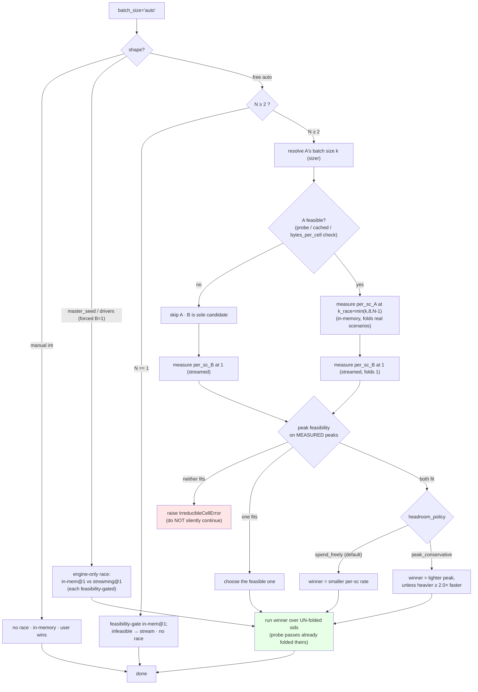
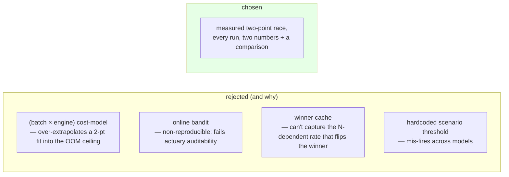
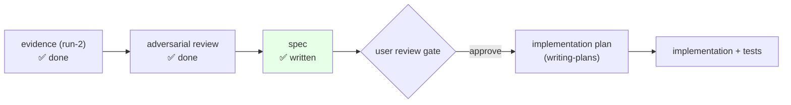

# Shape-aware `for_each_scenario` driver — the full walkthrough

Date: 2026-06-10 · Companion to the spec
[`../specs/2026-06-10-shape-aware-driver-design.md`](../specs/2026-06-10-shape-aware-driver-design.md).

> **What this document is.** A detailed, narrative account of *how we arrived at the design*: the
> provenance, the problem, the parts of the code it touches, the adversarial review, the
> measurements that settled it, and the resulting algorithm — with diagrams throughout. The spec
> is the buildable contract; this is the reasoning behind every line of it. Read this to
> *understand*; read the spec to *implement*.

---

## 1. The one-paragraph version

`for_each_scenario` runs an actuarial model once per scenario (or per batch of scenarios) and folds
the results into bounded-memory accumulators. Its `batch_size="auto"` mode currently picks *the
biggest batch that fits in memory*. We want it to pick *the **fastest** execution that still fits*.
There are two sensible ways to run the loop — **Point A** (a big batch, held in memory) and
**Point B** (one scenario at a time, streamed) — and which is faster flips depending on the model,
the policy count, the horizon, and the number of scenarios. Rather than guess the crossover with a
threshold, `auto` will **measure both points on the first couple of real passes of the actual run,
pick the winner, and run the rest with it.** This document explains why that is the right answer
and what it took to be confident in it.

---

## 2. How we got here (provenance)

This work fell out of **PR #111** (the unified aggregation surface). A speed investigation there
noticed that `run_aggregated`'s per-batch collect ran Polars' *in-memory* engine while the
single-pass path *streamed* — a one-line `engine="streaming"` fix brought them to parity. That
raised the obvious question for the sibling driver: should `for_each_scenario` *also* choose its
engine/batch by shape?

The path from that question to this design was not straight. It is worth keeping the wrong turns
visible, because two of them are exactly the traps a future reader would re-fall into.

```mermaid
flowchart TD
    A["PR #111: streaming fix on run_aggregated<br/>(policy axis) → 5.5× win"] --> B{"Should for_each_scenario<br/>(scenario axis) do the same?"}
    B --> C["Field experiment:<br/>auto-cross-join vs batch=1 streaming"]
    C --> D["Early read: 'retire the cross-join,<br/>streaming always wins'"]
    D -->|"OVERTURNED by heavy cells:<br/>at 1000 scenarios cross-join is ~3-4× faster"| E["Restated with user:<br/>objective = max speed s.t. peak ≤ budget"]
    E --> F["Design workflow: 3 selector designs generated<br/>(probe-race, analytic cost-model, online bandit)"]
    F -->|"adversarial panel: all ~18-19/40,<br/>shared FATAL assumption"| G["Assumption: a free (batch × engine) grid<br/>where streaming wins on the scenario plan"]
    G -->|"verified against source → REFUTED"| H["Source-grounded correction:<br/>for_each_scenario ALWAYS cross-joins"]
    H --> I["Design collapses to TWO operating points<br/>+ a measured two-point race"]
    I --> J["Adversarial review of the draft<br/>(5 lenses, 55 findings)"]
    J -->|"Tier-0 blocker: comparator may<br/>mispredict; evidence incomplete"| K["Instrumented re-run<br/>(this session's measurement)"]
    K -->|"comparator validated; evidence refreshed"| L["THIS DESIGN:<br/>race every run, no winner cache"]

    style D fill:#ffe6e6
    style G fill:#ffe6e6
    style L fill:#e6ffe6
```



**Wrong turn 1 — "streaming always wins."** The first field read was that streaming the projection
collect was a blanket improvement. The heavy cells (1000 scenarios) overturned it: there the big
in-memory batch is *3–4× faster*. The win is **shape-dependent**, not universal.

**Wrong turn 2 — "a free `(batch × engine)` grid."** Three selector designs were generated by a
design workflow and adversarially scored; all three shared one assumption — that you could pick a
batch size *and independently* pick an engine, with streaming carrying its `run_aggregated`-sized
win onto the scenario plan. **Checking that against the source refuted it** (§3). That collapsed a
4-quadrant search into a 2-point choice.

---

## 3. The fact that reshaped everything: `for_each_scenario` always cross-joins

`run_aggregated` (policy axis) row-slices the portfolio — each batch is *some of the policies*, no
join. People reasoned by analogy that `for_each_scenario` with `batch_size=1` would likewise be a
cheap "slice" plan that streams beautifully. **It is not.**



Concretely, in `_with_scenarios.py:109`:

```python
expanded = base_df.join(scenarios_df.lazy(), how="cross")
```

and the batch loop calls `with_scenarios(af, batch_sids)` **per pass** (`_for_each.py:634`). So:

- **`batch_size` = scenarios-per-pass**, not policies-per-batch. *Every policy is present in every
  pass.*
- A `batch_size=1` pass is a **1-scenario cross-join of all policies** — structurally a cross-join
  plan, **not** `run_aggregated`'s no-join slice.
- Therefore **`run_aggregated`'s 5.5× streaming win does not auto-transfer.** Whether streaming
  helps the *scenario* plan has to be **measured**, not assumed.

There is no free `(batch × engine)` grid. There are exactly **two coherent operating points**:

| | **Point A** — big batch, in-memory | **Point B** — `batch_size=1`, streaming |
|---|---|---|
| each pass collects | `n_policies × k` rows | `n_policies × 1` rows |
| why in-memory / why streamable | the Polars planner can't fuse the Rust lookup plugin with the downstream `group_by` (`_for_each.py:654-657`), so a big batch is held in memory | one scenario's working set is small and bounded → the collect can stream |
| pays plan-build | once per `k` scenarios | once per scenario |
| peak memory | ∝ `n_policies × k` | ∝ `n_policies × 1` |
| wins when | **overhead-dominated** (many cheap scenarios) | **compute-dominated** (few heavy scenarios, many policies, long horizon) |

---

## 4. The code this design touches

The scenario subsystem is a small constellation of modules under
`bindings/python/gaspatchio_core/scenarios/`. The call graph for an `auto` run:



What changes, file by file (orange = touched):

| file | role today | change in this design |
|---|---|---|
| `_for_each.py` | the scenario loop: sizing, the per-batch collect+fold, the post-loop calibration write-back | **the selector lives here** — measure two rates on the first passes, gate feasibility, pick, run remainder; track folded sids for fail-open; per-batch (size-aware) calibration write-back |
| `_auto_batch.py` | `resolve_batch_size` — two-point RSS probe; raises `IrreducibleCellError` when one cell > budget | unchanged logic; its `IrreducibleCellError` is reinterpreted by the caller as "A infeasible → B" instead of an abort |
| `_collect_with_peak` (in `_for_each.py`) | collect with an optional `engine=` + transient-RSS sampler | called with `engine="streaming"` for Point B passes; docstring corrected (streaming pairs safely with `batch_size=1`) |
| `_batch_profile.py` | learned calibration cache for A's batch **size**, keyed on `(plan_sha, shape_fp)` | **unchanged structurally** — *no* winner cache is added; the write-back that *feeds* it is corrected to be size-aware (§6.4) |
| `_memory.py` | cgroup-aware budget (`memory_budget`, `effective_limit`) | reused for the cached-path budget (the cgroup fix) |
| `_result.py` | `ScenarioResult` dataclass | new `RaceDecision` dataclass + `race` field; `batch_size_resolution` Literal gains `"auto_race"` |
| `_run.py` / `_audit.py` | `ScenarioRun.run` + the audit JSON sidecar | new `headroom_policy` kwarg; race fields written into `run_metadata`; `AUDIT_SCHEMA_VERSION` bump |
| `scenarios/__init__.pyi` | type stubs | updated to match; mypy + pyright + stubtest green |
| `evals/benchmarks/` | scenario benchmarks | new A-vs-B CI guard (promoted from the evidence harness) |

The loop today, in shape (with the change-points marked):



---

## 5. The analysis — part 1: the adversarial review

The draft design (two-point race, race-on-real-work, *with* a winner cache) was put through a
5-lens adversarial review: source-correctness, evidence-grounding, failure-modes, simplicity, and
API/typing. Each lens hunted real flaws; each finding then faced a 3-angle refutation panel.



The findings deduped to roughly ten distinct issues across three tiers. The decisive ones:

- **Tier 0 (blockers).** Two things the review surfaced that I then verified directly against the
  raw data:
  1. The **committed evidence was a partial run** — 10 of 14 cells, *missing all three
     1000-scenario A-wins and the 100K infeasibility cell*, with one near-crossover cell's winner
     flipped between runs.
  2. The **race's per-scenario comparator might mispredict** exactly where A wins. The report's own
     numbers showed B's per-scenario wall rising ~4× from 100 → 1000 scenarios; if the race timed
     one early B pass and extrapolated linearly, it could under-predict B by ~4× and wrongly crown
     it in the regime A wins by 3.8×.
- **Tier 1 (real gaps).** The hard ceiling could be violated (`spend_freely` crowning an
  over-budget B); the winner-cache validity bounds **omitted the scenario axis** (all three
  *critical* findings, independently); the calibration write-back would be corrupted when B wins;
  the audit sidecar never received the decision.
- **Tier 2 (precision).** `N==1` cited a measurement never taken; the `bytes_per_cell` path had no
  feasibility signal; fail-open after real passes risked double-folding.

The Tier-0 items meant the spec could **not** be locked on the existing evidence. That triggered the
measurement.

---

## 6. The analysis — part 2: the measurement that settled it

I built an instrumented harness (`reports/2026-06-10-evidence/evidence_grid_instrumented.py`) with
two jobs: **(a)** re-run the full 14-cell grid to refresh the evidence, and **(b)** capture Point
B's per-pass wall via the `on_batch` callback, to answer the comparator question directly.

### 6.1 The decisive instrument

The selector's proposed statistic is "mean of a few early B passes × N". The way to test it is to
record the wall of *every* B pass across a long run and ask: is the early sample representative of
the whole?



### 6.2 What the per-pass timeseries showed

B's per-pass wall is **dead flat within every run** (`per_pass_timeseries.jsonl`):

```
A2_base  1000sc × 1K:  pass #1 = 0.517s ... pass #1000 = 0.532s   (drift late/early = 1.039)
A4_heavy 1000sc × 1K:  pass #1 = 0.502s ... pass #1000 = 0.512s   (drift           = 1.067)
A1_short 1000sc × 1K:  pass #1 = 0.259s ... pass #1000 = 0.228s   (drift           = 0.986)
A2_base   100sc × 1K:  ~0.11s throughout                          (drift           = 0.984)
A2_base    10sc × 1K:  ~0.08s throughout (after a 0.099 warmup)
```

The *level* differs between runs (0.08 → 0.11 → 0.51 s as scenarios go 10 → 100 → 1000) but each
run is internally flat. The level shift is established at **pass #1**, not accumulated — almost
certainly because the registered `inv_returns` lookup table is 10× larger at 1000 scenarios, so
every streamed pass's lookup is costlier from the start. **The race always measures inside the run
it is deciding for, so it captures whatever level applies.**

### 6.3 The comparator is sound — simulated against the real totals

Simulating the race (mean of early post-warmup passes × N) versus the actual B total:

| cell | winner | drift (late/early) | **race pred / actual** |
|---|---|---|---|
| A2_base 100sc × 1K | B | 0.984 | **0.994** |
| A1_short 1000sc × 1K | A | 0.986 | **1.025** |
| A2_base 1000sc × 1K | A | 1.039 | **0.962** |
| A4_heavy 1000sc × 1K | A | 1.067 | **0.960** |

Within **~4%** on every cell, *including* the 1000-scenario A-wins. The race would predict B ≈ 515 s
vs A's 123 s at A2_base 1000sc and **correctly pick A**. **Tier-0 dissolved.** My original fear was
based on comparing B's per-scenario cost *between* runs; the measurement showed it is flat *within*
a run, which is the only thing the race relies on.

### 6.4 A bonus the data handed us — and how it simplified the design

Probing Point A across batch sizes showed **A's per-scenario wall is flat in `k` for `k ≥ 4`**
(~85–95 ms across `k = 4…32`; only `k = 2` is ~20% higher). A's supposed advantage — "amortise
plan-build across a big batch" — *saturates by `k ≈ 4`*.



Two consequences:

1. **The race can measure A cheaply.** Because `per_sc_A` is flat, a small probe batch
   (`k_race = min(k, 8, N−1)`) gives a representative A rate **and** bounds the cost of "ran the
   loser" to ≤ 8 scenarios if B turns out faster. This kills the review's "race overhead is
   unbounded at small N" finding.
2. **A cross-run winner cache cannot work — so we drop it.** The winner flips because `per_sc_B`
   rises with N. That is precisely what a cache keyed on the output fingerprint cannot capture: a
   winner learned at 100 scenarios is wrong at 1000, and the rates themselves are N-dependent and
   don't port across N. Since the race is cheap (≤ 8 A-scenarios + 1 B-scenario, all real folded
   work), there is little to save and a real correctness trap if we cache. **Dropping the winner
   cache deletes all three *critical* review findings, ~4 more cache-corruption findings, and a
   schema-version bump** — the evidence and the simplicity principle pointing the same way.

---

## 7. The design — the selector

The selector reduces to **measure two per-scenario rates for this run, then pick.** No
extrapolation model, no cache, no bandit — the decision is two measured numbers and a comparison.



### 7.1 Why each branch is the way it is

- **Feasibility before timing A (`AF`)** — A's peak ∝ `n_policies × k`. At 100K policies even one
  in-memory cell can exceed the budget (the sizer *refused* in run-2: "~640 MB/cell vs ~3448 MB
  budget"). You must detect that *without* running A, or you OOM. The sizer's existing per-cell
  estimate already does this; the cached/`bytes_per_cell` paths get an explicit equivalent.
- **Measure on real passes, not throwaway probes** — the two probe passes fold real scenarios into
  the accumulators. The remainder runs only the *un-folded* scenarios. Net extra cost over just
  running the winner from the start: at most one single-scenario loser pass (when A wins) or ≤ 8
  in-memory loser scenarios (when B wins). No recomputation.
- **Hard ceiling on the measured peaks (`Feas`)** — a point whose *measured* pass peak exceeds the
  budget is infeasible regardless of speed. If neither fits, **raise** — a pass surviving once does
  not mean 500 more passes have headroom. This is the fix for "`spend_freely` could crown an
  over-budget B."
- **`peak_conservative` margin (2.0×)** — only bites where A fits but B is *heavier and faster*
  (high policies near the budget edge). On the run-2 grid it agreed with `spend_freely` everywhere
  both points were feasible, so it is a genuine opt-in, not a silent behaviour change.
- **Forced `batch_size=1`** (seeded / drivers) — A is structurally unavailable, so the race becomes
  in-memory@1 vs streaming@1 (each still feasibility-gated). Seeded stochastic runs are precisely
  the compute-dominated regime where streaming tends to win (1.3–4.8× in the grid).

---

## 8. The evidence, refreshed (run-2, all 14 cells)

The decision boundary the selector must reproduce — and now does, measured end-to-end:

```
                         scenarios →   10            100            1000
 policies   horizon
 1K         60  (A1)                   B 1.78×       B 1.14×        A 2.02×
 1K         82  (A2)                   B 1.56×       B 1.14×        A 4.35×
 1K         82  (A4 heavy)             B 1.17×       B 1.01× (tie)  A 4.05×
 1K         360 (A3 long)              B 4.03×       B 2.10×        (→A, capped)
 10K        82  (A2)                   B 4.79×         —              —
 10K        360 (A3)                   B 4.69×         —              —
 100K       82  (A2)                   B  [A infeasible — over budget]
```

In words:

- **Point B wins** when per-pass compute is large vs per-pass overhead: **few scenarios (≤ ~100),
  many policies (≥ 10K), or long horizon.** At **100K policies B is the only feasible option.**
- **Point A wins** when overhead dominates: **many scenarios (≥ ~1000)** at modest policies/horizon.
- **The crossover moves with the model** — at 100 scenarios, A1_short is a near-tie on B (+1–14%)
  while A3_long is still +110% on B. A hardcoded scenario threshold would mis-fire across models —
  which is why the selector measures.

All 14 cells are numerically identical between A and B to float precision (max rel `5.8e-16`,
≈ 2.6 ULP from sum-order non-associativity). The one near-tie (A4_heavy @ 100sc) legitimately
flips winner between runs — which is why the CI guard skips near-ties.

---

## 9. What this design deliberately is NOT



It also changes nothing on the policy axis (`run_aggregated` / `run_to_parquet`), adds no
parallelism, and leaves manual `batch_size` untouched.

---

## 10. Where this sits in the pipeline



**Reading order for someone picking this up cold:** this walkthrough → the spec
(`specs/2026-06-10-shape-aware-driver-design.md`) → the evidence report
(`reports/2026-06-10-shape-aware-driver-evidence.md`, the numbers + reproduce bundle) → the review
digest (`reports/2026-06-10-design-review-findings.md`, every finding and its disposition).

### Artifacts

| artifact | what it is |
|---|---|
| `specs/2026-06-10-shape-aware-driver-design.md` | the buildable contract |
| `reports/2026-06-10-shape-aware-driver-evidence.md` | objective, the cross-join correction, the refreshed matrix, reproduce bundle |
| `reports/2026-06-10-design-review-findings.md` | the adversarial review, Tier-0 resolution |
| `reports/2026-06-10-evidence/evidence_grid_instrumented.py` | the harness (full grid + per-pass timing) |
| `reports/2026-06-10-evidence/evidence_results_v2.jsonl` | the 14-cell run-2 raw data |
| `reports/2026-06-10-evidence/per_pass_timeseries.jsonl` | the per-pass walls that validated the comparator |
